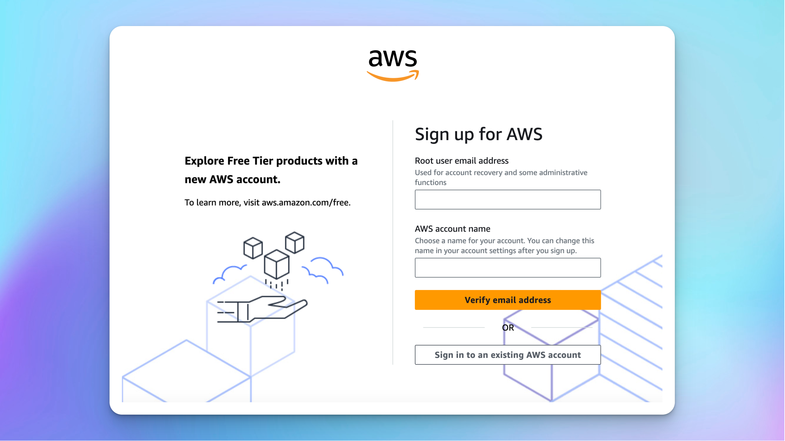

TypingMind offers access to Google's Gemini AI models, including:

- Gemini Pro
- Gemini Flash
- Nano Banana (Image model)

Here’s how to get the Gemini API key:

## Step 1: Log into your Google account

Go to [https://aistudio.google.com/app/apikey](https://aistudio.google.com/app/apikey), you will then be asked to log into your Google account first.

/Untitled.png)

## Step 2: Create API key

Click on "Get an API key" and then "Create API key in new project”.

/Untitled%201.png)

Copy the generated API key.

/Untitled%202.png)

## Step 3: Enter the API key to the app

Open TypingMind, go to Settings → API keys → enter the copied API key:

## Advanced settings

**Custom endpoint:** Use the direct endpoint from Google or configure your own custom chat completions endpoint.

