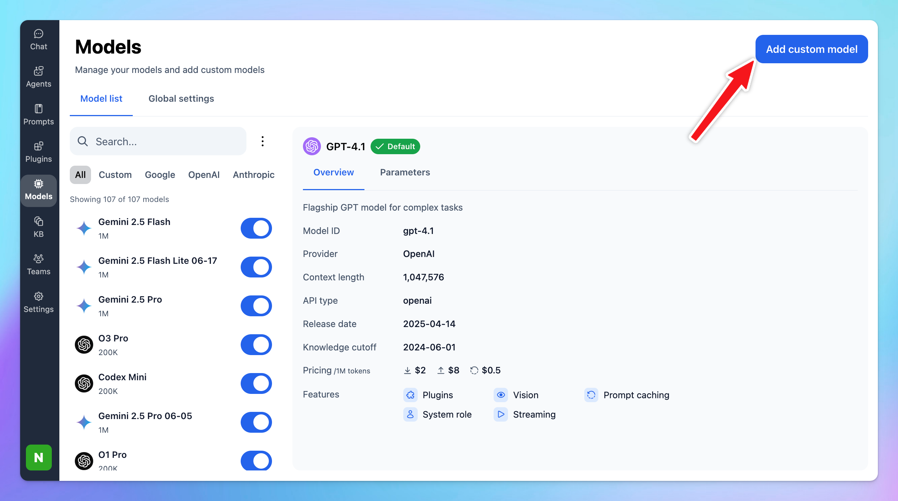

By default, TypingMind supports Gemini models out of the box. However, if you prefer to set up a **Gemini model as a custom model**, follow the steps below:

## 1. Add custom model

- Click on the **“Models”** icon in the left sidebar.
- Click **“\+ Add Custom Model”** (top right).



## 2. Set up Gemini as Custom Model

- **Name:** (e.g., “Gemini 2.5 Pro”)
- **API Type:** Gemini API
- **Endpoint:**
  ```text
  https://generativelanguage.googleapis.com/v1beta/models/
  ```
- **Model ID, for example: (other models can be found at** [https://ai.google.dev/gemini-api/docs/models](https://ai.google.dev/gemini-api/docs/models))
  ```text
  gemini-2.5-flash
  ```
- **Context Length:** Use the context length supported by Gemini model you chose.
- Under **Custom Headers**, add:(Replace with your real Gemini API Key—get yours at: [**https://aistudio.google.com/app/apikey**](https://aistudio.google.com/app/apikey))
  `apiKey` : `YOUR_GEMINI_API_KEY`
- **Test Connection:** Click **Test** to check if the endpoint works.
- **Save** to add the model to your list

