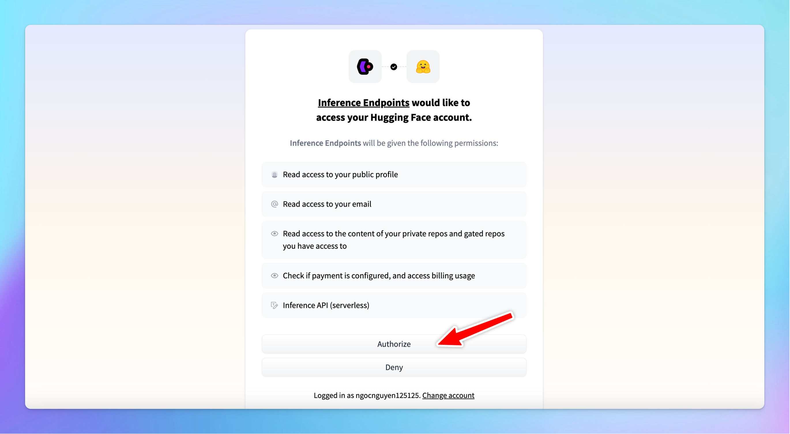

Hugging Face is a platform that hosts a wide range of AI models, which allows users to share and discover thousands of pre-trained models contributed by the community.

This article will walk you through deploying your own open-source language models (LLMs) from Hugging Face on TypingMind.

<aside>
  💡 Please note: you can apply this guide to add your text-to-image or text-to-speed models that are available on HuggingFace too.
</aside>

[https://www.youtube.com/watch?v=RGlATRjmgdc](https://www.youtube.com/watch?v=RGlATRjmgdc)

# Step 1: Set up your Hugging Face endpoint

- Go to [https://ui.endpoints.huggingface.co/](https://ui.endpoints.huggingface.co/)
- Log in to your Hugging Face account if you haven't already.

- **Add payment method** since Hugging Face charges based on usage hours.

- Click **New endpoint**

- **Choose the mode**l you want to deploy. Hugging Face offers over 60,000 models, including Transformers, diffusers, and sentence Transformers.

- **Select a cloud provider and a region** close to your data (e.g., Europe, North America, Asia Pacific).
- **Select the GPU**: make sure the selected GPU has enough memory for the model. The default selection is usually optimal. You can totally select your preferred GPU, but avoid choosing a low-memory GPU for a high-memory model.

- To manage costs, set the model to automatically **scale to zero after a specified period of inactivity.**

**_Example_**_: Set the endpoint to scale to zero after 2 hours of inactivity. This means the endpoint will shut down after being idle, which helps save on usage costs. Be aware that restarting the endpoint after it scales to zero may take a few minutes._

- Choose the **Protected** type for endpoint security. This setting allows that only users with the correct token can access the model.
- Click **Create Endpoint**. Note that it may take a few minutes to create the endpoint.

<aside>
  💡 Some models may require specific adjustments. For example, if you encounter an error like “rope scaling must be a dictionary with two fields,” you'll need to modify the source code accordingly. Upload the corrected code to Hugging Face and redeploy the model.
</aside>

- Once **the endpoint is created**, it is ready for use.

# Step 2: Create your API key

- Go to [huggingface.co](http://huggingface.co) and log into your account

- Select **Settings** from the drop-down menu

- Click on the **Access Tokens** section in the sidebar and click **Create new token**

- **Token Name**: you can give your token a descriptive name, such as “typingmind”.
- For general use, ensure the following permissions are checked:
  - “Make calls to the serverless inference API”
  - “Make calls to inference endpoints”

- After setting the permissions, scroll down and click **Create**.
- Copy the API key immediately and store it in a secure location. You will need this key to link your deployed model with TypingMind.

# Step 3: Integrate with TypingMind

- Go to [TypingMind](https://typingmind.com/)
- Click on the **Model** button and then select **Manage Models**.
- Click on **Add Custom Model**.
- Fill in the following required fields:
  - **Name**: enter a name for your model.
  - **Icon URL**: optionally, provide a URL for an icon that represents your model.
  - **Endpoint**: copy the endpoint URL from your Hugging Face model page that you created in step 2 and paste it into the appropriate field.
    Make sure you append `/v1/chat/completions` at the end of the endpoint URL to make it compatible.
  - **Model ID**: this can be copied directly from the model page on Hugging Face.
    
- Click **Add** **Custom Headers**, type `Authorization` in the first box.
- In the second box, type `Bearer [Your API Key]`, replacing `[Your API Key]` with the actual key you generated earlier.
- Click **“Test”** to verify if the setup is working correctly.
- If successful, you should receive a confirmation that the model is ready to use.

- If the test fails, double-check the endpoint URL, API key, and permissions.

# Step 4: Start chatting!

Your model is now live on Typing Mind! Let’s start a conversation now:

