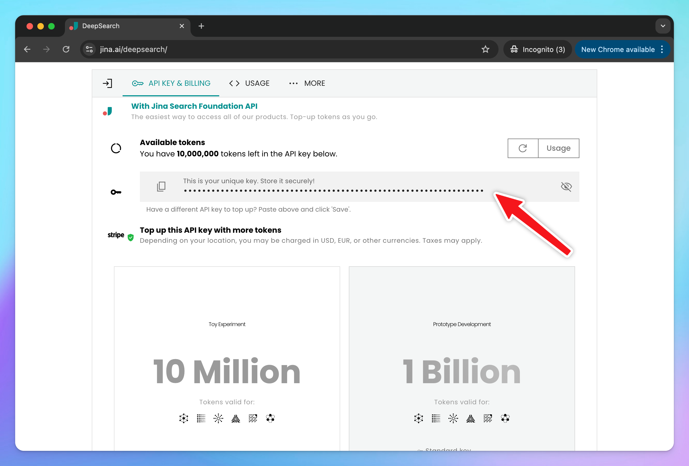

[DeepSearch](https://jina.ai/deepsearch/) is a powerful API from Jina that combines **search, content extraction, and multi-step reasoning**. Instead of giving you a quick but shallow response, it performs a series of steps: plan → search → read → reflect → answer.

This guide will walk you through how to use Jina Deep Research on TypingMind.

<aside>
  🔥

  **Go to [TypingMind app](https://typingmind.com/?ref=jinaai)** to set up and use Jina Deep Research **for free**.
</aside>

## Step 1: Get Jina Deep Research API key

Head over to [the DeepSearch page](https://jina.ai/deepsearch/?utm_source=chatgpt.com) and scroll to the **Deep Research API** section. You’ll be able to generate an API key that comes with a generous 10M free token allowance. No credit card or account is required.

Once generated, copy your key. It will look something like this: `jina_xxxxxxxxxxxxxxxxx`

Keep it private—this is the key that authenticates your requests.

## Step 2: Set up Jina Deep Research on TypingMind

To configure Jina Deep Research in TypingMind, go to Models —\> Add Custom Models:

/image%206.png)

Use the following details:

- **Name**: Jina Deep Research (or a name of your choice)
- **Endpoint**: [`https://deepsearch.jina.ai/v1/chat/completions`](https://deepsearch.jina.ai/v1/chat/completions)
- **Model ID**: `jina-deepsearch-v1`
- **Add Custom Header:** `Authorization` : `Bearer your_Jina_api_key`

## Step 3: Start working on your research tasks with Jina

With everything set up, select **Jina DeepSearch** as your model in TypingMind and begin experimenting.

