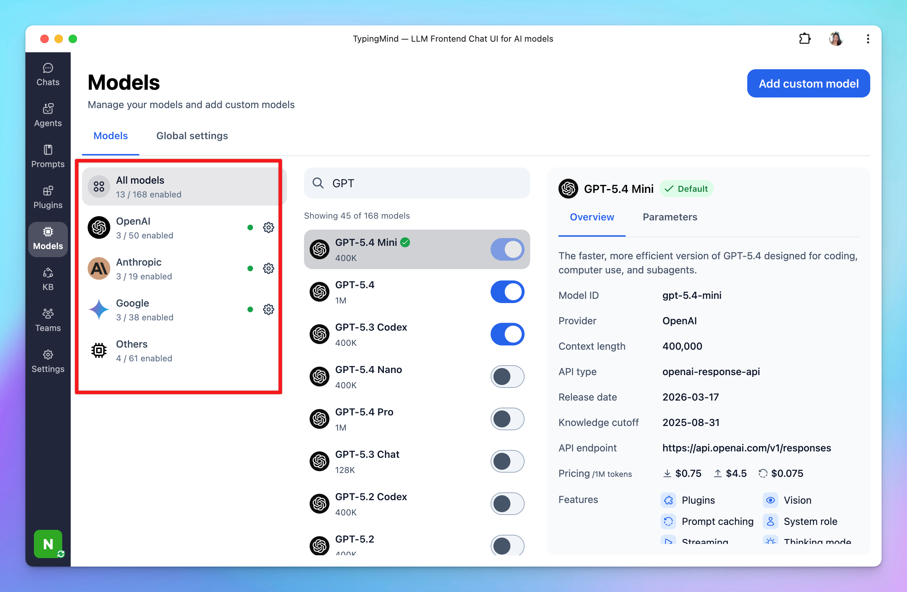

# Manage AI models

An overview of how to manage AI Chat Models more effectively on TypingMind.

To access the Model Management page, navigate “Model” on the left panel and click on it.

## Search and filter models

This helps you easily find specific models from a long list of AI models. 

- **Filter models from specific AI providers**: in the first row, there are some available categories like Gemini, OpenAI, Anthropic, or Custom so you can easily filter the AI models based on service providers.

- **Search models**: you can type a model name on the search box to search for an AI model you want to interact with.

## View model information

Access detailed information about each model to understand its current context length, and which features they support such as plugins, vision, prompt caching, background mode, thinking mode, etc.

To view the model details, you just need to click on that specific model:

## Set default model

You can set one model, or multiple models, as the default for new chats.

## Edit/duplicate custom models

Modify existing custom models as needed. 

- Click on the model
- Click Edit or Duplicate icon to edit or duplicate the custom model

## Re-arrange model list

Organize the model list according to your preferences for easier access and better workflow management.

Simply click on the Reorder button right next to the search box —> Drag and drop as you want.

## Control model visibility

Choose which models should be visible on the model list for quick selection while chatting. 

Click on the toggle icon next to each model to enable or disable the model visibility.

