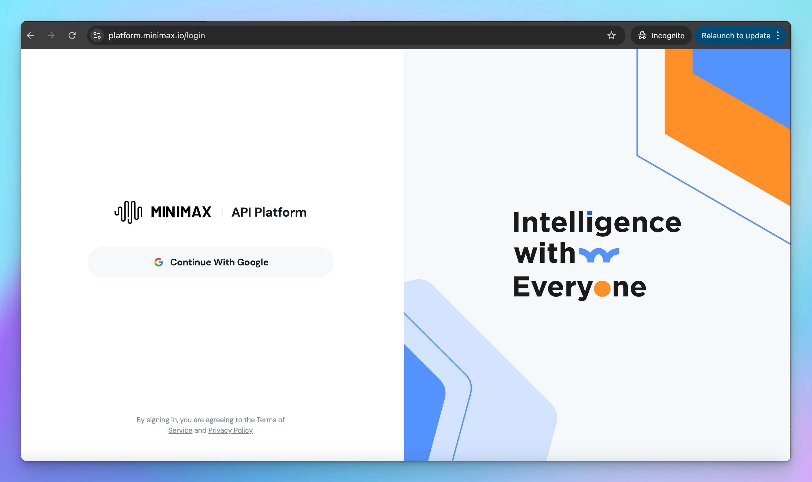

# MiniMax

Learn how to set up MiniMax models on TypingMind.

## Step 1: Create a MiniMax API account

Go to [https://platform.minimax.io/login](https://platform.minimax.io/login) and create a new MiniMax API account.

## Step 2: Set up MiniMax API account

You can go to [https://platform.minimax.io/user-center/basic-information/interface-key](https://platform.minimax.io/user-center/basic-information/interface-key) to get the API key and copy it to a safe place -you’ll need it to set up MiniMax on TypingMind.

## Step 3: Set up MiniMax as custom model on TypingMind

On TypingMind, go to Models → Add Custom Models and enter the following details:

- Give the model any name you prefer
- Enter the endpoint: [**`https://api.minimax.io/v1/chat/completions`**](https://api.minimax.io/v1/chat/completions)
- Enter the Model ID and context length, for example, `MiniMax-M2` **,** context length 200,000 tokens.
- Enable **Support Plugins** if you want to use plugins with this model.
- Add a custom header row, then enter `Authorization` and the API key in the value textbox in the format: `Bearer your_api_key` - with the API key is the copied API key in step 2.
- Click “**Test**” to verify the information is correct
- Click **Add Model**.

<aside>
💡

MiniMax M2 is currently available for free, so you don’t need to top up any API credits at this time.

In the future, you may need to add credits at [https://platform.minimax.io/user-center/payment/balance](https://platform.minimax.io/user-center/payment/balance) to continue using the models via API.

</aside>

## Step 4: Use MiniMax M2 via TypingMind

Start a conversation with MiniMax on TypingMind!

