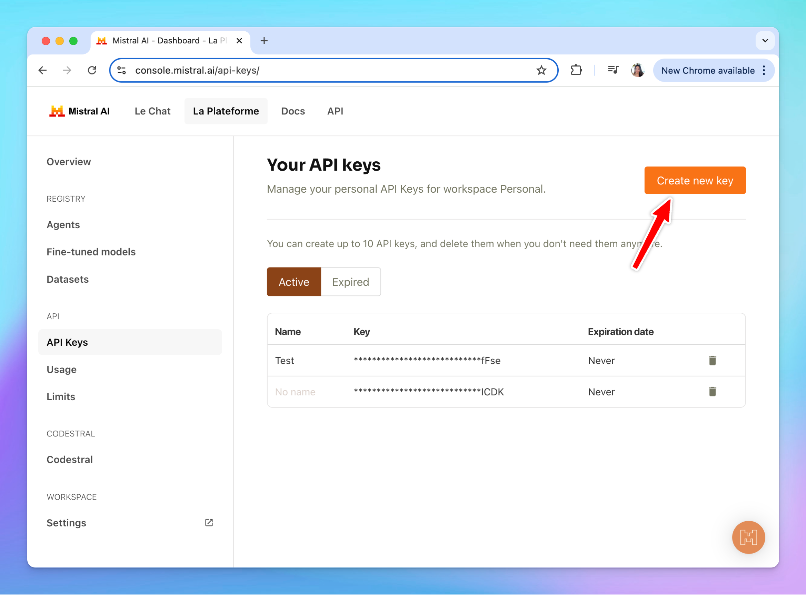

It’s easy to setup Typing Mind for using with Mistral AI ([https://mistral.ai/](https://mistral.ai/)). Here is a quick guide.

[https://www.youtube.com/watch?v=H2Eb46wBypw](https://www.youtube.com/watch?v=H2Eb46wBypw)

## Get a Mistral AI account

You can sign up from [https://mistral.ai/](https://mistral.ai/) or another service that provide MistralAI models. Typing Mind will work with any endpoint that have the compatible API schema.

Once you have an account, go to [https://console.mistral.ai/api-keys/](https://console.mistral.ai/api-keys/) to create an API key:

## Add a custom model in Typing Mind:

Go to [typingmind.com](http://typingmind.com) and create a new Custom Model as follow:

- Go to Models —\> Click Add Custom Model
- Enter any name.
- Enter the exact endpoint from the [API document](https://docs.mistral.ai/): [`https://api.mistral.ai/v1/chat/completions`](https://api.mistral.ai/v1/chat/completions)
- Enter the Model ID and context length: `codestral-latest`, `mistral-large-latest`, `pixtral-large-latest`, etc. View all available models here: [https://docs.mistral.ai/getting-started/models/models\_overview/](https://docs.mistral.ai/getting-started/models/models_overview/)
- Add a custom header row, then enter `Authorization` and the API key in the value textbox in the format: `Bearer your_api_key`
- Click “**Test**” to verify the information is correct
- Click **Add Model**.

<aside>
  💡 **Quick troubleshooting guide:**
  ⚠️ **If you are using mistral.ai**, your account must have an active subscription for the API key to work.
  **⚠️ Newly created API key will take 2-3 minutes to start working**. If you click the “Test” button but failed, try again in 2-3 minutes.
</aside>

## Use Mistral AI in Typing Mind

You can now select the newly created custom model and chat with it.

