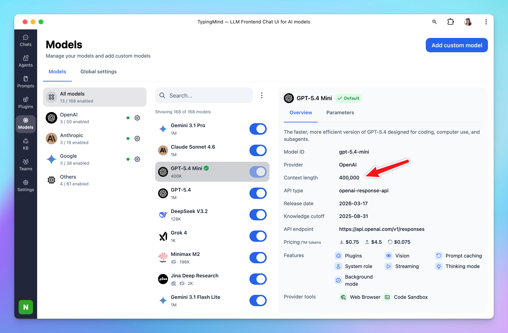

The context window of a large language model is the amount of text, in tokens, that the model can consider or "remember" at any one time. An LLM's context window can be thought of as the equivalent of its working memory - it determines how long of a conversation it can carry out without forgetting details, and the maximum size of documents or code samples it can process at once.

<aside>
  💡

  **Token** estimation works as follows: 1 token ≈ 0.75 words in English, meaning 1,000 tokens ≈ 750 words. A million tokens is roughly 750,000 words, or the equivalent of 10–15 full-length novels processed at once
</aside>

## **Why it matters**

Context length determines how much the model can “remember” during a single request. It affects:

- long conversations
- large documents
- codebases
- multi-step reasoning
- retrieval-heavy workflows

## What happen when you reached context length limit on TypingMind?

As you may know, each chat model has a different context window, for example::

- **GPT-5.4**: 1M tokens
- **Claude 4.5 Sonnet**: 200,000 tokens
- **Gemini 3.1 Pro**: 1M tokens

When the context window fills up, **the app summarizes key information from older messages and retains that summary so the AI can stay relevant**, then removes the original messages to free up context space.

You can control this context summary option by going to Settings → Internal Prompts → Auto summarize long conversations:

<aside>
  💡 Please note that the AI model will continuously preserve the system message that you set up via System Instruction or AI Agent setting.
</aside>