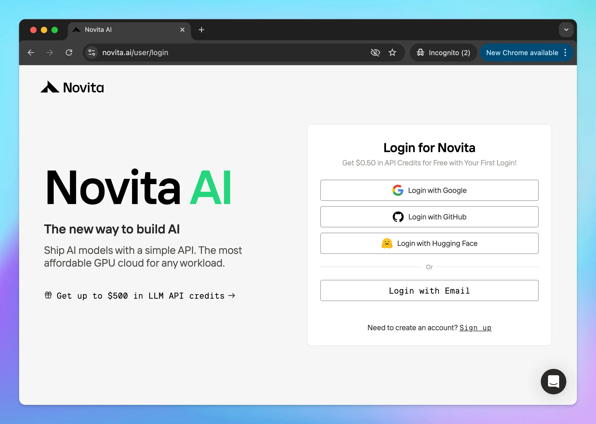

It’s easy to set up TypingMind to use the models available on Novita AI ([https://novita.ai/](https://novita.ai/)). Here’s a quick guide.

## Step 1: Log in / Sign up for a Novita AI account

You can sign up from [https://novita.ai/user/login](https://novita.ai/user/login) to create a new Novita AI account or log in if you already had an account.

## Step 2: Get Novita API key

Go to [https://novita.ai/en/settings/key-management](https://novita.ai/en/settings/key-management) to create an API key for Novita:

<Frame>
  
</Frame>

## Step 3: Set up Novita Models on TypingMind

You have two options to set up Novita Models on TypingMind:

### 1. Use available Novita models 

- Go to [typingmind.com](http://typingmind.com) 
- Go to Models → Switch to API keys tab and enter the API key for Novita

<Frame>
  
</Frame>

After that, switch back to Models tab → Select Novita and enable the models you want to chat with.

<Frame>
  
</Frame>

### 2. Use Novita models as custom models

This is usually helpful when a new model is released and the app has not been updated yet.

- Go to Models → Click Add Custom Models
- Enter any model name.
- Enter the exact endpoint from the [API document](https://novita.ai/docs/guides/llm-api): [`https://api.novita.ai/v3/openai/chat/completions`](https://api.novita.ai/v3/openai/chat/completions)
- Enter the Model ID and context length: for example, `deepseek/deepseek-r1-0528`, `meta-llama/llama-4-scout-17b-16e-instruct` . You can view all available models here: [https://novita.ai/models-console](https://novita.ai/models-console)
- Add a custom header row, then enter `Authorization` and the copied API key in the value textbox in the format: `Bearer your_api_key`
- Click “**Test**” to verify the information is correct
- Click **Add Model**.

## Step 4: Use Novita AI Models in TypingMind

You can now select the newly created custom model and chat with it.

