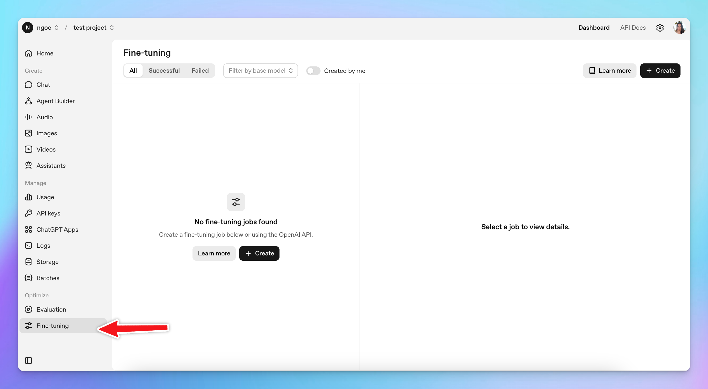
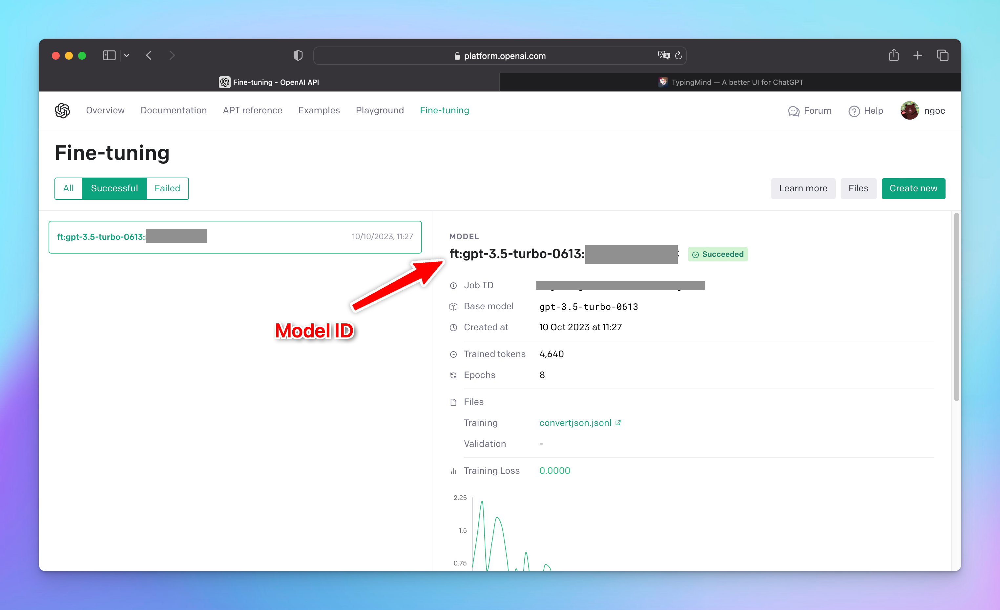

OpenAI's fine-tuning model can be used on TypingMind. Here are 3 simple steps to set it up:

## 1. Access Fine-tuning on OpenAI

First, log into your OpenAI API account at [https://platform.openai.com](https://platform.openai.com/) and go to “**Fine-tuning**”

## 2. Create a fine-tuning model

Click “**Create new**” and select the **GPT-3.5-turbo** as the base model (TypingMind doesn’t support other base models now)

Upload the .jsonl file to use for training, please follow the [OpenAI instructions](https://platform.openai.com/docs/guides/fine-tuning) to create the file.

## 3. Get the model ID and API key

Once you're done with all of that, you'll get the **model ID**.

Copy it along with your OpenAI API key to a safe place, you will need them soon.

## 4. Set up fine-tuning model on TypingMind

Head over to [typingmind.com](http://typingmind.com), click "**Models**" on the left side panel. Then, select “**Add Custom Model**”.

Here’s how you fill in the fields:

- Name: `GPT-3.5 Fine-tuning` (or you can set any name you want)
- Endpoint: `https://api.openai.com/v1/chat/completions`
- Model ID: input the model ID you have just copied at step 3
- Context Length: 4096
- You can enable the “**Support Plugins**” toggle if you want to use the plugins for your fine-tuning model.
- Click “**Add Custom Headers**” and add: `Authorization`: `Bearer {{your OpenAI API key}}`

Here is what it looks like:

Hit “**Test**” to make sure the model work well and then click “**Add Model**”.

That's it! You're all set!