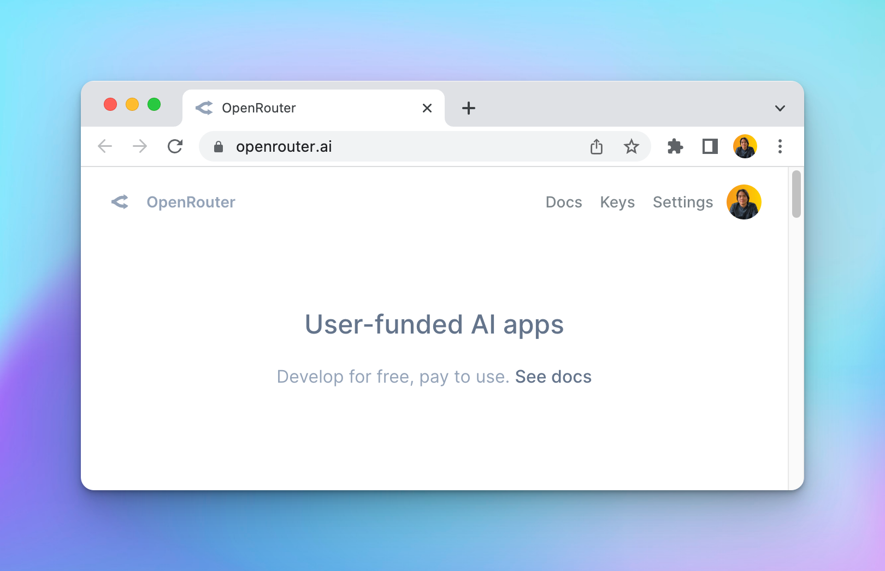
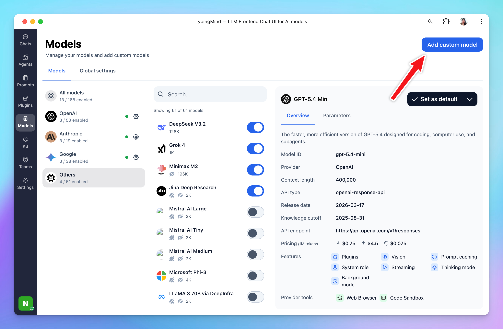

# OpenRouter

[OpenRouter](https://openrouter.ai/) is a platform/API layer that lets yoiu access many different AI models from different providers such as OpenAI, Anthropic Claude, Minimax, Moonshot, Deepseek, etc.

Here is how to use OpenRouter models on Typing Mind.

## 1. Create an account

Go to [openrouter.ai](https://openrouter.ai) and create an account. Open Router allows you to use some model for free, or you can buy more credits to use the premium models.

## 2. Create an API key

After signing up, go to [https://openrouter.ai/keys](https://openrouter.ai/keys) to create an API key.

Enter “Typing Mind” to the name field. Leave the “Credit limit” empty to set the limit to unlimited.

## 3. Add Credits

Go to **Account** > **Settings**, scroll down to the credit section to **Add Credits** so you can use the generated API keys.

## 4. Add OpenRouter model to TypingMind as custom model

Click the Model tab on the left workspace bar, then click “**Add Custom Model**”.

Choose “**Import Open Router**”, enter the generated API key at Step 2 and click “**Check API Key**”

A list of chat models will be shown up, you can pick one or multiple chat models at a time from the list and scroll down to import the models.

## 5. Use the model

Now you can select the newly added custom model and start chatting:

