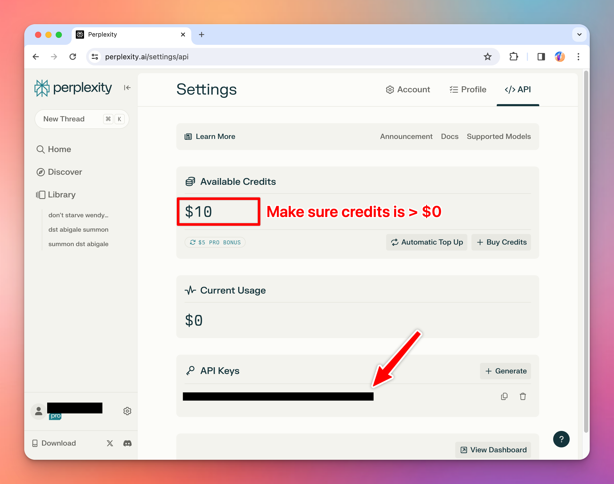
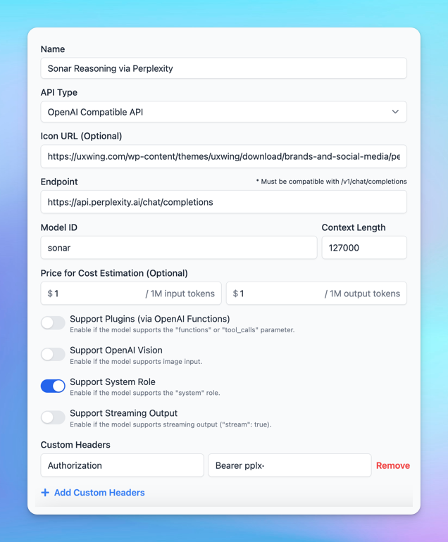

It’s easy to set up Typing Mind for using with Perplexity AI ([https://www.perplexity.ai/](https://www.perplexity.ai/)) Here is a quick guide.

<aside>
  💡 Perplexity AI model is different from the Perplexity Plugin:

  * **Perplexity model** optimizes for the entire conversation, and answers user queries effectively using Perplexity datasets.
  * **Perplexity plugin** optimizes searching information during the conversation to get up-to-date responses. You can enable or disable it whenever you want or use it with other AI models such as GPT-4o, or Claude to enhance the AI responses.
</aside>

## Get a Perplexity AI account

Go to [https://www.perplexity.ai/](https://www.perplexity.ai/) and sign up for an account. Then go to  [https://www.perplexity.ai/settings/api](https://www.perplexity.ai/settings/api) to get your API key.

Note that you may need to **top-up your credit** to use the API.

## Add a custom model in Typing Mind

Go to [typingmind.com](http://typingmind.com) and create a new Custom Model as follow:

- Click **Add Custom Model**
- Enter any name you want, for example “Perplexity”
- Enter the exact endpoint from the [API document](https://docs.perplexity.ai/reference/post_chat_completions): `https://api.perplexity.ai/chat/completions`
- Enter the Model ID and context length, for example:
  - `llama-3-sonar-small-32k-chat`, `llama-3-sonar-large-32k-chat`, `llama-3-sonar-large-32k-online`, `sonar-reasoning`
  - Find more model ID here: [https://docs.perplexity.ai/guides/model-cards](https://docs.perplexity.ai/guides/model-cards)
- Click “**Add Custom Headers**” and add the following header:

`Authorization`: `Bearer your_API_key`

- Click “**Test**” to verify the information is correct
- Click **Add Model**.
- Logo URL (suggested): [https://seeklogo.com/images/P/perplexity-ai-logo-13120A0AAE-seeklogo.com.png](https://seeklogo.com/images/P/perplexity-ai-logo-13120A0AAE-seeklogo.com.png)

Here is what it looks like:

<aside>
  💡 **Quick troubleshooting guide:**
  ⚠️ If you see errors like “**Sorry, Custom Model has rejected your request”**, click on the Model dropdown menu → Model Settings → Advanced Settings → Then reset all parameters to default.
  \*\*\*\*⚠️ If you see the errors like **“…After the (optional) system message(s), user and assistant roles should be alternating”**, please enable Support System Role for custom model settings.
</aside>

## Use Perplexity AI model

You can now select and use Perplexity model from the dropdown menu.

