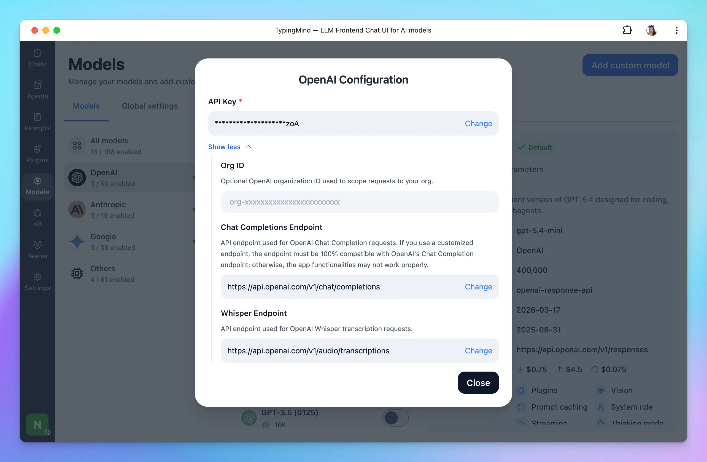

## For available models

We provide chat models from the following providers:

- [**OpenAI**](/manage-and-connect-ai-models/openai-\(gpt-5-gpt-4.1\)): access GPT-5, GPT-4, GPT-3.5 series.
- [**Anthropic Claude**](/manage-and-connect-ai-models/anthropic-claude): access Claude 4.6, Claude 4.5 series.
- [**Google Gemini**](/manage-and-connect-ai-models/google-gemini-\(gemini-3.1-nano-banana\)): access Gemini 3.1, Gemini 3.0, Gemini Nano Banana.

You can add or manage API keys in any of these places:

- Click **Models** in the left sidebar, then click the gear icon next to the AI provider you want to connect with.
- Go to **Settings** and open **API Keys**.
- Click your **profile icon** in the bottom-left corner and select **API Keys**.

## For other models

In case you want to use chat models not available within our provided list above, such as Azure OpenAI, Perplexity, Mistral, etc., you can completely set up these chat models on TypingMind by following the steps below:

- Open the Model settings on the left side panel.
- Click on **Add Custom Models**.
- Set up the custom models for:
  - [Azure OpenAI](https://docs.typingmind.com/chat-models-settings/use-azure-openai)
  - [Mistral AI](https://docs.typingmind.com/chat-models-settings/use-with-mistral-ai)
  - [Perplexity](https://docs.typingmind.com/chat-models-settings/use-with-perplexity-ai)
  - [OpenRouter](https://docs.typingmind.com/chat-models-settings/use-openrouter-models)

<Tip>
  More guidelines can be found at [https://docs.typingmind.com/chat-models-settings](https://docs.typingmind.com/manage-and-connect-ai-models)
</Tip>

