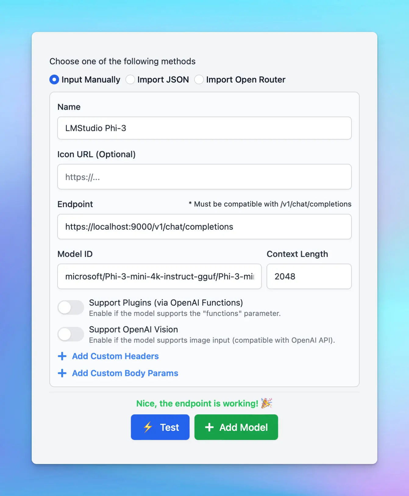

For the macOS version and Setapp version, due to **Apple’s security policy**, requests to `http`  protocol are blocked. If you want to connect the local custom models to the macOS app, you will need to **setup HTTPS.** 

Here are the step-by-step to set up HTTPS to get the Local AI Models such as Ollama, LMStudio, etc. to work on TypingMind Mac App:

# **Step 1: Set up Node.js**

1. Go to [https://nodejs.org/en](https://nodejs.org/en)
2. Click “**Download Node.js**”
3. Install Node.js by following the installation prompts. 

To confirm that Node.js was installed successfully, open a Terminal window,  type the `node -v` command and press Enter. It will return the Node JS version you installed currently (for example: `v20.12.2`)

# **Step 2: Install Homebrew**

1. Go to [https://brew.sh/](https://brew.sh/)
2. You'll see a command under "**Install Homebrew**". Copy this command. 

`/bin/bash -c "$(curl -fsSL [https://raw.githubusercontent.com/Homebrew/install/HEAD/install.sh](https://raw.githubusercontent.com/Homebrew/install/HEAD/install.sh))"`

1. Open your Terminal window
2. Paste the copied command into the terminal and press Enter.
3. Follow the on-screen instructions. It may ask for your device password; this is normal as it requires permission to install the software.

# **Step 3: Create a certificate for HTTPS on your local device**

To securely run your application over HTTPS, you need an SSL certificate. 

1. In your terminal, install `mkcert` by running:

```bash
brew install mkcert
```

1. If you are using Firefox, you also need to install `nss`. Run:

```bash
brew install nss
```

# **Step 4: Install and generate local HTTPS certificate**

1. First, run the following command to install `mkcert` on your machine:

```bash
mkcert -install
```

1. Generate a local certificate for "localhost":

```bash
mkcert localhost
```

# **Step 5: Set up Local HTTPS proxy**

To enable HTTPS for your local server, you'll use `npx` to run `local-ssl-proxy` with the following command:

```bash
npx local-ssl-proxy --key localhost-key.pem --cert localhost.pem --source 9000 --target 1234
```

- **`-source 9000`**: the source port where the proxy will listen for HTTPS requests. You can choose any port number greater than 1000, but it should be different from the port your Local AI Model uses. In this example, we use `9000`.
- **`-target 1234`**: the target port where the local model is running. Replace `1234` with the actual port number used by your local model. We use `1234` here as an example because it is the port number of LMStudio.

When successful, the terminal appears the following messages `Started proxy: [https://localhost:9000](https://localhost:9000/) → [http://localhost:1234](http://localhost:1234/)`

# **Step 6: Set up custom model with HTTPS on TypingMind**

Now you can access the model endpoint using `https://localhost:9000` instead of `http://localhost:1234`.

Here’s an example to set Phi-3 via LMStudio on TypingMind MacApp:

