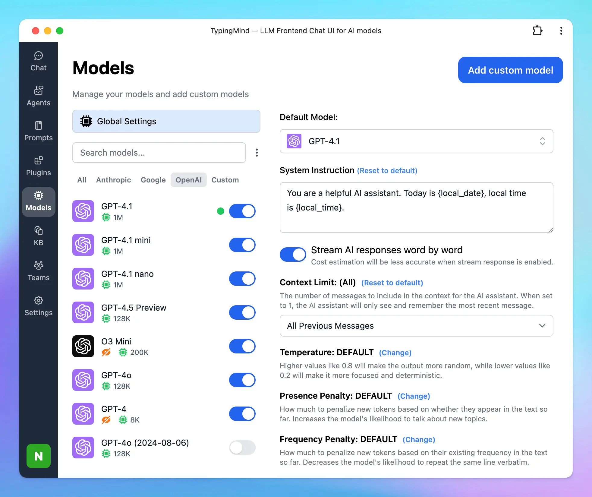

Hey there! Choosing the right AI model in 2025 can feel like picking the perfect tool from a crowded toolbox. Even when you're writing a blog, coding an app, researching for a project, or diving into social media trends, each AI model has its own pros and cons.

We have done a deep dive into the top players—OpenAI's GPT models, Anthropic's Claude, Google's Gemini, Perplexity, Meta AI's Llama, DeepSeek, and xAI's Grok—to help you find the best fit for your needs.

Let's check it out!

## Models' Capabilities

Here's a snapshot of the top AI models to help you compare at a glance. <Icon icon="check" /> means the feature is supported, <Icon icon="thumbs-up" /> means it's the best in that category, and <Icon icon="minus" /> means it's not supported. I've also included API pricing and key limits.

| **Task** | **GPT Models** | **Claude Models** | **Gemini Models** | **Perplexity** | **Grok** | **Llama Models** | **DeepSeek** |
| --- | --- | --- | --- | --- | --- | --- | --- |
| **API Available** | <Icon icon="check" /> | <Icon icon="check" /> | <Icon icon="check" /> | <Icon icon="check" /> | <Icon icon="check" /> | <Icon icon="check" /> | <Icon icon="check" /> |
| **API Pricing** | Free to use |  |  |  |  |  |  |
| **Everyday Answers** | <Icon icon="check" /> | <Icon icon="check" /> | <Icon icon="check" /> | <Icon icon="check" /> | <Icon icon="check" /> | <Icon icon="check" /> | <Icon icon="check" /> |
| **Writing** | <Icon icon="check" /> | <Icon icon="thumbs-up" /> | <Icon icon="check" /> | <Icon icon="minus" /> | <Icon icon="check" /> | <Icon icon="check" /> | <Icon icon="minus" /> |
| **Coding** | <Icon icon="check" /> | <Icon icon="thumbs-up" /> | <Icon icon="check" /> | <Icon icon="minus" /> | <Icon icon="check" /> | <Icon icon="check" /> | <Icon icon="check" /> |
| **Math** | <Icon icon="check" /> | <Icon icon="check" /> | <Icon icon="check" /> | <Icon icon="check" /> | <Icon icon="check" /> | <Icon icon="check" /> | <Icon icon="check" /> |
| **Reasoning** | <Icon icon="check" /> | <Icon icon="check" /> | <Icon icon="check" /> | <Icon icon="check" /> | <Icon icon="check" /> | <Icon icon="check" /> | <Icon icon="check" /> |
| **Web Search** | <Icon icon="check" /> | <Icon icon="check" /> | <Icon icon="check" /> | <Icon icon="thumbs-up" /> | <Icon icon="check" /> | <Icon icon="minus" /> | <Icon icon="check" /> |
| **Deep Research** | <Icon icon="check" /> | <Icon icon="minus" /> | <Icon icon="check" /> | <Icon icon="check" /> | <Icon icon="check" /> | <Icon icon="minus" /> | <Icon icon="check" /> |
| **Native Image Generation** | <Icon icon="check" /> | <Icon icon="minus" /> | <Icon icon="check" /> | <Icon icon="minus" /> | <Icon icon="check" /> | <Icon icon="check" /> | <Icon icon="minus" /> |
| **Video Analysis** | <Icon icon="minus" /> | <Icon icon="minus" /> | <Icon icon="check" /> | <Icon icon="minus" /> | <Icon icon="minus" /> | <Icon icon="minus" /> | <Icon icon="minus" /> |
| **Computer Use** | <Icon icon="check" /> | <Icon icon="check" /> | <Icon icon="minus" /> | <Icon icon="minus" /> | <Icon icon="minus" /> | <Icon icon="minus" /> | <Icon icon="minus" /> |

## Deep Dive: Which AI Should You Use?

### 1. GPT Models (OpenAI)

**Rate:** 8.5/10

**Best for**: General-purpose use, content creation, conversational interfaces, productivity.

OpenAI's GPT family is still the most widely deployed and user-friendly line of models. GPT-4.5 (`o3`) delivers smooth, emotionally intelligent conversations and excels in content-heavy workflows.

However, it's **not the top performer when it comes to serious coding tasks**—often trailing behind Claude in code correctness, explanation clarity, and multi-step logic.

**Pros**:

- Natural, fluent writing and tone.
- Excellent for summarizing, brainstorming, and communication tasks.
- Some models have higher context limit (GPT-4.1 with 1M context), appropriate to process long documents or conversations.

**Cons**:

- Mediocre at complex coding, debugging, or multi-step logic.
- Prone to hallucinations in technical domains.
- Feels more "surface-level" compared to Claude in deep thinking tasks.

### 2. Claude Models (Anthropic)

**Rate:** 8/10

**Best for**: Deep reasoning, coding, document analysis, structured workflows.

Claude models excel at tasks that require step-by-step reasoning, thoughtful summarization, and precision. They're especially good for analyzing long documents or solving technical problems. Compared to GPT, Claude's responses often feel **less polished but more concise and human**—as if you're talking to someone who thinks before they speak.

**Pros**:

- Strong at logic, coding, and long-form understanding.
- Responses feel grounded, natural, and to the point.

**Cons**:

- Compared to some other models, Claude supports a smaller context window for conversations.
- Higher cost.

### 3. Gemini Models (Google)

**Rate:** 7/10

**Best for**: Long-context tasks, video analysis.

Gemini is technically powerful on paper—with huge context windows and native multimodal input—but in real-world use, the experience can feel underwhelming. Outside of specific use cases like long document handling or video understanding, it often lags behind Claude and GPT in most use cases.

**Pros**:

- Handles very long input well (up to 2M tokens).
- Can process and analyze videos and other media types.
- Low price.

**Cons**:

- Reasoning and coding not noticeably better than peers.
- Output can be inconsistent or generic depending on prompt structure.

### 4. Perplexity (Perplexity AI)

**Rate:** 7/10

**Best for**: Real-time web-grounded search, factual Q&A.

Perplexity AI is optimized for real-time, web-grounded search and question-answering tasks. It delivers fast, accurate, and concise answers, making them ideal for users seeking up-to-date information with source citations.

**Pros**:

- Real-time access to web information with source citations.
- Tailored for factual accuracy and readability.

**Cons**:

- Primarily optimized for search and factual Q&A; may not excel in creative writing or coding tasks or other tasks.

### 5. Llama Models (Meta AI)

**Rate:** 6.5/10

**Best for**: Developers, startups, self-hosting, privacy-sensitive and cost-efficient deployments.

Meta's LLaMA line is open-source and increasingly competitive. While LLaMA 3 models (8B, 70B) are strong for lightweight tasks, the early **LLaMA 4 "Scout" model** has pushed limits by introducing support for **up to 10 million tokens**—ideal for processing entire books, codebases, or chat histories. Performance-wise, they're still behind Claude and GPT in general fluency, but they're rapidly catching up and are far more customizable.

**Pros**:

- Fully open-source and freely available for commercial use.
- Great cost-performance ratio.
- Can be fine-tuned and self-hosted.
- **Newer models (like LLaMA 4 Scout) support up to 10M tokens of context** — the highest available publicly.

**Cons**:

- Output quality is variable depending on the model size and tuning.
- Not as fluent or context-aware as Claude or GPT out of the box.
- Requires more setup and ML knowledge to deploy effectively.

### 6. DeepSeek (DeepSeek AI)

**Rate:** 6.5/10

**Best for**: Reasoning-heavy tasks, math, logic, and budget-conscious coding use.

DeepSeek (like DeepSeek R1 and V3) is a budget-friendly, open-source model that punches above its weight in coding and math.

**Pros**:

- Impressive performance in math and logic benchmarks (e.g., AIME, GPQA).
- Open-source and very cost-effective for developers and researchers.

**Cons**:

- Still lags behind Claude or GPT in coding or deep reasoning chains.
- Less polished language generation and weaker long-form output.
- Not great for creative writing—responses lack flair.

### 7. Grok (xAI)

**Rate:** 7.5/10

**Best for**: Coding, creative writing, real-time information retrieval, and engaging conversations.

Grok 3 has emerged as a strong contender in the AI space, particularly good at **coding** and **creative writing** tasks. Its advanced reasoning modes, such as "Think" and "Big Brain," enable it to tackle complex problems and generate nuanced content.

**Pros**:

- Strong capabilities in code generation and problem-solving.
- Offers a witty and engaging tone, producing coherent and stylistically consistent narratives.

**Cons**:

- While Grok 3 performs well in many areas, it may occasionally produce inaccuracies, especially when dealing with real-time data.
- Though proficient, it may not fully capture the nuance and emotional depth found in human writing.

## Disclaimer

These ratings and impressions are based on a combination of **personal experience** and **social research** — including feedback from the AI community, casual testing, and public discussions. They're meant to give you a general sense of how these models perform in everyday use.

That said, **they don't reflect 100% of user experiences**, and different people (or workflows) may get very different results depending on the task, prompt style, or platform used.

The best way to find the right model? Try them out yourself on TypingMind - compare multiple AI models in parallel to find the best one for your needs!

<Tip>
  All above models can be set up on TypingMind: [https://docs.typingmind.com/manage-and-connect-ai-models](https://docs.typingmind.com/manage-and-connect-ai-models)
</Tip>