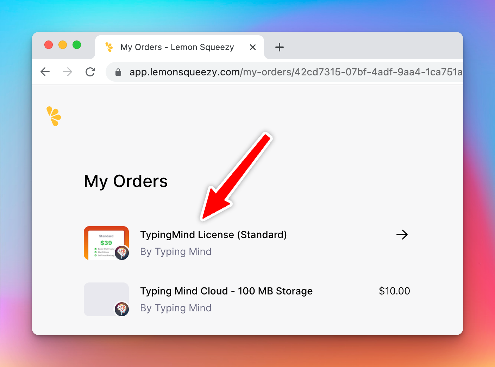

Each license key allows you to use Typing Mind on 5 devices, which is typically enough for one user. Team license keys can be used on more devices.

## Recover your license:

👉 Please go to [**https://typingmind.com/license**](https://typingmind.com/license) to recover your license using the email you used to make the purchase.

---

## For purchases made via Lemon Squeezy:

1. Go to the **My Orders** ([https://app.lemonsqueezy.com/my-orders/](https://app.lemonsqueezy.com/my-orders/)) page and login with your purchase email.

<aside>
  👉 [Go to My Orders Page](https://app.lemonsqueezy.com/my-orders)
</aside>

1. Click on the order you purchased.

1. Click on the license key.

1. Here, you will find all of your linked devices. Click “Deactivate” to unlink the devices you no longer use.

## Shortcut to unlink your device

If you still have access to the previous device, simply open the License Key popup and click “Unlink this device”.

