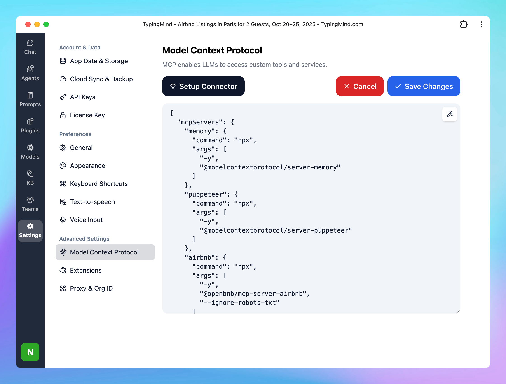

# Connect Multiple MCP Servers

Once you have finished setting up [MCP connectors](https://docs.typingmind.com/model-context-protocol-(mcp)-in-typingmind), you can connect multiple MCP servers to TypingMind.

## **Step 1: Edit the server configuration**

Click on Edit Servers to configure your MCP servers:

```json
{
  "mcpServers": {
    "memory": {
      "command": "npx",
      "args": [
        "-y",
        "@modelcontextprotocol/server-memory"
      ]
    },
    "puppeteer": {
      "command": "npx",
      "args": [
        "-y",
        "@modelcontextprotocol/server-puppeteer"
      ]
    },
    "airbnb": {
      "command": "npx",
      "args": [
        "-y",
        "@openbnb/mcp-server-airbnb",
        "--ignore-robots-txt"
      ]
    },
    "notion": {
      "command": "npx",
      "args": [
        "-y",
        "@suekou/mcp-notion-server"
      ],
      "env": {
        "NOTION_API_TOKEN": "your_notion_auth_token"
      }
    }
  }
}
```



Each server entry includes:

- `command`: the executable used to start the server (usually `npx`)
- `args`: the arguments passed to that command
- `env` (optional): environment variables required for authentication or configuration

You can add as many servers as you like using the same structure.

## **Step 2: Save the configuration**

Save your changes after editing the file. TypingMind will use this configuration to recognize and launch your MCP servers.

## **Step 3: Enable each server**

In TypingMind, enable each MCP server as a **separate plugin**. Go Plugins —> Enable the connected MCP servers:


Once enabled, TypingMind will automatically connect to all configured servers at startup.