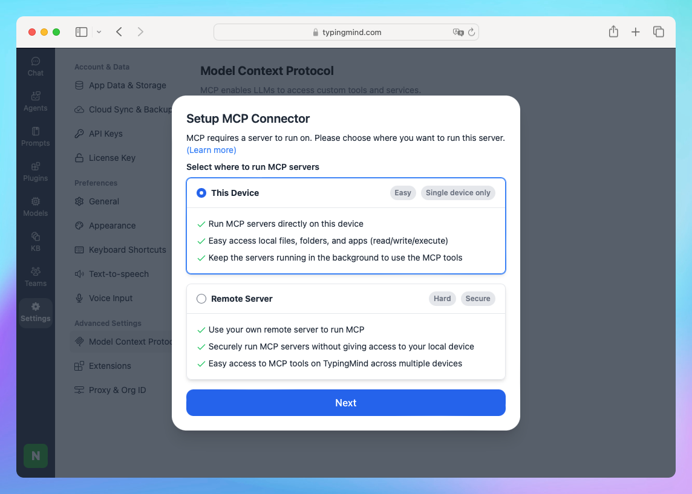

This guide will walk you through setting up the TypingMind Model Context Protocol (MCP) connector to run securely over HTTPS on your local machine, which is often required for browsers like Safari.

## **Ph**ase 1: Environment Setup

### **Step 1: Set up Node.js**

- Go to Node.js website: [https://nodejs.org/en](https://www.google.com/url?sa=E&q=https%3A%2F%2Fnodejs.org%2Fen)
- Download the recommended LTS version for macOS.
- Run the downloaded installer and follow the installation prompts.

**Verify Installation:** Open a Terminal window. Type `node -v` and press Enter. You should see the installed version number (e.g., v20.12.2).

### **Step 2: Install Homebrew**

Homebrew is a package manager for macOS that simplifies installing software like mkcert.

- Go to the Homebrew website: [https://brew.sh/](https://brew.sh/)
- Copy the command shown under "**Install Homebrew**". It will look similar to this (check the website for the latest command):

```bash
/bin/bash -c "$(curl -fsSL https://raw.githubusercontent.com/Homebrew/install/HEAD/install.sh)”
```

- Open your Terminal window and paste the copied command into the terminal and press Enter.
- Follow the on-screen instructions: you might be asked for your macOS user password – this is normal. Homebrew may also instruct you to run a couple of commands to add it to your PATH; follow those instructions carefully if prompted.

**Verify Installation:** Type `brew --version` in the Terminal and press Enter. You should see the Homebrew version number.

### **Step 3: Install mkcert**

`mkcert` is a tool to create locally-trusted development certificates.

- In your Terminal, run:

```bash
brew install mkcert
```

- *(Optional)* If you use Firefox or applications that might use its trust store, install nss:

```bash
brew install nss
```

### **Step 4: Create and Install Local Certificate Authority (CA) & Generate Certificate**

- Install the mkcert local CA into your system and browser trust stores. You just need to run this once per machine:

```bash
 mkcert -install
```

- Generate the certificate files specifically for `localhost`.

```bash
 mkcert localhost
```

This creates two files in your current directory:

- `localhost.pem` (certificate)
- `localhost-key.pem` (private key)

*You should see output confirming the files were created.* Keep the Terminal window open in this directory. 

## **Phase 2: Running and Connecting the MCP Connector with HTTPS**

### **Step 5: MCP Setup in TypingMind**

- Open TypingMind.
- Go to **Settings** on the left workspace bar
- Under "Advanced Settings", click on Model Context Protocol.
- Click the Setup MCP Connector button.
- A dialog box "Setup MCP Connector" will appear. Select the This Device option.
- Click Next.

### **Step 6: Prepare and run the MCP Server Command**

- You will see a command like this (token will be different):

```bash
npx @typingmind/mcp [auth_token]
```

**Do not run this command directly.**




You need to modify it to use the HTTPS certificates:

- Ensure you're in the same Terminal directory as your `.pem` files.
- Construct the modified command like this:

```bash
CERTFILE=./localhost.pem KEYFILE=./localhost-key.pem npx @typingmind/mcp [auth_token]
```

- Replace `[auth_token]` with the actual token from TypingMind (or copy the command in the app)

**Command breakdown:**

- `CERTFILE=./localhost.pem`: Path to your certificate
- `KEYFILE=./localhost-key.pem`: Path to your private key

**Run the command** by pressing Enter in Terminal.

You should see output like:


On TypingMind interface, you will see the status “Server Ready”, you can easily click on Get started:


Keep this Terminal window open while using TypingMind.