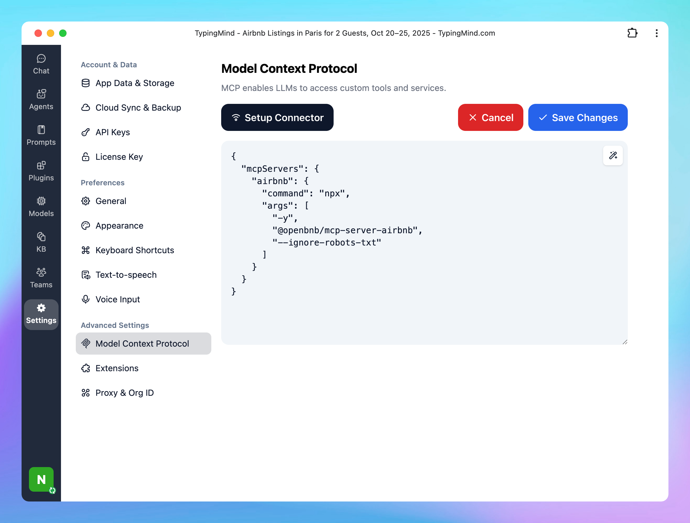

# TypingMind MCP + Airbnb

This guide will help you set up the Airbnb **MCP server**, provides AI assistants on TypingMind with the ability to search Airbnb listings with advanced filtering capabilities and detailed property information retrieval.

## Why setting Airbnb MCP on TypingMind?

Connecting the **Airbnb MCP server** to TypingMind lets your AI assistant directly access Airbnb data in real time.

With this setup, you can:

- Search Airbnb listings by location, date, price, or amenities.
- Retrieve detailed property information such as reviews, host data, and availability.
- Automate property discovery and comparison using natural language prompts.
- Integrate Airbnb search results into larger workflows when using TypingMind with other MCP servers (like Notion or n8n).

## Step-by-step to install Airbnb MCP on TypingMind

### Step 1: Set up MCP Connectors

In TypingMind, go to Settings → Advanced Settings → Model Context Protocol to start setup your MCP connector. The MCP Connector acts as the bridge between TypingMind and the MCP servers. 

MCP servers require a server to run on. TypingMind allows you to connect to the MCP servers via:

- Your own local device
- Or a private remote server.


If you choose to run the MCP servers on your device, run the command displayed on the screen.


<aside>
💡

For detailed setup instructions or guidance on setting up the Team version, visit [https://docs.typingmind.com/model-context-protocol-in-typingmind](https://docs.typingmind.com/model-context-protocol-in-typingmind)

</aside>

### Step 2: Add the Airbnb MCP Server to TypingMind

- Click on Edit Servers to add MCP server
- Add the following JSON to configure the Airbnb MCP server:

```json
{
  "mcpServers": {
    "airbnb": {
      "command": "npx",
      "args": [
        "-y",
        "@openbnb/mcp-server-airbnb",
        "--ignore-robots-txt"
      ]
    }
  }
}
```

More information about Airbnb mcp: [https://github.com/openbnb-org/mcp-server-airbnb](https://github.com/openbnb-org/mcp-server-airbnb)



### Step 3: Enable Airbnb via Plugin section

After the MCP servers are added successfully, it will show up in your **Plugins** page to be used like plugin. You can use the MCP tools directly or assign them to AI agent like other plugins.

- Go to the **Plugins** section in TypingMind.
- You should see a new plugin called **"airbnb"**.
- Enable the plugin


### Step 4: Start chatting

You’re all set! Now you can search Airbnb listings and plan your trip instantly!

