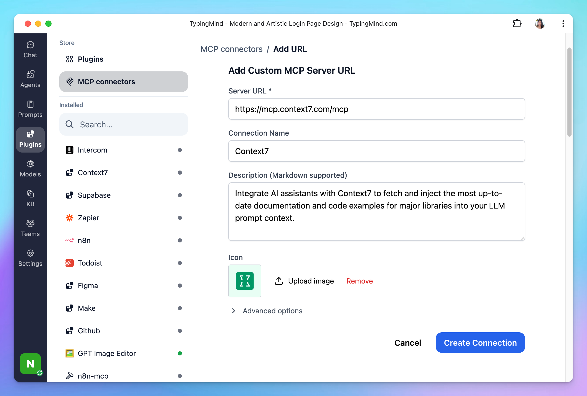

This guide will help you set up the **Context7 MCP server**, enabling your AI assistant in **TypingMind** to fetch and inject the most up-to-date documentation and code examples for major libraries into your LLM prompt context.

## Why uses Context7?

Most large language models (LLMs) are trained on publicly available code, documentation, and web content — but that training data is often months or years out of date. Worse, it's generic by nature: the model might "know" about React Query or TailwindCSS, but it doesn't know **which version** you're using, or whether the APIs it remembers are still valid.

The result?

- ❌ Code examples that rely on deprecated patterns
- ❌ Hallucinated APIs that never existed
- ❌ Answers that sound plausible but only apply to old versions of libraries

**With Context7, that changes.**

Context7 is a Model Context Protocol (MCP) server that pulls real-time documentation and usage examples directly from official sources — and injects them into your prompt. You get grounded answers, tailored to the actual version of the tools you're using.

## Step-by-step to install Context7 on TypingMind

### Step 1: Add Context7 as custom MCP connection

Go to Plugin → MCP Connectors → Add Connector 

- Add Server URL: `https://mcp.context7.com/mcp`
- Connection name: Context7
- Description: Integrate AI assistants with Context7 to fetch and inject the most up-to-date documentation and code examples for major libraries into your LLM prompt context.

- Click **Create Connection**

### Step 2: Set up MCP Connectors

After creating the connection with Context7 MCP, you will see Context7 appear in the plugin list, click on that to start setup your MCP connector with TypingMind:

- If you select TypingMind Cloud, you can connect to our remote MCP server in one-click without any further setup
- If you choose to set up Private MCP Connector, then follow the steps here: [Use MCP with Private MCP Connector](https://docs.typingmind.com/model-context-protocol-(mcp)-in-typingmind/use-mcp-with-private-mcp-connector)

### Step 3: Enable Context7 and control tool use

After successfully connecting with Context7 MCP, you can control which actions Context7 MCP should trigger within TypingMind by switching to Tools tab → Enable/disable specific tools.

### Step 4: Start chatting

You’re all set! 

