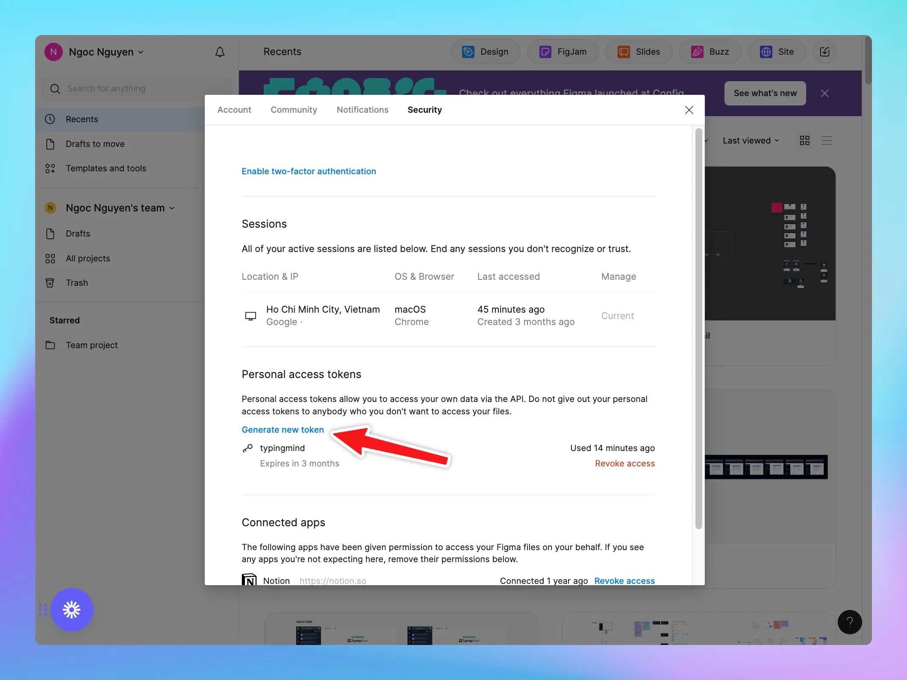

Using TypingMind with Figma via MCP allows you to access your Figma files so you can automate tasks, streamline collaboration, and bridge design-to-dev workflows

## Why use TypingMind MCP + Figma?

Connecting TypingMind’s Model Context Protocol (MCP) to Figma unlocks powerful automation and streamlined design workflows:

- **Generate code** directly from Figma design files
- **Quickly search and analyze** frames, components, or text layers across all pages
- **Transform design insights into structured tasks**, like creating Jira Epics or tickets in Notion or Linear

## Step-by-step to install

### Step 1: Set up MCP Connectors

In TypingMind, go to Settings → Advanced Settings → Model Context Protocol to start setup your MCP connector. The MCP Connector acts as the bridge between TypingMind and the MCP servers. 

MCP servers require a server to run on. TypingMind allows you to connect to the MCP servers via:

- Your own local device
- Or a private remote server.


If you choose to run the MCP servers on your device, run the command displayed on the screen.


Detail setup can be found at [https://docs.typingmind.com/model-context-protocol-in-typingmind](https://docs.typingmind.com/model-context-protocol-in-typingmind)

### Step 2: Add the Figma MCP Server

- Click on Edit Servers to add MCP server
- Add the following JSON to configure the Figma MCP server:

```json
{
  "mcpServers": {
    "Framelink Figma MCP": {
      "command": "npx",
      "args": ["-y", "figma-developer-mcp", "--figma-api-key=YOUR-KEY", "--stdio"]
    }
  }
}
```

Here’s how you can get the Figma API key to put into `<YOUR_KEY>` :

- From the file browser, click the account menu in the top-left corner and select **Settings**.
- Select the **Security** tab.
- Scroll to the **Personal access tokens** section, then click **Generate new token**.
- Enter a name for your new token and provide permissions for your token.
- Copy the token that is generated




<aside>
💡

View more about [Figma MCP Server](https://github.com/GLips/Figma-Context-MCP)

</aside>

- Click Save changes to save the MCP server


### Step 3: Enable Framelink Figma MCP via Plugin section

After the MCP servers are added successfully, it will show up in your **Plugins** page to be used like plugin. You can use the MCP tools directly or assign them to AI agent like other plugins.

- Go to the **Plugins** section in TypingMind.
- You should see a new plugin called **"**Framelink Figma MCP**"**.
- Enable the plugin


### Step 4: Start chatting

You can now interact with Figma files through TypingMind:

