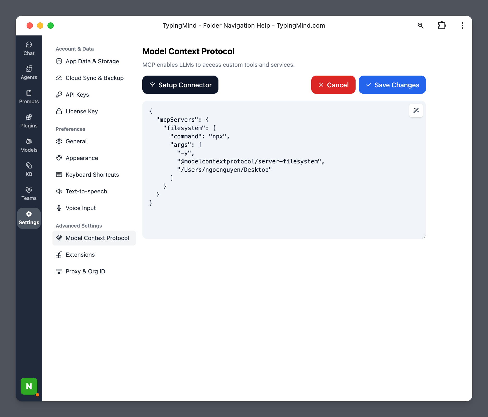

This guide walks you through setting up the **FileSystem MCP server** so your AI assistant in **TypingMind** can read and interact with files stored locally on your computer.

## Why access your local files?

- **Read and write files**: Summarize documents, edit notes, or generate new content directly into local files.
- **Create, list, and delete directories**: Organize your folders automatically based on tasks or projects.
- **Move files and directories**: Help clean up, archive, or reorganize data as needed.
- **Search files by name or content**: Quickly locate the documents or data you’re looking for.
- **Retrieve file metadata**: Get information like last modified date, file size, or file type.

## Step-by-step to install

### Step 1: Set up MCP Connectors

In TypingMind, go to Settings → Advanced Settings → Model Context Protocol to start setup your MCP connector. The MCP Connector acts as the bridge between TypingMind and the MCP servers. 

MCP servers require a server to run on. TypingMind allows you to connect to the MCP servers via:

- Your own local device
- Or a private remote server.


If you choose to run the MCP servers on your device, run the command displayed on the screen.


Detail setup can be found at [https://docs.typingmind.com/model-context-protocol-in-typingmind](https://docs.typingmind.com/model-context-protocol-in-typingmind)

### Step 2: Add the FileSystem MCP Server

- Click on Edit Servers to add MCP server
- Add the following JSON to configure the FileSystem MCP server:

```json
{
  "mcpServers": {
    "filesystem": {
      "command": "npx",
      "args": [
        "-y",
        "@modelcontextprotocol/server-filesystem",
        "/Users/username/Desktop",
        "/path/to/other/allowed/dir"
      ]
    }
  }
}
```

Replace the folder paths with those you want the AI to access. Make sure these folders exist on your device.



Github Reference: [Official FileSystem MCP Server on GitHub](https://github.com/modelcontextprotocol/servers/tree/main/src/filesystem)

- Click Save changes to save the MCP server


### Step 3: Enable filesystem via Plugin section

After the MCP servers are added successfully, it will show up in your **Plugins** page to be used like plugin. You can use the MCP tools directly or assign them to AI agent like other plugins.

- Go to the **Plugins** section in TypingMind.
- You should see a new plugin called **"filesystem"**.
- Enable the plugin


### Step 4: Start chatting

You can now interact with your local files through natural language. For example:

- “List all the files on my Desktop.”
- “Open and summarize the file ‘ProjectProposal.docx’.”
- “Move the file ‘New’ to folder ‘MCP’ ”

Ensure that the files are inside one of the directories you added in Step 2.


<Tip>

  You can find more MCP servers at [https://github.com/modelcontextprotocol/servers](https://github.com/modelcontextprotocol/servers)

</Tip>

## Use cases to use File System

- **Desktop Organization**: automatically sort files, manage folders, and streamline your desktop layout.
- **File Management Automation**: create, edit, move, or delete files using natural language.
- **Enhanced AI Assistance**: give TypingMind contextual awareness of your local files for smarter support.
- **Workflow Integration**: automate project organization, backups, and document processing.
- **Development Support**: manage code, test environments, and generate documentation efficiently.
