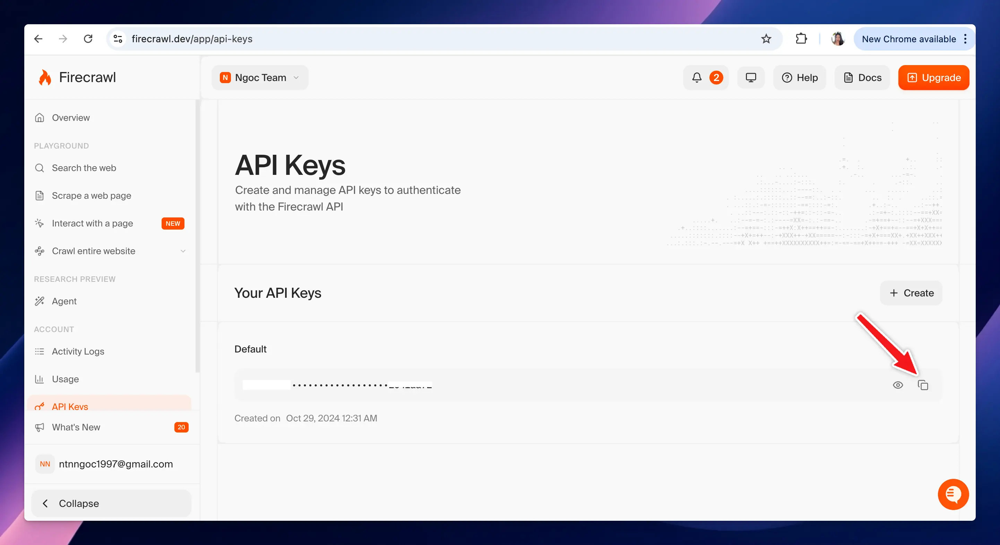

# TypingMind MCP \+ Firecrawl

This guide will help you integrates Firecrawl for web scraping capabilities via Firecrawl MCP server.

## Why uses Firecrawl?

**Firecrawl** gives your AI assistant live web scraping and search capabilities through MCP, so it can access up-to-date information from websites instead of relying only on built-in knowledge. It is especially useful for extracting webpage content, researching current information, and more.

## Step-by-step to install Firecrawl MCP on TypingMind

### Step 1: Get Firecrawl API key

- Log in/Sign up for a Firecrawl account at [https://www.firecrawl.dev/](https://www.firecrawl.dev/)
- Go to [https://www.firecrawl.dev/app/api-keys](https://www.firecrawl.dev/app/api-keys) to **get a Firecrawl API key**
- Copy your API key to a safe place

### Step 2: Add Firecrawl as custom MCP connection

Go to Plugin → MCP Connectors → Add Connector

- Add Server URL: `https://mcp.firecrawl.dev/{FIRECRAWL_API_KEY}/v2/mcp` with `{FIRECRAWL_API_KEY}` is your copied API key in step 1.
- Connection name: Firecrawl
- Description: Integrate AI assistants with Firecrawl to search and scrape websites.

- Click **Create Connection**

### Step 2: Set up MCP Connectors

After creating the connection with Firecrawl MCP, you will see Firecrawl appear in the plugin list, click on that to start setup your MCP connector with TypingMind:

- If you select TypingMind Cloud, you can connect to our remote MCP server in one-click without any further setup
- If you choose to set up Private MCP Connector, then follow the steps here: [Use MCP with Private MCP Connector](https://docs.typingmind.com/model-context-protocol-\(mcp\)-in-typingmind/use-mcp-with-private-mcp-connector)

### Step 3: Enable Firecrawl and control tool use

After successfully connecting with Firecrawl MCP, you can control which actions Firecrawl MCP should trigger within TypingMind by switching to Tools tab → Enable/disable specific tools.

### Step 4: Start chatting

You’re all set!

