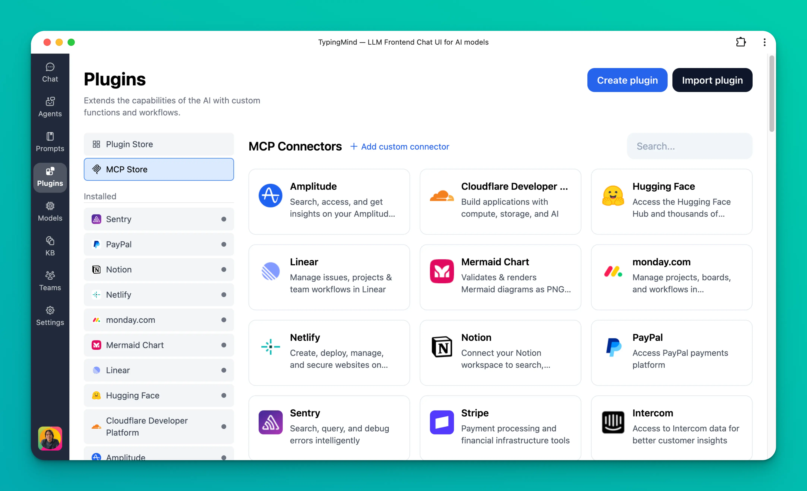

This guide will help you set up the **Make MCP server**, enabling your AI assistant in **TypingMind** to connect with Make to connect with thousands apps and run automation workflows.

## **What is Make MCP?**

Make MCP (Model Context Protocol) server acts as a bridge between TypingMind and Make.com.

With it, TypingMind can:

- Run your Make scenarios as tools
- Trigger actions across thousands apps (Slack, Gmail, Notion, Google Sheets, CRMs, etc.)
- Automate real workflows directly from chat

## Step-by-step to install Make.com on TypingMind

### Step 1: Obtain Make MCP Token

An MCP token is a unique URL that allows external AI systems to access your tools in Make.

To obtain an MCP token:

1. In the left sidebar of your Make account, click your name.
2. Click **Profile**.
3. Navigate to the **API / MCP access** tab.
4. Click **Add token**.

1. Select the scope `mcp:use`
2. Name your token
3. Click **Add**.

1. Copy the token to a safe place to use later on TypingMind:

> ⚠️ Treat this URL like a password. It gives TypingMind access to your configured scenarios.
> 

### Step 2: Add the Make MCP as custom connection on TypingMind

- Go to Plugin → MCP Connectors → Add Connector

- Add Server URL: add the MCP server URL in the format:

`https://<MAKE_ZONE>/mcp/api/v1/u/<MCP_TOKEN>/sse` with MCP token is the token you copied in step 1. Example: `https://eu2.make.com/mcp/api/v1/u/8*******/sse`

- Connection name: Make

- Click **Create Connection**

### Step 3: Connect to Make MCP server

After creating the connection with Make MCP, you will see Make appear in the plugin list, click on that to start setup your MCP connector with TypingMind:

- If you select TypingMind Cloud, you can connect to our remote MCP server in one-click without any further setup
- If you choose to set up Private MCP Connector, then follow the steps here: [Use MCP with Private MCP Connector](https://docs.typingmind.com/model-context-protocol-(mcp)-in-typingmind/use-mcp-with-private-mcp-connector)

### Step 4: Enable Make and control scenarios

You can control which scenarios your Make MCP should trigger within TypingMind by switching to Tools tab → Enable/disable specific tools.

### Step 5: Start chatting

You’re all set! Now you can access all Make scenarios and trigger automations via TypingMind!

