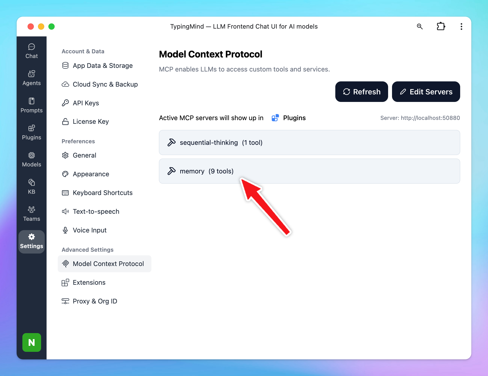

This guide will help you set up the **Memory MCP server**, enabling your AI assistant in **TypingMind** to remember your preferences, chat history so it can refer to and always provide relevant answers even when you start a new conversation.

## Why uses Memory?

**1. Persistent Cross-Session Memory**

Your AI can finally remember your preferences, past issues, and important events—across different chat sessions and conversations. This shifts the AI experience from generic to truly individualized.

**2. Seamless Tool & Knowledge Integration**

With a standardized interface, plugging in a CRM, customer history, or knowledge base becomes far simpler. You can “teach” your AI with everything your business or your personal preferences already knows.

**3. Secure by Design**

Memory MCP supports authentication, access controls, and encryption by default. You’re always in control of what your AI can see or do, and data privacy comes first.

**4. Modular & Extensible**

Want to add a new “memory source” next month? No need to re-architect—the protocol supports plugging in new sources or destinations easily, keeping your AI flexible and future-proof.

## Step-by-step to install Memory on TypingMind

### Step 1: Set up MCP Connectors

In TypingMind, go to Settings → Advanced Settings → Model Context Protocol to start setup your MCP connector. The MCP Connector acts as the bridge between TypingMind and the MCP servers. 

MCP servers require a server to run on. TypingMind allows you to connect to the MCP servers via:

- Your own local device
- Or a private remote server.


If you choose to run the MCP servers on your device, run the command displayed on the screen.


Detail setup can be found at [https://docs.typingmind.com/model-context-protocol-in-typingmind](https://docs.typingmind.com/model-context-protocol-in-typingmind)

### Step 2: Add the FileSystem MCP Server

- Click on Edit Servers to add MCP server
- Add the following JSON to configure the Sequential Thinking MCP server:

```json
{
  "mcpServers": {
    "memory": {
      "command": "npx",
      "args": [
        "-y",
        "@modelcontextprotocol/server-memory"
      ]
    }
  }
}
```



<aside>
💡

View more: [Memory MCP Server](https://github.com/modelcontextprotocol/servers/tree/main/src/memory)

</aside>

### Step 3: Enable memory via Plugin section

After the MCP servers are added successfully, it will show up in your **Plugins** page to be used like plugin. You can use the MCP tools directly or assign them to AI agent like other plugins.

- Go to the **Plugins** section in TypingMind.
- You should see a new plugin called **"memory"**.
- Enable the plugin


### Step 4: Add system prompt to utilizing Memory

This prompt allows the AI automatically saves your conversation to memory and trigger memory whenever you start a conversation to provide relevant answers.

Go to **Models** —> **Global Settings** —> **Add** the below instructions to the Initial System Instructions:

```json
1. Memory Retrieval:
At the beginning of each conversation, always trigger the "Memory" plugin to retrieve all relevant information from the user's memory.
Before responding, review the memory to determine whether any of it can support or inform your answer to the user's question.

2. Memory Update During Interaction:
While engaging in conversation, carefully observe for any new information related to the following categories:

a) Basic Identity: age, gender, location, job title, education level, etc.
b) Behaviors: interests, routines, habits, etc.
c) Preferences: communication style, preferred language, tools, etc.
d) Goals: personal or professional targets, ambitions, or desired outcomes.
e) Relationships: any personal or professional connections (up to three degrees of separation).

Trigger the "Memory" plugin to update memory as soon as new relevant information is identified.

Note: This is a personal workspace, so all memory retrievals and updates should be assumed to belong to a single individual.
```

### Step 5: Start chatting

You’re ready to go! Begin chatting to start building memory. The AI will automatically retrieve relevant context and update the knowledge graph as needed.


<aside>
💡

You can find more MCP servers at [https://github.com/modelcontextprotocol/servers](https://github.com/modelcontextprotocol/servers)

</aside>