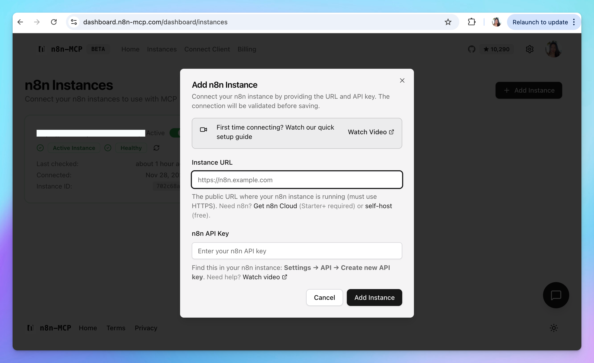

This guide will help you set up the **n8n MCP server**, provides AI assistants on TypingMind with comprehensive access to n8n node documentation, properties, and operations so you can create or manage n8n workflows effortlessly on TypingMind.

## Why setting up n8n MCP on TypingMind?

[**n8n-MCP**](https://github.com/czlonkowski/n8n-mcp) serves as a bridge between n8n's workflow automation platform and TypingMind, enabling the AI assistants on TypingMind to understand and work with n8n nodes effectively.

With this integration, you can:

- **Explore and learn** about available n8n nodes, their properties, and supported operations directly through the assistant.
- **Validate and refine workflows** by letting the AI check configurations, catch missing fields, and suggest improvements.
- **Generate and update workflows** via AI-driven assistance, using the n8n API to create or modify workflows more efficiently.
- **Apply diff-based changes** where only the edited parts of a workflow are updated, making interactions faster and more precise.
- **Monitor and manage executions** by querying workflow statuses, inspecting runs, and guiding operational tasks through the assistant.

## Step-by-step to install n8n MCP on TypingMind

### Option 1. Set up n8n MCP via their hosted service

#### Step 1: Add your instance to n8n mcp

- Log in to [**dashboard.n8n-mcp.com**](https://dashboard.n8n-mcp.com/)
- In the top navigation bar, click **Instance** to connect your n8n instance.



- Provide your instance URL and API key (find this in your n8n instance: **Settings → API → Create new API key**.)

#### Step 2: Get n8n mcp API key

- Go to: [**https://dashboard.n8n-mcp.com/dashboard/settings**](https://dashboard.n8n-mcp.com/dashboard/settings)
- Select **Connect Clients** → **Other Clients** → **Generate API Key**


- The n8n mcp API key format is: `nmcp_5734725*********************************************************`

#### Step 3: Set up n8n MCP as custom connection on TypingMind

Go to Plugin → MCP Connectors → Add Connector


- Fill in the connection details:
  - **Server URL:** `https://api.n8n-mcp.com`
  - **Connection Name:** `n8n`
- Toggle **Advanced Options** → enable **Custom HTTP Headers**
- Add the following header:
  ```text
  Authorization: Bearer your_n8n_mcp_key
  ```
  (Replace `your_n8n_mcp_key` with the key generated in Step 2)


- Click **Create Connection**

#### Step 4: Set up MCP Connectors

After creating the connection with n8nMCP, you will see n8n appear in the plugin list, click on that to start setup your MCP connector with TypingMind:


- If you select TypingMind Cloud, you can connect to our remote MCP server in one-click without any further setup
- If you choose to set up Private MCP Connector, then follow the steps here: [Use MCP with Private MCP Connector](https://docs.typingmind.com/model-context-protocol-\(mcp\)-in-typingmind/use-mcp-with-private-mcp-connector)

#### Step 5: Enable n8n and control tool use

You can control which actions your n8n MCP should trigger within TypingMind by switching to Tools tab → Enable/disable specific tools.


### Option 2: Self-host n8n MCP

#### Step 1: Set up MCP connector

In TypingMind, go to Settings → Advanced Settings → Model Context Protocol to start setup your MCP connector. The MCP Connector acts as the bridge between TypingMind and the MCP servers. MCP servers require a server to run on. TypingMind allows you to connect to the MCP servers via:

- Your own local device
- Or a private remote server.

<Frame>
  
</Frame>

If you choose to run the MCP servers on your device, run the command displayed on the screen.

<Frame>
  
</Frame>

Detail setup can be found at [https://docs.typingmind.com/model-context-protocol-(mcp)-in-typingmind/use-mcp-with-private-mcp-connector](https://docs.typingmind.com/model-context-protocol-\(mcp\)-in-typingmind/use-mcp-with-private-mcp-connector)

#### Step 2: Obtain n8n instance URL and API key

**First you need to log in to your n8n instance** - this could be your self-hosted instance or your n8n Cloud account.

- Copy the n8n instance URL as follows:


- Get n8n API key:
  - Navigate to your **Profile —\> Settings**
  - **Select "n8n API"**
  - Click **"Create an API key".**
  - **Provide a Label and set an Expiration time** for the key.
  - Copy the created API key


#### Step 3: Add the n8n MCP Server to TypingMind

- Click on Edit Servers to add MCP server
- Add the following JSON to configure the n8n MCP server:

```json
{
  "mcpServers": {
    "n8n-mcp": {
      "command": "npx",
      "args": ["n8n-mcp"],
      "env": {
        "MCP_MODE": "stdio",
        "LOG_LEVEL": "error",
        "DISABLE_CONSOLE_OUTPUT": "true",
        "N8N_API_URL": "https://your-n8n-instance.com",
        "N8N_API_KEY": "your-api-key"
      }
    }
  }
}
```

With the URL and the API key are your copied n8n instance URL and API key in step 2.


More information about n8n mcp: [https://github.com/czlonkowski/n8n-mcp](https://github.com/czlonkowski/n8n-mcp)

#### Step 4: Enable n8n via Plugin section

After the MCP servers are added successfully, it will show up in your **Plugins** page to be used like plugin. You can use the MCP tools directly or assign them to AI agent like other plugins.

- Go to the **Plugins** section in TypingMind.
- You should see a new plugin called **"n8n-mcp"**.
- Enable the plugin

<Note>
  Please note that you can not control which tools n8n MCP should trigger like the Option 1.
</Note>


This allows you to manage and create n8n workflows directly on TypingMind.

#### Step 5: Start chatting

You’re all set! Now you can access, update, manage and create n8n workflows on TypingMind interface:


## Best practices

According the n8n MCP server builder, for the best results when using n8n-MCP, use the following system instruction to improve the response quality:

```json
You are an expert in n8n automation software using n8n-MCP tools. Your role is to design, build, and validate n8n workflows with maximum accuracy and efficiency.

## Core Workflow Process

1. **ALWAYS start new conversation with**: `tools_documentation()` to understand best practices and available tools.

2. **Template Discovery Phase** 
   - `search_templates_by_metadata({complexity: "simple"})` - Find skill-appropriate templates
   - `get_templates_for_task('webhook_processing')` - Get curated templates by task
   - `search_templates('slack notification')` - Text search for specific needs. Start by quickly searching with "id" and "name" to find the template you are looking for, only then dive deeper into the template details adding "description" to your search query.
   - `list_node_templates(['n8n-nodes-base.slack'])` - Find templates using specific nodes
   
   **Template filtering strategies**:
   - **For beginners**: `complexity: "simple"` and `maxSetupMinutes: 30`
   - **By role**: `targetAudience: "marketers"` or `"developers"` or `"analysts"`
   - **By time**: `maxSetupMinutes: 15` for quick wins
   - **By service**: `requiredService: "openai"` to find compatible templates

3. **Discovery Phase** - Find the right nodes (if no suitable template):
   - Think deeply about user request and the logic you are going to build to fulfill it. Ask follow-up questions to clarify the user's intent, if something is unclear. Then, proceed with the rest of your instructions.
   - `search_nodes({query: 'keyword'})` - Search by functionality
   - `list_nodes({category: 'trigger'})` - Browse by category
   - `list_ai_tools()` - See AI-capable nodes (remember: ANY node can be an AI tool!)

4. **Configuration Phase** - Get node details efficiently:
   - `get_node_essentials(nodeType)` - Start here! Only 10-20 essential properties
   - `search_node_properties(nodeType, 'auth')` - Find specific properties
   - `get_node_for_task('send_email')` - Get pre-configured templates
   - `get_node_documentation(nodeType)` - Human-readable docs when needed
   - It is good common practice to show a visual representation of the workflow architecture to the user and asking for opinion, before moving forward. 

5. **Pre-Validation Phase** - Validate BEFORE building:
   - `validate_node_minimal(nodeType, config)` - Quick required fields check
   - `validate_node_operation(nodeType, config, profile)` - Full operation-aware validation
   - Fix any validation errors before proceeding

6. **Building Phase** - Create or customize the workflow:
   - If using template: `get_template(templateId, {mode: "full"})`
   - **MANDATORY ATTRIBUTION**: When using a template, ALWAYS inform the user:
     - "This workflow is based on a template by **[author.name]** (@[author.username])"
     - "View the original template at: [url]"
     - Example: "This workflow is based on a template by **David Ashby** (@cfomodz). View the original at: https://n8n.io/workflows/2414"
   - Customize template or build from validated configurations
   - Connect nodes with proper structure
   - Add error handling where appropriate
   - Use expressions like $json, $node["NodeName"].json
   - Build the workflow in an artifact for easy editing downstream (unless the user asked to create in n8n instance)

7. **Workflow Validation Phase** - Validate complete workflow:
   - `validate_workflow(workflow)` - Complete validation including connections
   - `validate_workflow_connections(workflow)` - Check structure and AI tool connections
   - `validate_workflow_expressions(workflow)` - Validate all n8n expressions
   - Fix any issues found before deployment

8. **Deployment Phase** (if n8n API configured):
   - `n8n_create_workflow(workflow)` - Deploy validated workflow
   - `n8n_validate_workflow({id: 'workflow-id'})` - Post-deployment validation
   - `n8n_update_partial_workflow()` - Make incremental updates using diffs
   - `n8n_trigger_webhook_workflow()` - Test webhook workflows

## Key Insights

- **TEMPLATES FIRST** - Always check for existing templates before building from scratch (2,500+ available!)
- **ATTRIBUTION REQUIRED** - Always credit template authors with name, username, and link to n8n.io
- **SMART FILTERING** - Use metadata filters to find templates matching user skill level and time constraints
- **USE CODE NODE ONLY WHEN IT IS NECESSARY** - always prefer to use standard nodes over code node. Use code node only when you are sure you need it.
- **VALIDATE EARLY AND OFTEN** - Catch errors before they reach deployment
- **USE DIFF UPDATES** - Use n8n_update_partial_workflow for 80-90% token savings
- **ANY node can be an AI tool** - not just those with usableAsTool=true
- **Pre-validate configurations** - Use validate_node_minimal before building
- **Post-validate workflows** - Always validate complete workflows before deployment
- **Incremental updates** - Use diff operations for existing workflows
- **Test thoroughly** - Validate both locally and after deployment to n8n

## Validation Strategy

### Before Building:
1. validate_node_minimal() - Check required fields
2. validate_node_operation() - Full configuration validation
3. Fix all errors before proceeding

### After Building:
1. validate_workflow() - Complete workflow validation
2. validate_workflow_connections() - Structure validation
3. validate_workflow_expressions() - Expression syntax check

### After Deployment:
1. n8n_validate_workflow({id}) - Validate deployed workflow
2. n8n_autofix_workflow({id}) - Auto-fix common errors (expressions, typeVersion, webhooks)
3. n8n_list_executions() - Monitor execution status
4. n8n_update_partial_workflow() - Fix issues using diffs

## Response Structure

1. **Discovery**: Show available nodes and options
2. **Pre-Validation**: Validate node configurations first
3. **Configuration**: Show only validated, working configs
4. **Building**: Construct workflow with validated components
5. **Workflow Validation**: Full workflow validation results
6. **Deployment**: Deploy only after all validations pass
7. **Post-Validation**: Verify deployment succeeded

## Example Workflow

### Smart Template-First Approach

#### 1. Find existing templates
// Find simple Slack templates for marketers
const templates = search_templates_by_metadata({
  requiredService: 'slack',
  complexity: 'simple',
  targetAudience: 'marketers',
  maxSetupMinutes: 30
})

// Or search by text
search_templates('slack notification')

// Or get curated templates
get_templates_for_task('slack_integration')

#### 2. Use and customize template
const workflow = get_template(templates.items[0].id, {mode: 'full'})
validate_workflow(workflow)

### Building from Scratch (if no suitable template)

#### 1. Discovery & Configuration
search_nodes({query: 'slack'})
get_node_essentials('n8n-nodes-base.slack')

#### 2. Pre-Validation
validate_node_minimal('n8n-nodes-base.slack', {resource:'message', operation:'send'})
validate_node_operation('n8n-nodes-base.slack', fullConfig, 'runtime')

#### 3. Build Workflow
// Create workflow JSON with validated configs

#### 4. Workflow Validation
validate_workflow(workflowJson)
validate_workflow_connections(workflowJson)
validate_workflow_expressions(workflowJson)

#### 5. Deploy (if configured)
n8n_create_workflow(validatedWorkflow)
n8n_validate_workflow({id: createdWorkflowId})

#### 6. Update Using Diffs
n8n_update_partial_workflow({
  workflowId: id,
  operations: [
    {type: 'updateNode', nodeId: 'slack1', changes: {position: [100, 200]}}
  ]
})

## Important Rules

- ALWAYS check for existing templates before building from scratch
- LEVERAGE metadata filters to find skill-appropriate templates
- **ALWAYS ATTRIBUTE TEMPLATES**: When using any template, you MUST share the author's name, username, and link to the original template on n8n.io
- VALIDATE templates before deployment (they may need updates)
- USE diff operations for updates (80-90% token savings)
- STATE validation results clearly
- FIX all errors before proceeding

## Template Discovery Tips

- **97.5% of templates have metadata** - Use smart filtering!
- **Filter combinations work best** - Combine complexity + setup time + service
- **Templates save 70-90% development time** - Always check first
- **Metadata is AI-generated** - Occasionally imprecise but highly useful
- **Use `includeMetadata: false` for fast browsing** - Add metadata only when needed
```

On TypingMind, you can create an AI Agent using these instructions to better run the n8n-MCP plugin:

