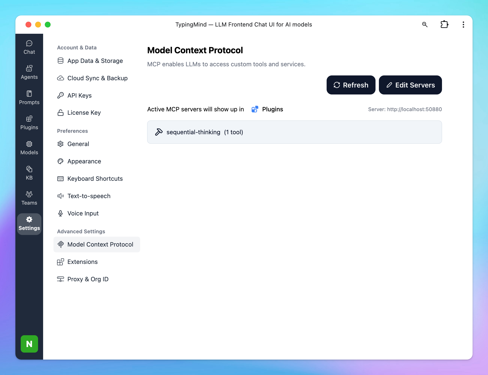

This guide will help you set up the **Sequential Thinking MCP server**, enabling your AI assistant in **TypingMind** to reason through tasks and problems using a structured, step-by-step approach.

## Why uses Sequential Thinking?

Sequential Thinking enhances AI reasoning by allowing it to:

- Break down complex problems into manageable steps
- Revise and refine thoughts as understanding deepens
- Branch into alternative paths of reasoning
- Adjust the total number of thoughts dynamically
- Generate and verify solution hypotheses

## Step-by-step to install Sequential Thinking on TypingMind

### Step 1: Set up MCP Connectors

In TypingMind, go to Settings → Advanced Settings → Model Context Protocol to start setup your MCP connector. The MCP Connector acts as the bridge between TypingMind and the MCP servers. 

MCP servers require a server to run on. TypingMind allows you to connect to the MCP servers via:

- Your own local device
- Or a private remote server.


If you choose to run the MCP servers on your device, run the command displayed on the screen.


Detail setup can be found at [https://docs.typingmind.com/model-context-protocol-in-typingmind](https://docs.typingmind.com/model-context-protocol-in-typingmind)

### Step 2: Add the Sequential Thinking MCP Server

- Click on Edit Servers to add MCP server
- Add the following JSON to configure the Sequential Thinking MCP server:

```json
{
  "mcpServers": {
    "sequential-thinking": {
      "command": "npx",
      "args": [
        "-y",
        "@modelcontextprotocol/server-sequential-thinking"
      ]
    }
  }
}
```



<aside>
💡

View more: [Sequential Thinking MCP server](https://github.com/modelcontextprotocol/servers/tree/main/src/sequentialthinking)

</aside>

### Step 3: Enable sequential thinking via Plugin section

After the MCP servers are added successfully, it will show up in your **Plugins** page to be used like plugin. You can use the MCP tools directly or assign them to AI agent like other plugins.

- Go to the **Plugins** section in TypingMind.
- You should see a new plugin called **"sequential-thinking"**.
- Enable the plugin


### Step 4: Start chatting

You’re all set! Start chatting with your assistant using prompts that benefit from structured analysis.

Example prompt: "Decompose the task: "Build a Python CLI tool that resizes images using Pillow"”


<aside>
💡

You can find more MCP servers at [https://github.com/modelcontextprotocol/servers](https://github.com/modelcontextprotocol/servers)

</aside>