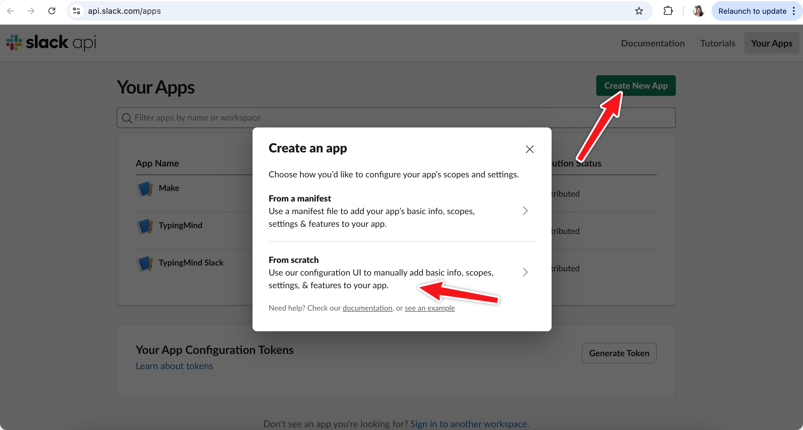

# TypingMind MCP + Slack

This guide will help you set up the Slack **MCP server**, provides AI assistants on TypingMind with the ability to interact with Slack workspaces. This integration allows you to list channels, post messages, reply to threads, add reactions, get channel history, and manage users on Slack via TypingMind.

## Step-by-step to install Slack MCP on TypingMind

### Step 1: Configure Slack Bot

To use this MCP server, you need to create a Slack app and configure it with the necessary permissions:

**1. Create a Slack App**

- Visit the [Slack Apps page](https://api.slack.com/apps)
- Click "Create New App"
- Choose "From scratch"
- Name your app and select your workspace



**2. Configure Bot Token Scopes**

Navigate to "OAuth & Permissions" > Bot token scopes and add these scopes:

- `channels:history` - View messages and other content in public channels
- `channels:read` - View basic channel information
- `chat:write` - Send messages as the app
- `reactions:write` - Add emoji reactions to messages
- `users:read` - View users and their basic information
- `users.profile:read` - View detailed profiles about users


**3. Install App to Workspace**

- Click "Install to Workspace" and authorize the app


- Save the "Bot User OAuth Token" that starts with `xoxb-`


**4. Get Your Team ID**

Get your Team ID (starts with a `T`) by following [this guidance](https://slack.com/help/articles/221769328-Locate-your-Slack-URL-or-ID#find-your-workspace-or-org-id)

**5. Add Bot to Channels (Optional)**

For the bot to access private channels or to post messages, you may need to invite it to specific channels using `/invite @your-bot-name`

### Step 2: Set up TypingMind MCP Connectors

In TypingMind, go to Settings → Advanced Settings → Model Context Protocol to start setup your MCP connector. The MCP Connector acts as the bridge between TypingMind and the MCP servers. 

MCP servers require a server to run on. TypingMind allows you to connect to the MCP servers via:

- Your own local device
- Or a private remote server.


If you choose to run the MCP servers on your device, run the command displayed on the screen.


<aside>
💡

For detailed setup instructions or guidance on setting up the Team version, visit [https://docs.typingmind.com/model-context-protocol-in-typingmind](https://docs.typingmind.com/model-context-protocol-in-typingmind)

</aside>

### Step 2: Add the Slack MCP Server to TypingMind

- Click on Edit Servers to add MCP server
- Add the following JSON to configure the Slack MCP server:

```json
{
  "mcpServers": {
    "slack": {
      "command": "npx",
      "args": [
        "-y",
        "@modelcontextprotocol/server-slack"
      ],
      "env": {
        "SLACK_BOT_TOKEN": "xoxb-xxxxxx",
        "SLACK_TEAM_ID": "T0xxxxxxx"
      }
    }
  }
}
```

More information about Slack MCP: [https://github.com/zencoderai/slack-mcp-server](https://github.com/zencoderai/slack-mcp-server)


### Step 3: Enable Slack via Plugin section

After the MCP servers are added successfully, it will show up in your **Plugins** page to be used like plugin. You can use the MCP tools directly or assign them to AI agent like other plugins.

- Go to the **Plugins** section in TypingMind.
- You should see a new plugin called **"slack"**.
- Enable the plugin


### Step 4: Start chatting

You’re all set! Now you can view, manage and send messages to Slack effortlessly from TypingMind!

