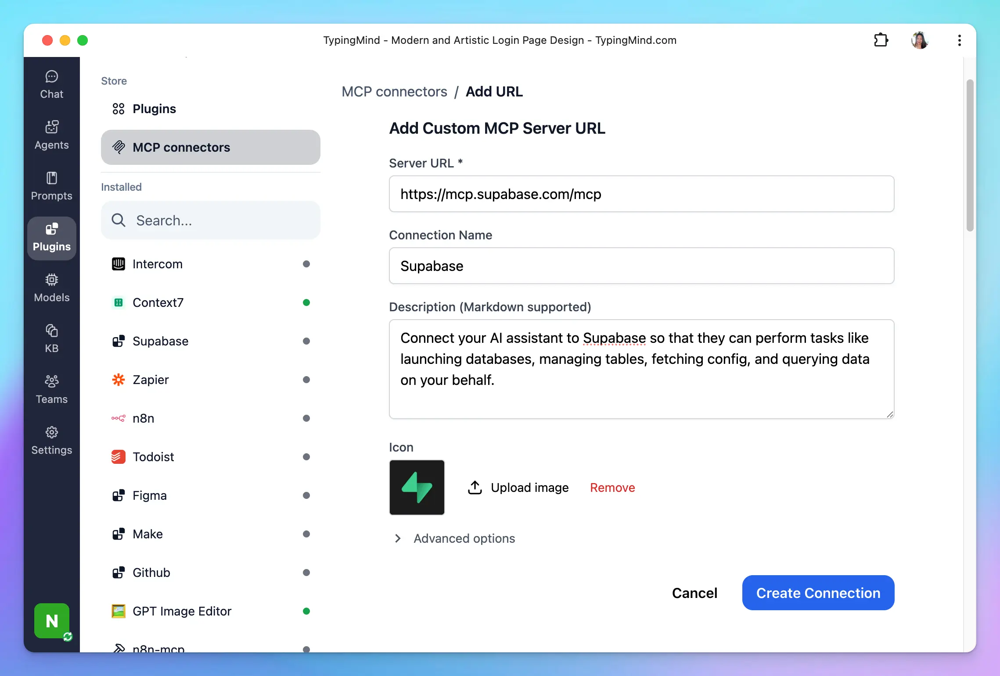

This guide will help you set up the **Supabase MCP server**, enabling your AI assistant in **TypingMind** to perform tasks like launching databases, managing tables, fetching config, and querying data on your behalf.

### Step 1: Add Supabase as custom MCP connection

Go to Plugin → MCP Connectors → Add Connector 

- Add Server URL: [`https://mcp.supabase.com/mcp`](https://mcp.supabase.com/mcp)
- Connection name: Supabase
- Description: Connect your AI assistant to Supabase so that they can perform tasks like launching databases, managing tables, fetching config, and querying data on your behalf.

- Click **Create Connection**

### Step 2: Set up MCP Connectors

After creating the connection with Supabase MCP, you will see Supabase appear in the plugin list, click on that to start setup your MCP connector with TypingMind:

- If you select TypingMind Cloud, you can connect to our remote MCP server in one-click without any further setup
- If you choose to set up Private MCP Connector, then follow the steps here: [Use MCP with Private MCP Connector](https://docs.typingmind.com/model-context-protocol-(mcp)-in-typingmind/use-mcp-with-private-mcp-connector)

### Step 3: **Authenticate your Supabase account**

You’ll be redirected to Supabase’s official authorization page. Review the permissions that TypingMind is requesting, then click **Allow access** to connect your account.

### Step 4: Enable Supabase and control tool use

After successfully connecting with Supabase MCP, you can control which actions Supabase MCP should trigger within TypingMind by switching to Tools tab → Enable/disable specific tools.

### Step 5: Start chatting

You’re all set! 

