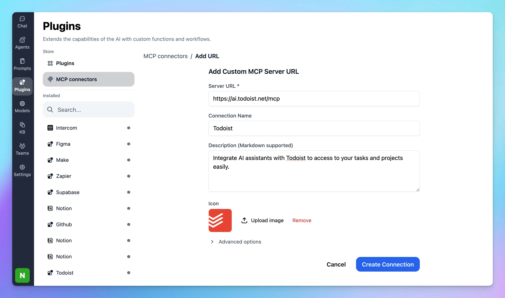

This guide will help you set up the **Todoist MCP server**, enabling your AI assistant in **TypingMind** to connect with Todoist to read, create, and update your tasks & projects seamlessly.

### Step 1: Add Todoist as custom MCP connection

Go to Plugin → MCP Connectors → Add Connector 

- Add Server URL: [`https://ai.todoist.net/mcp`](https://ai.todoist.net/mcp)
- Connection name: Todoist
- Description: Integrate AI assistants with Todoist to access to your tasks and projects easily.

- Click **Create Connection**

### Step 2: Set up MCP Connectors

After creating the connection with Todoist MCP, you will see Todoist appear in the plugin list, click on that to start setup your MCP connector with TypingMind:

- If you select TypingMind Cloud, you can connect to our remote MCP server in one-click without any further setup
- If you choose to set up Private MCP Connector, then follow the steps here: [Use MCP with Private MCP Connector](https://docs.typingmind.com/model-context-protocol-(mcp)-in-typingmind/use-mcp-with-private-mcp-connector)

### Step 3: **Authenticate your Todoist account**

You’ll be redirected to Todoist’s official authorization page. Review the permissions that TypingMind is requesting, then click **Allow access** to connect your account.

### Step 4: Enable Todoist and control tool use

After successfully connecting with Todoist MCP, you can control which actions Todoist MCP should trigger within TypingMind by switching to Tools tab → Enable/disable specific tools.

### Step 5: Start chatting

You’re all set! 

