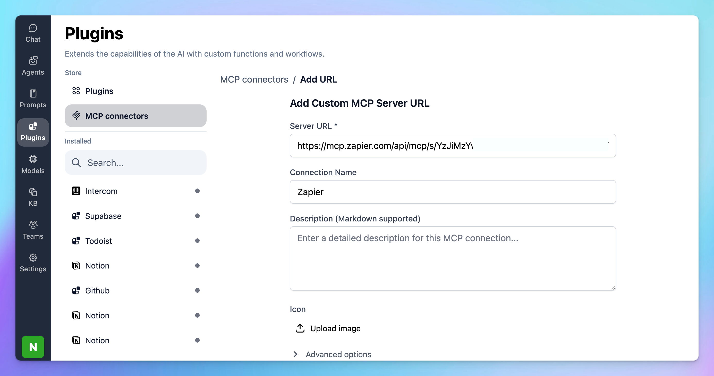

# TypingMind MCP + Zapier

This guide will help you set up the **Zapier MCP server**, enabling your AI assistant in **TypingMind** to connect with Zapier to connect with 6000+ apps and do 30000+ actions in a single dashboard

## **What is Zapier MCP?**

**Zapier MCP** gives your AI assistant direct access to over 7,000+ apps and 30,000+ actions without complex API integrations. Now your AI can perform real tasks like sending messages, managing data, scheduling events, and updating records—transforming it from a conversational tool to a functional extension of your applications.

## Step-by-step to install Zapier on TypingMind

### Step 1: Get the Zapier Server URL

- Go to [**mcp.zapier.com**](https://mcp.zapier.com/) and sign in with your Zapier account.
- Click **Create new MCP server**.
- Choose **“Other”** as the client type.
- Give it a name, e.g., `TypingMind`.

After that, add tools to the created server:

- Click **”+ Add tool”** to add your first tool
- Type the name of an app (e.g., “Slack”, “Google Sheets”)
- From the list of available actions, pick the action you want (e.g., “Send Channel Message”, “Create Spreadsheet Row”)
- Connect your app account if prompted
- Save your tool configuration.

- Switch to the **Connect** tab of your MCP server.
- Copy the **Server URL** provided by Zapier (e.g. `https://mcp.zapier.com/api/mcp/s/xxxxx/mcp`).

> ⚠️ Treat this URL like a password. It gives TypingMind access to your configured tools.
> 

### Step 2: Add Zapier as custom MCP connection

Go to Plugin → MCP Connectors → Add Connector 

- Add Server URL: add the copied server URL in step 1
- Connection name: Zapier

- Click **Create Connection**

### Step 3: Set up MCP Connectors

After creating the connection with Zapier MCP, you will see Zapier appear in the plugin list, click on that to start setup your MCP connector with TypingMind:

- If you select TypingMind Cloud, you can connect to our remote MCP server in one-click without any further setup
- If you choose to set up Private MCP Connector, then follow the steps here: [Use MCP with Private MCP Connector](https://docs.typingmind.com/model-context-protocol-(mcp)-in-typingmind/use-mcp-with-private-mcp-connector)

### Step 4: Enable Zapier and control tool use

You can control which actions your Zapier MCP should trigger within TypingMind by switching to Tools tab → Enable/disable specific tools.

### Step 5: Start chatting

You’re all set! 

