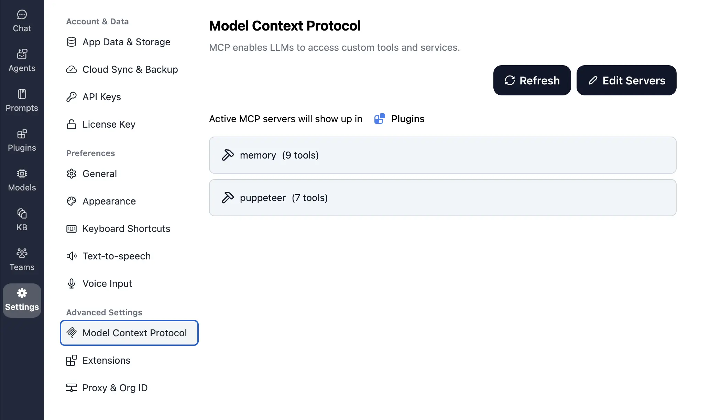

## Setup MCP in TypingMind License Version

In TypingMind, go to Settings → Advanced Settings → Model Context Protocol to start setup your MCP servers.



MCP servers require a server to run on. TypingMind allows you to connect to the MCP servers via your own local device or a private remote server.

When you first enter the screen, choose where to run the MCP servers.


Select a method that work well for you, then click next.

If you choose to run the MCP servers on your device, run the command displayed on the screen.


Open the **Terminal app** on macOS or the **Windows Terminal** to run the command.

ℹ️ Note:

- Your device must support NodeJS 18\+ to run the MCP Connector.
- When choosing the “This Device” option, you must run the command on the same device you are using TypingMind, otherwise, TypingMind will not be able to connect.


TypingMind attempt to connect to the MCP Connector, when success, you can click “**Get Started**”.


Once connected, you can start to add MCP servers you want to use. Click the “**Edit Servers**” button and adding your servers to the text input.

For example, here is the JSON description for adding two official MCP servers created by Anthropic “memory” and “puppeteer”:

```json
{
  "mcpServers": {
    "memory": {
      "command": "npx",
      "args": [
        "-y",
        "@modelcontextprotocol/server-memory"
      ]
    },
    "puppeteer": {
      "command": "npx",
      "args": [
        "-y",
        "@modelcontextprotocol/server-puppeteer"
      ]
    }
  }
}
```


After the MCP servers are added successfully, it will show up in your **Plugins** page to be used like plugin. You can use the MCP tools directly or assign them to AI agent like other plugins.


## Setup MCP in TypingMind Teams Version

In [TypingMind for Teams](https://custom.typingmind.com), MCP are implemented as plugins. Go to your Admin Panel → Plugins → Create New Plugin.


Under the **Implementation** section, select “Model Context Protocol” and set your server config JSON in the text input.

You can use available variables in the plugin settings, user ID, or authentication configs like any other plugins in the config JSON.


When the plugin is installed to your instance, you will need to connect to **MCP Connector** in order to activate the plugin.

You can get the connector details by deploying the [**MCP Connector (open-source)**](https://github.com/TypingMind/typingmind-mcp) to your server where you want the MCP servers to run. You will need two pieces of information from your MCP Connector setup: Connector URL & Auth Token.

- **Connector URL**
  - Start the MCP Connector using npx:
    ```jsx
    npx @typingmind/mcp <auth-token>
    ```
    Replace `<auth-token>` with your own authentication token. You can use any value for the Auth Token, like a random string of characters.
  - Once the MCP Connector is running, the Connector URL will be shown in your terminal or console output, typically looking like:
    ```jsx
    https://your-server-domain.com:port
    ```
  - Copy this URL and paste it into the **Connector URL** field in your TypingMind plugin configuration.
- **Auth Token**
  - Copy the `<auth-token>` you used in the command above into the Auth Token field in your TypingMind plugin configuration.


The end users will be able to use the MCP plugin just like any other plugins in the system.


## How it works

TypingMind uses the [**MCP Connector (open-source)**](https://github.com/TypingMind/typingmind-mcp) to run MCP servers. This connector can be run on your device and will manage all active MCP servers.

It is not necessary to run the MCP Connector on your device if you don't need features that require access to the local files, folders, and apps. You can set up a private remote server to run the MCP connector and all of its servers in an isolated environment.

Here is a diagram that demonstrates how TypingMind MCP Connector works.


[typingmind-mcp-howitworks.drawio](Use%20MCP%20with%20Private%20MCP%20Connector/typingmind-mcp-howitworks.drawio)

## Frequently asked questions

**What is Model Context Protocol (MCP)?**

MCP is an open protocol that standardizes how applications provide context to LLMs. Learn about MCP here: [http://modelcontextprotocol.io/](http://modelcontextprotocol.io/)

**What is MCP Connector and why do I need it?**

MCP Connector is an open-source tool to help run and manage multiple MCP servers in one place. It helps you decide where to run your MCP servers without exposing your local device to those servers. TypingMind uses MCP Connector to connect to the MCP servers.

**Is MCP Connector free?**

Yes, it doesn't cost anything to run the MCP Connector on your computer. If you deploy the MCP Connector on a private server, you will just need to pay for the private server only. The source code of MCP Connector is available on GitHub.

**How do I customize the icon and the tool name of the MCP tools?**

To create a customized icon and tool name for an MCP tool, you must create a plugin for it. Go to Plugins → Create new Plugin → select "Model Context Protocol" under the Implementation section and follow instructions there.

**I'm using TypingMind for Teams, do I still need the MCP Connector?**

Yes. For now, you will need to run the MCP connector on your own private server. This is because sometimes it's helpful to run the MCP servers where your data is so that the MCP servers can access and modify the data. For other less data-sensitive use cases, we plan to host a dedicated MCP Connector for each account in the future.

**Where do I run the MCP Connector?**

It can be run on any system/server that has NodeJS installed. Depending on which MCP server you use, you may need to install other tools (e.g., Docker). Check the documentation of the MCP server you are using to understand their specific system requirements.

**Where do I get the Auth Token for MCP servers?**

You can generate your own auth token; it can be any value, as long as it is unique and kept secret. In the TypingMind license version, an auth token is initially generated by TypingMind, but you may replace it with your own token. It is important to keep your auth token unique and secure to prevent unauthorized access.