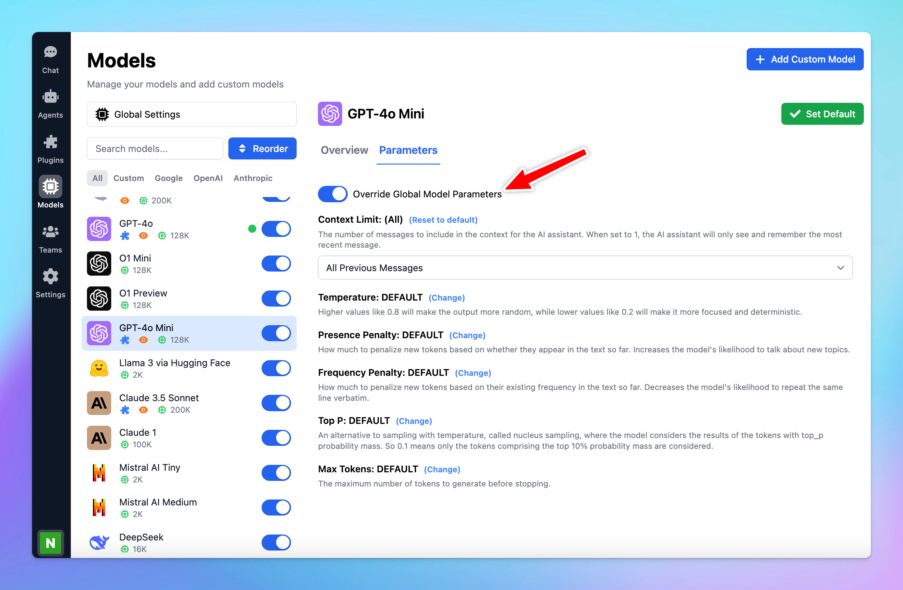

Each AI model may perform best with its own settings. Good news—you now have the option to customize the parameter settings for each AI model individually!

Let’s see how to do that!

## Why customize parameters for each AI model?

Customizing parameters for each AI model allows you to optimize their performance based on their specific strengths and your needs. This allows you get the best possible results from each model.

## Set up custom parameters per AI model

- Go to **Model settings** on the left side panel.
- Click on the AI model you want to assign custom parameters to.
- Switch to Parameters tab
- Toggle on **Override Global Model Parameters** to create a custom preset for that AI model. This way, it won't use your global settings.
- Set up the [parameters value](/parameter-settings/parameter-settings) as you want. (Context limit, Temperature, Top-p, Top-k, Max tokens, etc.)

- After you done customizing the settings, you can click back to “Chat” and select the AI model with preset parameters to chat with its custom parameters.

## Best practices

- Don't be afraid to play around with different settings to see what works best for the AI model
- Keep in mind that different models may respond differently to the same parameter settings.
- If you're not happy with the custom settings, you can always disable **Override Global Model Parameters** to revert back to your global settings.