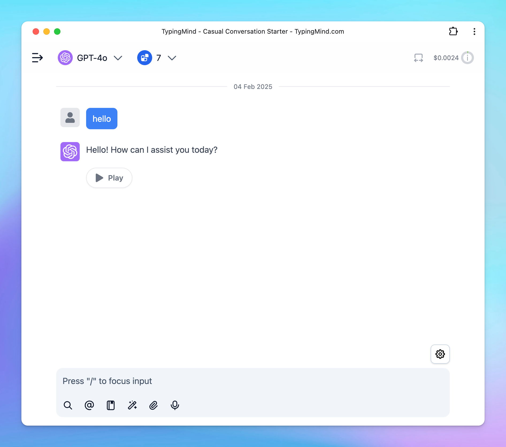

# Custom Settings for Specific Chats

Beside setting up parameters that apply for all chats,TypingMind also offers the flexibility to customize settings for individual chats.

If you make changes to the model or model parameters during an ongoing conversation, these adjustments will only be saved for that specific chat. This allows you to experiment with different settings without affecting your default preferences.

Here’s how to do that.

## Step 1: Start a conversation

First, open a new chat and start a conversation:

## Step 2: Change parameters for the conversation

Click on Model selection on top of the conversation —\> Change chat parameters

Scroll down to change the model parameters for the current conversation:

All changes will be only applied for that specific chat.

## Important notes

- When you return to a chat with customized settings, your preferences for that particular conversation will be remembered.
- This feature is particularly useful when you want to compare AI responses generated using different models or parameters.