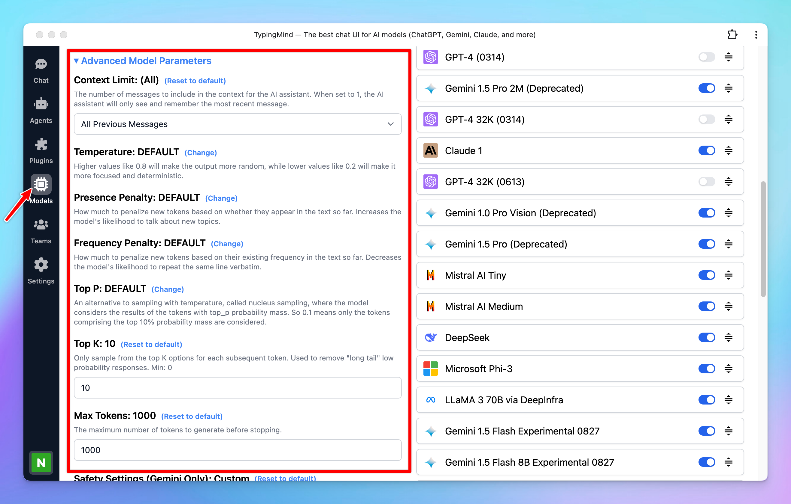
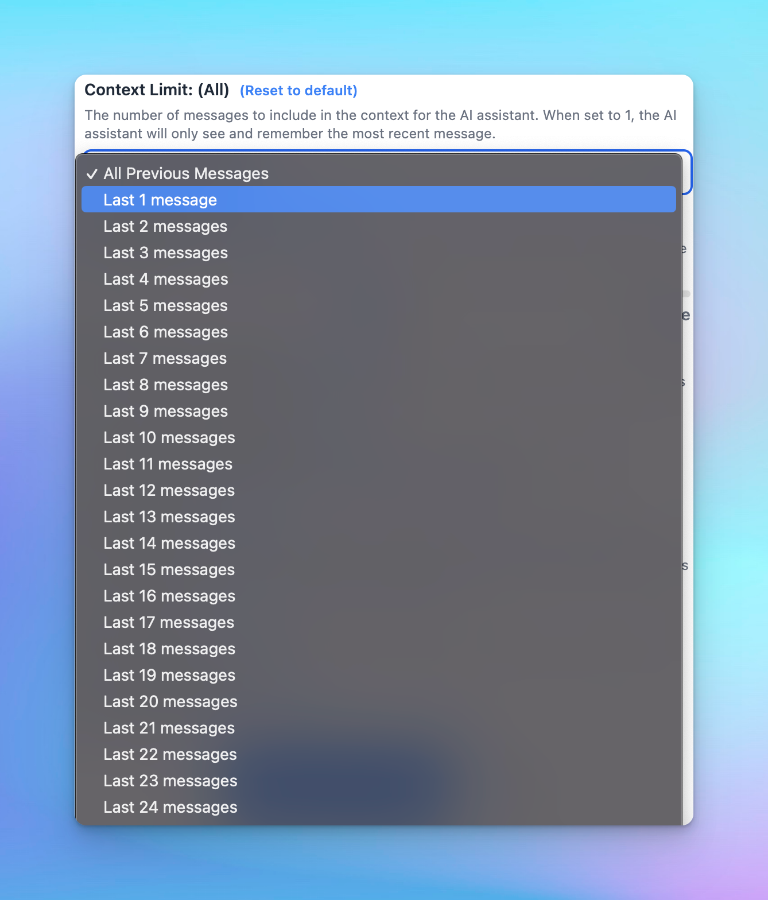

GPT models have important parameters that you can adjust to fine-tune the model's responses. Let’s check out some key parameters that you can adjust on TypingMind.

To find the model parameter settings:

- Go to the Model menu on the left sidebar
- Click on Global settings to set up the Model Parameters

<aside>
📌

Please note: You also have the option to set up custom parameters for each AI model. [Learn more](Custom%20parameters%20for%20each%20model%20a8df4910143c428faf4383d4ebc8817a.md)

</aside>

## 1. Context Limit

The number of messages to include in the context of the AI assistant. When set to 1, the AI assistant will only see and remember the most recent message.

## **2. Temperature (0 - 2)**

The Temperature parameter is a setting in ChatGPT that you can use to adjust the creativity of the model's responses. It acts as a "knob" to control how random and creative the output will be. Here's how it works:

- **High value (close to 2)**: the AI's responses are more diverse and creative. It's more likely to come up with unusual or unexpected responses.
- **Low value (close to 0)**: the AI's responses are more conservative and predictable. It will stick closer to the most likely response according to what it has learned during its training.

A temperature between 0.7 and 0.9 allows for a good balance between creativity and relevance. You can adjust this to see what works best for your specific use case. 

## 3. **Presence penalty (0-2)**

The Presence penalty parameter encourages the model to include a diverse range of tokens in the generated text. This influences if a certain topic or idea comes up again in the conversation.

- **Low value (closer to 0)**: the chat model will stick more closely to the concepts in the input and is less likely to generate new ideas.
- **High value (closer to 2)**: the chat model is more likely to generate new concepts that were not in the input.

## 4. **Frequency penalty (0-2)**

This parameter used to discourage the model from repeating the same words or phrases too frequently within the generated text. 

- **Low value (closer to 0):** the model is allowed to use common words or phrases more frequently.
- **High value (closer to 2)** discourages the model from using common words or phrases - the output will be less predictable and potentially more creative, as the model is encouraged to use a wider and more diverse vocabulary.
    
    > One use case for a higher frequency penalty could be in creative writing, where you want more novel and less clichéd phrases.
    > 

## 5. **Top P (0-1)**

Top P is also used to control the randomness of the AI's outputs, also known as nucleus sampling.

Basically, when the AI model is deciding what word to say next, it calculates a score for each possible word. It then uses these scores to decide which word to choose. Top P influences this selection process.

When you set a value for Top P, you're telling the model to restrict its selection to the particular percentage of the highest-scoring words or choices. 

<aside>
💡 For example, if Top P is set to 0.5, the model only considers the top 50% scored words for output generation.

</aside>

- **Lower values (closer to 0)**: the model only looks at the very most likely next words. This makes its responses more predictable, but they might also be less diverse and interesting.
- **Higher values(closer to 1)**: the chat model will a larger pool of possible next words, even ones that aren't the most likely. This makes its responses more varied and creative, but they might also be less logical or coherent.

<aside>
💡 Note: The settings of these parameters can drastically affect the output of the model. It's important to experiment with different settings to find the ones that best meet your needs.

</aside>

## 6. Top K

Top-k sampling is another strategy used to influence the randomness and creativity of an AI's outputs, similar to Top P, but it operates on a different principle.

While Top P (nucleus sampling) focuses on a percentage of highest-scoring words,  Top K limits the pool of next-word choices to a fixed number (k) of the highest-scoring options. This approach simplifies the selection process by only considering a set number of the most likely next words.

When the AI model calculates a score for each possible next word, applying Top-k means that only the top k words with the highest scores are considered for the next word choice.

- **Lower values (smaller k)**: by narrowing down to a small set of top choices, the model's responses become more predictable and coherent, as only the most likely next words are considered.
- **Higher values (larger k)**: allow a broader range of options (increasing k) and incorporate less likely next words, thus enhancing the diversity and novelty of the model's responses.

## 7. Max Tokens

Control the maximum number of tokens that the chat models can generate before stopping. 

<aside>
💡 If your AI responses are cut off, you can also increase this value to resolve this issue.

</aside>

## 8. Safety Settings (for Gemini only)

The safety settings for the Gemini API allow developers to adjust filters to block content based on harassment, hate speech, sexually explicit material, and dangerous content.

Check here for more detail information [https://ai.google.dev/gemini-api/docs/safety-settings](https://ai.google.dev/gemini-api/docs/safety-settings)

