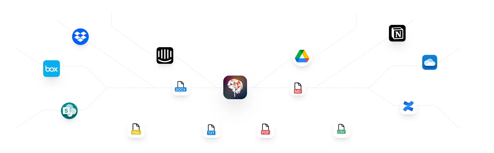

# Plugins

<aside>
  💡

  **TypingMind Plugins** is a powerful system that allow you to extend the capabilities of the AI assistant by giving it access to external tools.

  Explore and share your awesome extensions here! 👉 [**awesome-typingmind**](http://github.com/TypingMind/awesome-typingmind)
</aside>

In this page, we will introduce you to the TypingMind Plugin system and how to build various types of plugins to enhance your AI agents.

## Getting Started

[Use TypingMind Plugin](Plugins/Use%20TypingMind%20Plugin%20e07b943233a14bfe99bdda64a235bbb9.md)

[Build a TypingMind Plugin](Plugins/Build%20a%20TypingMind%20Plugin%207ecc24adfcde4443b37ce7e4aea73b05.md)

[User-contributed Plugins](Plugins/User-contributed%20Plugins%2031b6b3649fcc4397ac0e5f489a90b0f9.md)

[Share / Import plugins](Plugins/Share%20Import%20plugins%20cb8b4262bde441ac9d978ef9f63e9a16.md)

[Server Side vs. Client Side Plugin](Plugins/Server%20Side%20vs%20Client%20Side%20Plugin%20d011f557fd514c91836f5b2b8257be88.md)

[OAuth 2.0 Authentication for Plugins](Plugins/OAuth%202%200%20Authentication%20for%20Plugins%201107c3f1757a807e855ffd214c4ec3eb.md)

[Create a Plugin Server URL](Plugins/Create%20a%20Plugin%20Server%20URL%203d0cea0386f24edf8c42f0d51dbc62ab.md)

[TypingMind Plugin JSON Schema](Plugins/TypingMind%20Plugin%20JSON%20Schema%2026c7c3f1757a800f8556e21516ec015e.md)

## Using built-in plugins in TypingMind

[Deep Research](Plugins/Deep%20Research%202717c3f1757a80098209eabdc1a6ed3c.md)

[Interactive Canvas (Artifacts)](Plugins/Interactive%20Canvas%20\(Artifacts\)%20eb033811155d4a579ec2525d8d0afa44.md)

[Web search & Image search](Plugins/Web%20search%20&%20Image%20search%20c85f10f2518e44f4993c02d2d1ebcc4f.md)

[Perplexity Search](Plugins/Perplexity%20Search%2022b1dbf2a7884074a0da3f7e5391da7b.md)

[Market News](Plugins/Market%20News%20049b57589f0741259738e87798b97f2d.md)

[Dall-E 3 (Image Generation)](Plugins/Dall-E%203%20\(Image%20Generation\)%204f154f4e198e469d88b76b2c199f7cb4.md)

[GPT Image Editor](Plugins/GPT%20Image%20Editor%201df7c3f1757a805a86b1d6885cc2f108.md)

[Stable Diffusion (Image Generation)](Plugins/Stable%20Diffusion%20\(Image%20Generation\)%20c7c3fbac0f17487d955b623f3f50af06.md)

[Web Page Reader ](Plugins/Web%20Page%20Reader%202072c09b15e343cc973337514665ec6d.md)

[Firecrawl Web Page Reader](Plugins/Firecrawl%20Web%20Page%20Reader%20ba3ab67573da4c4197472cdfec9ac275.md)

[Azure AI Search (RAG)](Plugins/Azure%20AI%20Search%20\(RAG\)%20a65aa8c5747840febf798d13ced431b5.md)

[OpenAI File Search (RAG)](Plugins/OpenAI%20File%20Search%20\(RAG\)%201b47c3f1757a8050bf62c9f1c3327397.md)

[**Send Emails via Zapier**](Plugins/Send%20Emails%20via%20Zapier%20f3e648c95dd04526ab361a49c3d31ee2.md)

[Powerpoint Generator](Plugins/Powerpoint%20Generator%20338b2e9ca11c468da02cce0ffeefac9e.md)

[Word Generator](Plugins/Word%20Generator%20bd52cb827bd24814b6676ec2924d9291.md)

## Plugin Development Tutorials

[Google Calendar ](Plugins/Google%20Calendar%2010f7c3f1757a80f48d26e644a5d072a1.md)

[Slack Message Notifier](Plugins/Slack%20Message%20Notifier%20bc106625f0d248b185b17ae762fe8d64.md)

[Spotify Song Suggestions](Plugins/Spotify%20Song%20Suggestions%201237c3f1757a80c48c9deeabc1dce2ea.md)