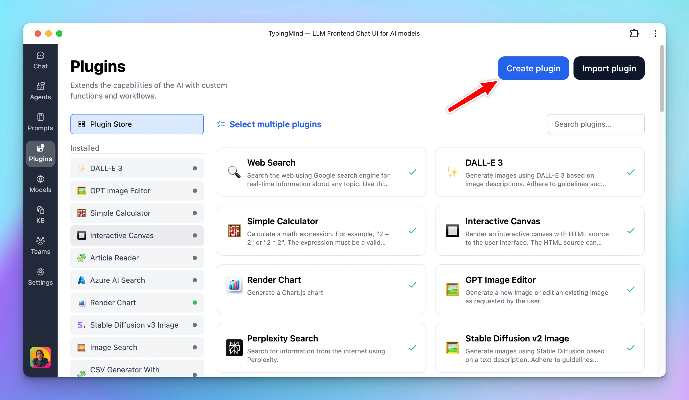
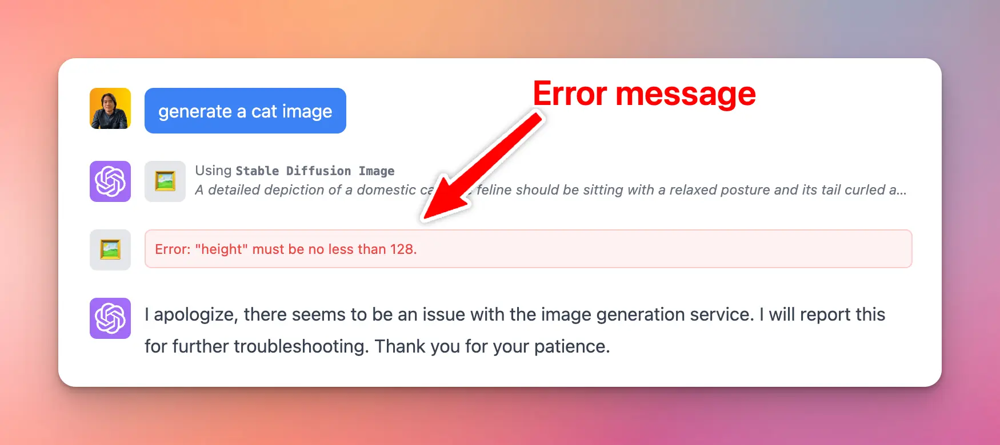

**TypingMind Plugins** allow you to extend the capabilities of the AI assistant by providing external tools and context. To get started, click the “Plugins” button on the start screen.

<Tip>
  👋 Explore and share your awesome plugins here! 👉 [https://github.com/TypingMind/awesome-typingmind](https://github.com/TypingMind/awesome-typingmind)
</Tip>

## Overview

TypingMind Plugins allow you to add new capabilities for the AI models. Plugins work using the OpenAI Function Calling API specifications. TypingMind also supports running plugins for other models like Gemini and Claude.

Plugins can be implemented using the following implementation types:

- **JavaScript:** run a JavaScript code in a secure sandbox environment, then return the result to the AI model or render the result to the user chat conversation.
- **HTTP Actions:** send an HTTP request and get the response.
- **MCP**: use a Model Context Protocol server as a plugin.

<Info>
  All existing TypingMind plugins are open-source under MIT license. You can view the source code of the plugins from our public [GitHub repository](../TypingMind%20Team%2050080fcbe55d4682acfa55780534d1be.md) here. The repos that contain the plugins are ones with names that start with `plugin-`. You can fork or create your own plugin from these plugins.
</Info>

## Create new plugin

Open TypingMind → Plugins → Click "Create Plugin" to start creating your own plugins.




Enter the relevant information about the plugin.

- **Plugin Name:** to be shown to the user.
- **Overview:** introduction about the plugin and how to use it. Markdown is supported.

The two most important parts of developing a plugin are to provide an **OpenAI Function Spec** and the **Code Implementation**.

## User Settings

User Settings allows you to define necessary input fields for your plugin which will be filled by the users. Each user may have their own settings, and the settings values will be passed to the plugin code as variables.

<Tip>
  In the [**TypingMind Team**](https://custom.typingmind.com) version, an admin user can choose to set the User Settings directly from the admin panel or allow the end-user to provide their own settings. If the admin user decides to set the setting values from the admin panel, the end users will not be able to view or change them.
</Tip>

The User Settings value is a JSON string with the following format:

```json
[
  {
    "name": "searchEngineID",
    "label": "Search Engine ID"
  },
  {
    "name": "searchEngineAPIKey",
    "label": "Search Engine API Key",
    "type": "password"
  },
	{
	  "name": "quality",
	  "label": "Quality",
	  "description": "Optional, default: \"standard\"",
	  "type": "enum",
	  "values": [
	    "standard",
	    "hd"
	  ]
	}
]
```

This tells the UI to render input fields where users can enter their own specific data. Each object in the array represents a single user input field. Below is an example of user settings required by the [Azure AI Search](https://github.com/TypingMind/plugin-query-azure-training-data) plugin.


Here's what each key represents:

- **`name`:** This is the identifier the plugin will use to retrieve the user's input.
- **`label`:** This is the label displayed to the user to help identify what information should be entered. Try to make this intuitive and relevant to the data you're asking for.
- **`required` (optional)**: Must be a boolean value of `true` or `false`, indicating whether the field is required or not. Default is `false`.
- **`description` (optional):** Displayed as a small text under the label. Use this to clarify other information related to the field.
- **`type` (optional):** This is used to specify the type of data expected from the users. For instance, input type could be `password`, `email`, `number`, or `enum`. By default, if not specified, the type is assumed to be `text`.
- **`placeholder` (optional):** The placeholder text to be shown in the input field.
- **`values` (optional):** Only takes effect when type is `enum`. This must be an array of strings of allowed values for the field.
- **`defaultValue` (optional):** The default value if not provided by the user. To use these settings within your plugin, you can access them from the user's input and either store them for later use or use them immediately as needed.

## Plugin Context

Plugin Context is a way to provide additional context and instructions to the AI's context.

Plugin context will be added directly to the AI's context (system prompt) when the plugin is enabled for the conversation, even when the plugin is not running.


You can provide context in two ways:

- Static text prompt: a fixed text prompt (with variables from user settings).
- Read context from an HTTP endpoint: allows you to inject live data to the context of the plugin.

**Example use cases:** If you create a "Search Knowledge Base" plugin, you can use Plugin Context to give the AI an overview of what kind of data it has access to (like an index of entries), and when/how the AI should use the plugin. This overview can be an HTTP endpoint that lists the entries in real-time, ensuring the best accuracy.

<Info>
  This feature serves the same purpose as the description field of the function JSON (defined in the OpenAI Function Spec). The advantage of Plugin Context is you can provide extremely long instructions, inject context variables (like user settings), or use real-time information via an HTTP request instead of a fixed value in the function JSON.
</Info>

## Authentication

TypingMind Plugin supports 3 options for Authentication.

- **No authentication:** the user doesn't need to authenticate to use the plugin.
- **API Key:** requires the user to add an API key to use the plugin.
- **OAuth 2.0:** requires the user to log in to an OAuth provider to use the plugin.


### API Key Authentication

Authentication via API key is done by using the combination of User Settings and variables.Take an example, let's say your plugin requires a Firecrawl API key. Start by defining an API key field in the User Settings, for example: `firecrawl_api_key` and mark it as required.

```json
[
  {
    "name": "firecrawl_api_key",
    "label": "Firecrawl API Key",
    "description": "This plugin require an API key from www.firecrawl.dev, go to your Firecrawl admin panel to get an API key.",
    "required": true
  }
]
```

This field will be exposed via a variable with the same name `{firecrawl_api_key}`. You can access this variable (in the later step) to add to your request to Firecrawl API.


### OAuth 2.0 Authentication

OAuth authentication enables plugin developers to create plugins that act on behalf of the user using the user's account.

This authentication type makes it easy to work with external services that require OAuth. Some example plugins you can create using OAuth authentication:

- A Google Calendar plugin that allows the AI to read events from the user's Google calendar.
- A Slack message plugin that allows the AI to send a message to the user's Slack channel.

<Tip>
  **Looking for a step-by-step guide?**

  Read our tutorial: [**create a Google Calendar plugin with OAuth 2.0**](https://docs.typingmind.com/plugins/google-calendar).
</Tip>


OAuth 2.0 flow overview:

- Creating a plugin with OAuth requires the plugin developer to set up Authorization URL, Token URL, Scopes, Prompt, and Access Type. These parameters are different depending on which OAuth provider is used.
- When installing a plugin with OAuth, the plugin will require setting up OAuth Client ID and OAuth Client Secret. The admin user who installs the plugin will need to set this up with their own OAuth app.
- When the plugin is being used by the end users, they will need to authorize first. The authorization process is handled by TypingMind automatically.
- Plugin developers can use the `{OAUTH_PLUGIN_ACCESS_TOKEN}` variable in their plugin source code as a placeholder for the user's access token. If the user has not authorized or the access token has expired, the variable will hold an empty value.

Here is a diagram of the full flow (excluding the refresh token process):


**Handling refresh token for persistent access**

Access tokens are typically short-lived. A **refresh token** allows new access tokens to be obtained without re-authentication, ensuring a smooth user experience even when access tokens expire quickly (e.g., in one hour).

TypingMind manages refresh tokens internally if they are provided by the OAuth provider. However, **whether a refresh token is issued depends on your OAuth configuration.**

To make sure refresh tokens are issued, it is often necessary to set specific parameters:

- **Access Type:** Setting `access_type=offline` to explicitly request a refresh token.
- **Prompt:** Many providers (like Google) only issue a refresh token the first time a user grants consent. Using `prompt=consent` ensures a refresh token is issued even if the user has previously authorized the app.

**Note**: Some OAuth providers automatically issue refresh tokens without requiring `access_type` or `prompt`, while others are strict about these parameters, or expect different values. Always consult the documentation of the specific provider.

Example OAuth Configuration:

```json
"oauthConfig": {
	  "scopes": "https://www.googleapis.com/auth/calendar.readonly",
	  "tokenURL": "https://oauth2.googleapis.com/token",
	  "contentType": "json",
	  "authorizationURL": "https://accounts.google.com/o/oauth2/v2/auth",
	  "prompt": "consent",
	  "accessType": "offline"
}
```

### **Shared OAuth Connections (TypingMind for Team only)**

TypingMind supports **Shared OAuth Connections**, allowing multiple plugins to share a single OAuth configuration. This simplifies plugin management and reduces repetitive OAuth setups, ensuring users only authenticate once across multiple plugins with the same OAuth settings.

**Note:** this feature is not available in the TypingMind Personal version.

**Key Benefits:**

- **Centralized OAuth Setup**: Admins configure OAuth credentials just once for multiple plugins.
- **Simplified User Experience**: Users authenticate once and gain seamless access across all plugins sharing the OAuth connection.

**How to set up shared connection:**

1. **Create a Shared Connection**:
   - Navigate to the Plugins Manager
   - Select the **"Shared OAuth Connections"** tab 
   - Click **"Add New Connection"** to create a new OAuth connection 
2. **Configure OAuth Credentials**:
   - Enter necessary details such as Authorization URL, Token URL, Client ID, Client Secret, Scopes, Prompt, and Access Type 
3. **Apply Shared OAuth to Plugins**:
   - Edit the desired plugin
   - Under the **"Authentication"** section, select **OAuth 2.0**
   - Choose your **"OAuth Configuration Source"** from the dropdown menu, selecting your newly created shared OAuth connection
   - Plugin credentials will automatically apply from the shared connection—no further setup required  

### **Built-in OAuth Plugins:**

- Built-in plugins provided by the system come with predefined OAuth settings and cannot be directly modified.
- To apply a shared OAuth connection:
  - Duplicate the built-in plugin
  - Edit your duplicated plugin to select the shared OAuth connection

## Permissions & Resources Access

TypingMind plugins can request additional permissions to be able to access additional resources and data from the chat conversation or from the user (the "authorized resources").

By default, plugins will have access to the user settings (provided by the user when installing the plugin) and the parameters provided by the AI model when it uses the plugin functions.

To access other resources and data (like user message content and attachments), plugin developers can define the additional permissions in the plugin. TypingMind currently supports the following permissions:

### How to access resources

Currently, you can only access the authorized resources when using the **JavaScript Code** as the Implementation Type in your function. The authorized resources are available as the 3rd parameter provided to the function defined in your code.

For example:

```jsx
async function edit_image(params, userSettings, resources) {
  const userAttachedImage = resources.userMessage.attachments;
  ...
}
```

### List of permissions and their associated resources

**1. Read user message and attachments**

Allow the plugin to read the user message and its attachments that was sent right before the plugin is used.

- Permission ID: `read_user_message`
- Resource variable name: `userMessage`
- Example data:

```json
{
  "text": "the user message content as string",
  "attachments": [
	  { "type": "image/png", "url": "https://...", "name": "screenshot1.webp" },
	  { "type": "image/png", "url": "https://...", "name": "screenshot2.webp" }
  ]
}
```

Example code to access the resource:

```jsx
async function create_image(params, userSettings, resources) {
  const userAttachedImage = resources.userMessage.attachments;
  ...
}
```

**2. Read output from the previous run of the plugin**

All plugins can read their own output from the previous run by default. There is no permission required for this resource.

- Permission ID: (No permission needed)
- Resource variable name: `previousRunOutput`
- Example data: exactly the return value of the plugin in its last execution.

<Note>
  Note: the plugin can only read its own output, not other plugins' output. It also can only access the immediate previous run's output, not the entire output of the chat history.
</Note>

This is useful if the plugin needs to make edits to its previous output. For example, the [**GPT Image Editor**](http://github.com/TypingMind/plugin-gpt-image-editor) uses this to access its previous image and make modifications without requiring the user to upload the image to the chat conversation again.

Example use case:

- User: "Create an image of a cat"
- AI: uses GPT Image Editor to create an image and output.
- User: "Add a hat"
- AI: uses GPT Image Editor, which accesses the `resources.previousRunOutput` to get the previously generated image and make modifications from there.

Example code to access the resource:

```jsx
async function edit_image(params, userSettings, resources) {
  const previouslyGeneratedImage = resources.previousRunOutput;
  ...
}
```

### Example plugins that use permissions

All of TypingMind's built-in plugins are open source. Our GPT Image Editor plugin is a good example of how to use the plugin permission system to access user attachments and the previous run output.

You can read the code here:  [**GPT Image Editor**](http://github.com/TypingMind/plugin-gpt-image-editor)

## Plugin Functions

This is where you define the functionalities of the plugin.

A TypingMind Plugin can have multiple functions, which help you organize multiple tasks into one single plugin for easier management.

Plugin functions can be implemented using the following types:

- **JavaScript:** run a JavaScript code in a secure sandbox environment, then return the result to the AI model or render the result to the user chat conversation.
- **HTTP Actions:** send an HTTP request and get the response.
- **MCP**: use a Model Context Protocol server as a plugin.

### **OpenAI Function Spec**

All implementation types (except MCP) require you to define a function specification in JSON. TypingMind uses OpenAI Function Spec as the standard function definition format.

Here are the best practices:

- **Make sure it's in the correct JSON format:** Follow the instructions in [OpenAI document](https://openai.com/blog/function-calling-and-other-api-updates) to understand how to write one. You can see the spec of existing plugins like Simple Calculator, JavaScript Interpreter, or the Generate Random Number example plugin below for reference.
- **Unique Function Name:** Note that the `name` field of the spec must be **unique across all plugins you currently have**. This is because OpenAI API will use this name to call the function, having multiple functions with the same name will confuse the AI.
- **Use meaningful names & descriptions:** It's important to provide a meaningful function name, function description, parameter name, parameter description, etc. The AI will use these names and descriptions to understand and decide when to use your function. Providing a meaningful and accurate name will help the AI use your function/plugin better.

**Example of a JSON OpenAI Function Spec:**

```json
{
  "name": "generate_random_number_in_range",
  "description": "Generate a random integer number between number 'a' and number 'b'.",
  "parameters": {
    "type": "object",
    "properties": {
      "a": {
        "type": "number",
        "description": "The number a (the smaller number)"
      },
      "b": {
        "type": "number",
        "description": "The number b (the larger number)"
      }
    },
    "required": [
      "a",
      "b"
    ]
  }
}
```

### JavaScript Code

You can implement your plugin using JavaScript code. The code will be run directly on the user’s browser. Below are the details.


**Make sure it’s a valid JavaScript**

Write the function implementation in JavaScript. You can use `async` functions if necessary.

**Make sure the function name match**

It’s important that you define a function with the exact same name as defined in the JSON spec at the top level. For example, if you have `"name": "get_calculation_result"` in your JSON spec, then the code must have a function named `get_calculation_result` defined at the top level.

**Provided parameters**

**TypingMind will call your** function with the following \*\*\*\*parameters:

- **First parameter, `params`**: Provided by the AI model every time your function is used. The object contains multiple key/value pairs that the AI will decide when they execute your function.
- **Second parameter,** `userSettings`: Provided by the user when they install the plugin. If your plugin has a User Settings, the key/value pair of the user settings will be passed into this object.  For example, if you have the following user settings:
  ```json
  [
    {
      "name": "searchEngineID",
      "label": "Search Engine ID"
    },
    {
      "name": "searchEngineAPIKey",
      "label": "Search Engine API Key",
      "type": "password"
    }
  ]
  ```
  You can retrieve those settings in your function as follows:
  ```jsx
  function search_images_via_google(params, userSettings, resources) {
    const searchEngineID = userSettings.searchEngineID;
    const searchEngineAPIKey = userSettings.searchEngineAPIKey;
    // Now you can use these values in your code
  }
  ```
- **Third parameter**, `resources`: the additional resources that your plugin has access to depends on its permissions. An example value of `resources:`
  ```jsx
  {
    "userMessage": {
  	  "text": "...",
  	  "attachments": [
  		  {
  			  "type": "image/png", 
  			  "url": "https://...",
  			  "name": "screenshot1.webp"
  	    }
  	  ]
  	},
  	"previousRunOutput": { ... }
  }
  ```

**Execution Environment**

The code will be executed directly in your local browser, there is no server component.

A sandbox environment will be created for the code by using `<iframe sandbox="allow-scripts">`. This sandbox environment provides some level of isolation, privacy, and security for the plugin code. Learn what you can and cannot do in an iframe sandbox [here](https://web.dev/sandboxed-iframes/).

If you are using someone else’s code, make sure you read and understand what it does. Never use untrusted code in your plugin.

**Be aware of CORS issues**

Because the code is executed locally on your browser, if you decide to send a request to an external server, make sure that external server is configured correctly to accept the requests without any CORS related issues.

**Example code of a plugin:**

```jsx
function generate_random_number_in_range({a, b}) {
    var min = Math.ceil(a);
    var max = Math.floor(b);
    return Math.floor(Math.random() * (max - min + 1) + min);
}
```

**Error & Exception handling**

If there is an error or exception while running your plugin, you should throw it using `throw new Error("User friendly message here")`. This way, the app will show the message `"User friendly message here"` to the end user. The AI will also see this error message and may attempt to run the plugins again with a different parameter if needed.

If your error is throw correctly, the app will display the error message like this:



### HTTP Action

Another option to implement your plugin is **HTTP Action**.


When the plugin runs, it will send a request from the user’s browser using the information provided.

- HTTP Method
- Endpoint URL
- Headers (optional)
- Body (optional)
- Post-Processing (optional)

**Access User Settings in HTTP Action**

User settings and call parameters are accessible via template parameters like `{param1}`, `{param2}`, etc.

Within the endpoint URL, headers, and body, you can use these variables to customize the requests. Variables comes from OpenAI Function Spec’s parameters and from User Settings.

For example, in the DALL-E 3 server plugin:

- the variable `{openaikey}` is used in the request headers
- the variables `{prompt}`, `{resolution}`, `{quality}` is used the request body.

The `{prompt}` parameter is provided by the AI when using the plugin, the other parameters are provided by the user via the plugin setting UI.


In the example above, all variables are used in a string value to be valid in JSON format. But for number variables, you might want to use them directly as a value, not between the double quotes, we support an exception for that case:


**Built-in variables for HTTP Action on server side**

When running an HTTP Action on server side (server plugin), your plugin has access to the following built-in variables:

| Variable | Description |
| --- | --- |
| `CHAT_ID` | Unique identifier of a chat (current conversation) where the plugin is used. |
| `USER_ID` | Unique identifier of the user who is using the plugin. |
| `OAUTH_USER_ID_TOKEN` | The `id_token` of the user. Only available if the current user is authenticated using [OAuth](../TypingMind%20Team/User%20Management/OAuth%202%200%207bc28ee62d684e6a8f88314830cddd69.md). |
| `OAUTH_USER_ACCESS_TOKEN` | The `access_token` of the user. Only available if the current user is authenticated using [OAuth](../TypingMind%20Team/User%20Management/OAuth%202%200%207bc28ee62d684e6a8f88314830cddd69.md). |
| `OAUTH_PLUGIN_ACCESS_TOKEN` | When the plugin authentication type is set to **OAuth**, the plugin will ask the user to authenticate before using. This is the access token of the user after authentication. |

**HTTP Action Post-Processing**

**Post-Processing** can be used to transform the HTTP response to your desired output. This is helpful to trim the response down only the useful information, saving the number of tokens used.

Typing Mind supports two Post-Processing engines:

- **JMESPath Transform** ([docs](https://jmespath.org/)): Useful to filter a big JSON response to a smaller JSON.
- **Handlebars.js Template** ([docs](https://handlebarsjs.com/guide/)): Useful to rewrite the JSON response into a different format like Markdown or HTML.

For example, here is how the DALLE-3 plugin uses Handlebars.js template to transform the JSON response into a Markdown document to be rendered to the user:


You can also use all variables in this post-processing via a special property called `__VARIABLES` (Only support for object responses):


**Test your HTTP Action**

To make sure the HTTP requests are working normally, you can send a test request with test variables.

The test result will be what the AI model see (or what will be rendered to the user, depends on your plugin setting).


## Output Options

You can setup your plugin to output the result directly to the AI, or render the output directly to the users using Markdown or HTML.

<Note>
  If you plugin has multiple functions, you can set output options for each function separately.
</Note>

This can be configured in the Output Options. The supported output types are:

- Give plugin output to the AI
- Render plugin output as markdown
- Render plugin output as interactive HTML
- Render plugin output as special cards format


### When to use custom output

Normally, the return value of your plugin will be passed directly to the AI, then the AI will decide how to answer the user based on the returned value.

However, in some cases, you prefer to render the output to the users directly by yourself.

For example, the **DALL-E 3** plugin will render the generated images directly to the users in Markdown format. This saves time for the users because the AI will not need to “type” the long image URLs manually after it received the return value from the plugin.


In order to do this, the **DALL-E 3** plugin uses the “**Render plugin output as markdown**” option.


### Render markdown

When output option is set to “Render as markdown”, the output of the plugin function will be rendered as markdown (GitHub flavored).

### Render as HTML

This is useful if you want to show interactive content to the user. Examples:

- Render interactive chart
- Show preview of generated code (HTML/JS/CSS)

When selecting the Output type to be “Render as HTML”, your plugin function can simply return a HTML string, TypingMind will automatically render it to the UI for the user.


### Render as TypingMind Card

TypingMind Card is a special format to render your plugin output more nicely.

To use this output type, your function must return a valid JSON object, the schema of this object depends on the type of card you want to render.

TypingMind currently support the following card type:

1. **Image Card**

Render a grid of images. JSON example:

```json
[
  { type: "image", image: { url: "https://link-to-image.webp" } }
]
```

Output preview:


<Info>
  We are working on adding more card types soon!
</Info>

## Test your plugin

After filling in all the information, click “Show Plugin Preview” to start testing your plugin.


Note that the AI will decide to use your plugin only when necessary. Make sure your JSON spec has meaningful and accurate names and description.

<Warning>
  **Hallucination problem**: Sometimes, the AI assistant hallucinates and try to call your function with incorrect parameter, or even attempt to call function names that does not exists. This is a known issue and there is not much we can do about this. Just click “Regenerate” and let the AI assistant try again.
</Warning>

## Create plugin with raw JSON

Other than creating new plugins using the built-in Plugin Editor provided by TypingMind, you can also write plugins using the source directly using the “JSON Editor” feature in TypingMind while creating or editing a plugin.

To view the latest JSON schema for TypingMind Plugin, go here:

[TypingMind Plugin JSON Schema](TypingMind%20Plugin%20JSON%20Schema%2026c7c3f1757a800f8556e21516ec015e.md)

## Share your plugin

Once you have created your plugin, you can share it with other people using the following way:

- Export the plugin to a JSON file.
- Use the TypingMind’s default share feature to create a secret link.
- Upload your plugin source to a GitHub repository and share the GitHub link.

Visit our public GitHub Repository to view the source code of all of our existing plugins:

[https://github.com/TypingMind](https://github.com/TypingMind)

## Limitations

- When using JavaScript implementation, your plugins are run on a sandboxed browser environment. Some JavaScript features may not be available.
- In TypingMind personal version, your plugins can send HTTP requests to external services, however, the destination server must be configured to allow CORS requests from Typing Mind. If CORS requests are not allowed, you will need an intermediate server to process the requests. Some API servers allow CORS requests from everywhere – like Perplexity API, or Open AI – so the intermediate server is not needed in these cases.

## Example plugins

Click here to see some example plugins created by the community:

[User-contributed Plugins](User-contributed%20Plugins%2031b6b3649fcc4397ac0e5f489a90b0f9.md)

Visit our public GitHub Repository to view the source code of all of our existing plugins:

[https://github.com/TypingMind](https://github.com/TypingMind)

## Bugs, ideas, and feature request

If you have suggestions to improve the TypingMind Plugin system, please don’t hesitate to contact us via the following channels:

- [Bug report](https://www.typingmind.com/report-bug)
- [Ideas & feature suggestions](https://feedback.typingmind.com)
- Customer support: `support@typingmind.com`