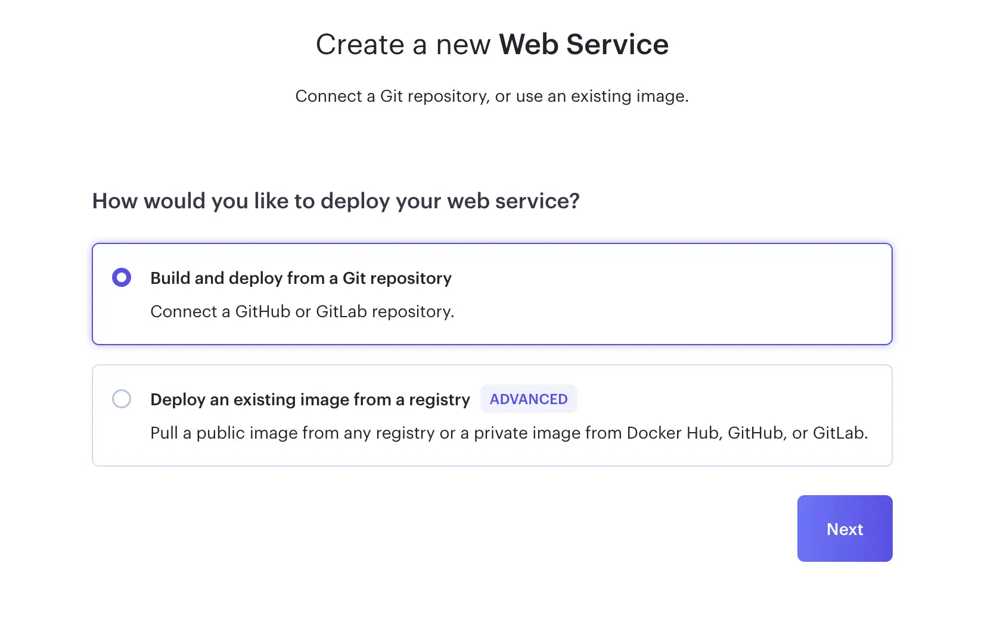
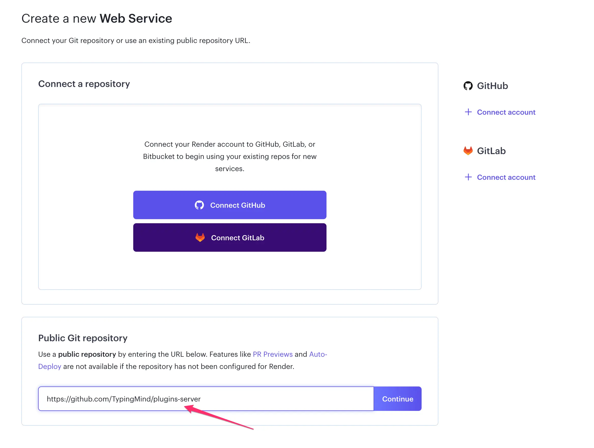
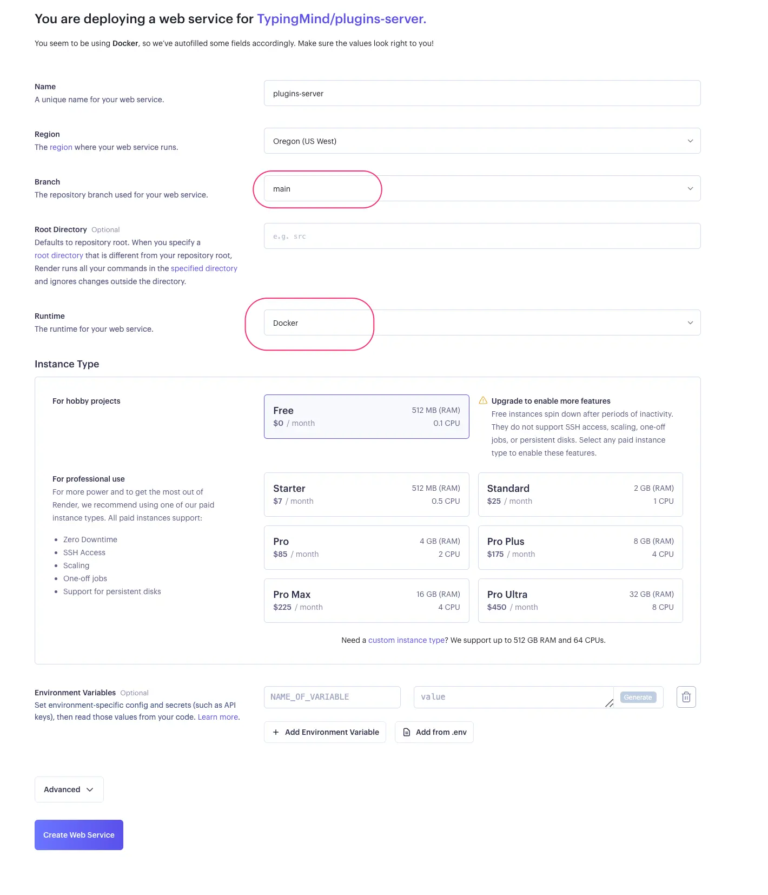
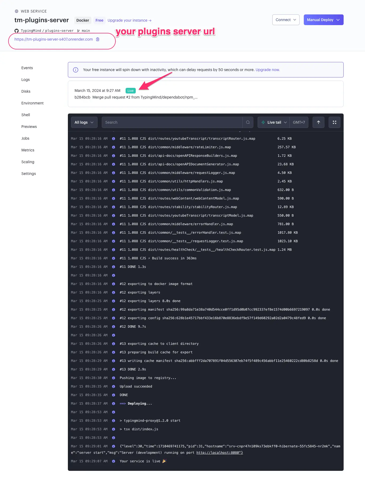
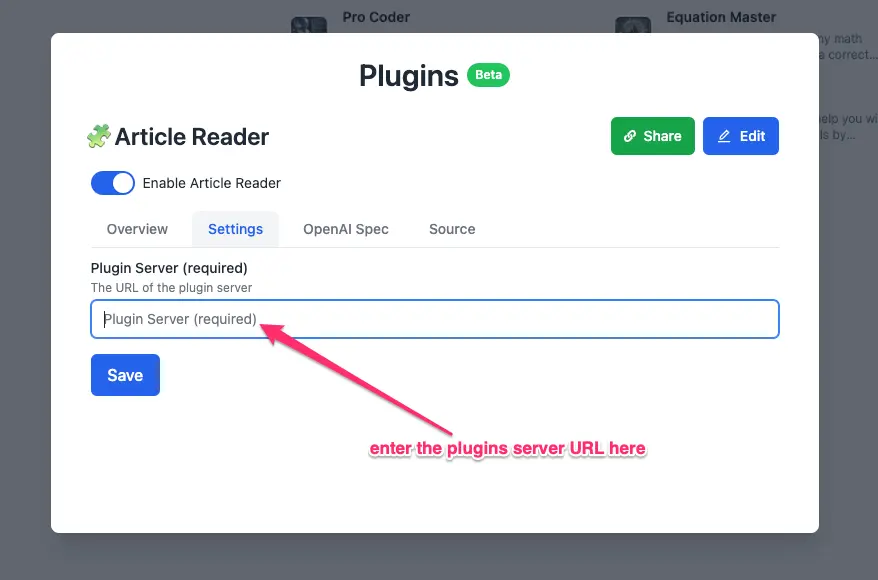

<Warning>
  **DEPRECATED**: Plugins Server is no longer officially supported by the TypingMind team. We now recommend using MCP instead. You can still continue using it, but we do not offer technical support or provide updates.
</Warning>

**Plugins Server** provides a proxy server for [Typing Mind's Plugins](https://docs.typingmind.com/plugins). A proxy server is needed for complex use cases where a server is required for processing data that cannot be done from the client side in Typing Mind.

Plugins Server is open-source. See the code on GitHub: [https://github.com/TypingMind/plugins-server](https://github.com/TypingMind/plugins-server)

On this page, we’ll guide you on how to deploy the Plugins Server on Render.com. You can deploy on any other hosting providers you want, the steps are almost identical.

## **Step-by-Step Guide**

1. **Make a Home on Render:**
   - Go to Render's website and create your free account.
   - Click to create a new "Web Service" 
   - on the next screen enter the URL of the TypingMind plugin repository  `https://github.com/TypingMind/plugins-server` to continue 
2. **Make sure the value looks right**
   - The project requires configuration settings. The **Branch** should be set to `main`, **Runtime** to `Docker`. You may set the region to any desired region. 
   - There is no requirement to include environment variables.
   <Warning>
     ⚠️ **If you are using a free tier hosting, your server may sleep when not in use which can cause a delay of up to 30 seconds for the first request. You can visit the link below to check your free usage.**
   </Warning>
   [Cloud Application Hosting for Developers | Render](https://dashboard.render.com/billing#free-usage)
3. **Complete the deployment process.**
   - Look for the "Create Web Service" button on Render. Click it and wait a little bit – it's building your project! 
   <Warning>
     🚨 You should keep your plugin server URL confidential and manage your server independently. Never share or publish it, as others may misuse it or occupy all of your free tier usage.
   </Warning>
4. **Configure the plugin to use your server.**
   - Inside your TypingMind Plugin settings, there's probably a place to put the address of your project that's now live on Render. 

## Need help?

Contact us for support at [**support@typingmind.com**](mailto:support@typingmind.com)