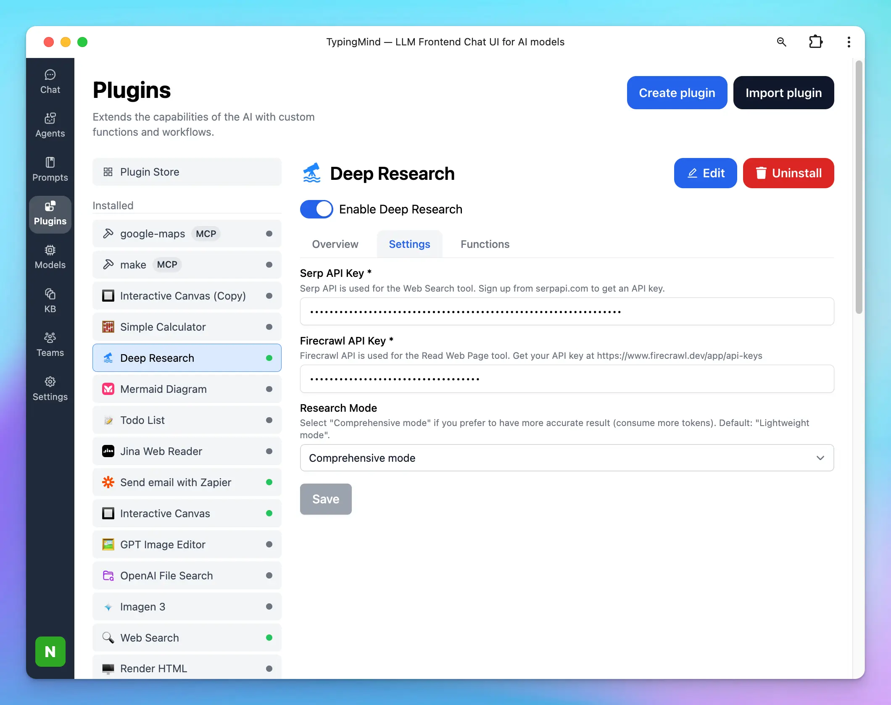

TypingMind now supports **Deep Research** as a customizable plugin. This plugin enables you to perform advanced, multi-step research directly inside TypingMind with structured planning, live web search, and content analysis.

Deep Research is especially useful for in-depth exploration of a topic, combining planning, searching, and reading tools into a cohesive workflow.

## Setting Up Deep Research on TypingMind

1. Go to **Plugins —\> Plugin Store**
2. Find **Deep Research** in your plugin list and install it
3. After installing, go to Deep Research plugin and click on Settings tab
   - Enter your [**Serp API key**](https://serpapi.com/) and [**Firecrawl API key**](https://www.firecrawl.dev/app/api-keys) in the designated fields.
   - These keys are required for the plugin to search the web and read content.
4. Choose your research mode:

The Deep Research plugin offers three research modes, allowing you to balance speed, cost, and accuracy:

- **Lightweight** – Fast and cost-saving; good for quick checks or summaries.
- **Comprehensive** – Thorough and accurate; runs longer and consumes more tokens.
- **Dynamic** – Balanced mode; adapts to your needs with a good mix of efficiency and depth.

You can select your preferred mode in the plugin settings before starting a session.

1. Save your changes.

At this point, the plugin is configured and ready to use.

## Using Deep Research in Conversations

1. Open a conversation in TypingMind.
2. Ask a question or provide a topic where you want in-depth research. For example:
   - _“Do a comprehensive deep research on the impact of AI in product design.”_
3. The plugin will:
   - Create a **Research Plan**.
   - **Search the web** for relevant sources using Serp API.
   - **Read web pages** with Firecrawl API.
   - Combine the results into a structured report.

You can follow up naturally in the same chat to refine, expand, or focus the research.

## Customize Deep Research Plugin

Deep Research plugin is fully customizable. You can duplicate and edit the plugin to:

- **Add your own tools:** the TypingMind plugin system allows you to add multiple tools to the Deep Research plugin and supports various ways to implement your tools using JavaScript, HTTP requests, or MCP. _Learn more here: [TypingMind Plugin Development Guide](Deep%20Research%202717c3f1757a80098209eabdc1a6ed3c.md)._
  - By default, the Deep Research plugin comes with 3 tools: Research Plan, Search Web, and Read Web Page. You can add more tools as your preferences like:
    - Reading tweets
    - Searching private databases
    - Controlling a browser
- Adjust **system instructions** and **prompts** in the plugin source.

## Token Usage Note

This plugin may use multiple tools in multiple turns. A deep research task can run for up to 2 minutes. Please monitor the token usage closely to avoid consuming too many tokens. You can also modify the plugin to make it more token-efficient by adding your own tools to perform web searches and read web pages.