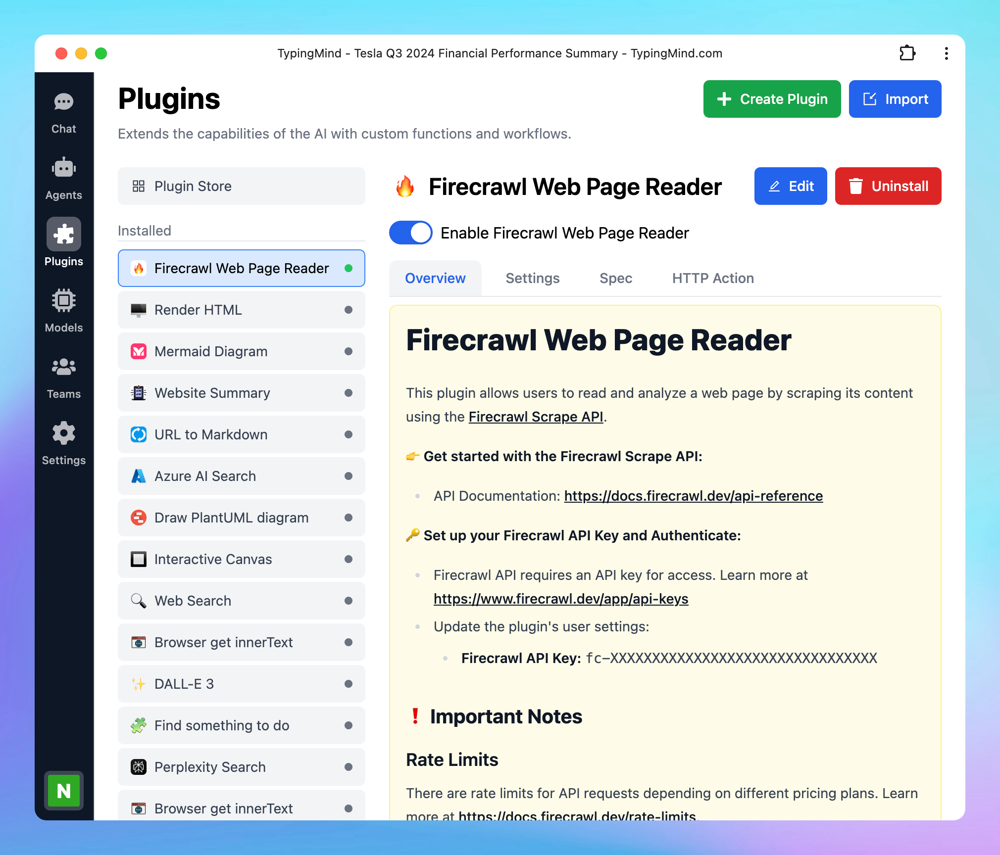

# Firecrawl Web Page Reader

Firecrawl Web Page Reader allows you to read and analyze a web page by scraping its content using the [**Firecrawl Scrape API**](https://docs.firecrawl.dev/api-reference/endpoint/scrape).

Here’s how to set up on TypingMind.

## Step 1: Sign up for a Firecrawl account

Go to [https://www.firecrawl.dev/signin/password_signin](https://www.firecrawl.dev/signin/password_signin) to **sign up for a Firecrawl account.**

## Step 2: Get the API key

- Once signed in, navigate to the **API key** section in your Firecrawl dashboard
- **Copy your API key**
- **Save this key** in a secure place, as you’ll need it to set it up on TypingMind.

## Step 3: Set up the plugin on TypingMind

- Go to [typingmind.com](http://typingmind.com)
- Click on the **Plugins** menu on the left side panel
- Select the plugin **Firecrawl Web Page Reader**
- Switch to the settings tab to **enter the copied API key.**

- You can also select the following options:
    - **Only main content:** indicates whether to scrape only the main content. Optional, default value is true.
    - **Response format**: specifies the format of the response from Firecrawl such as markdown, html, rawHtml, links, screenshot, extract, screenshot@fullPage. Optional, default value is markdown.

## Step 4: Start chatting!

- Enter the URL of the web page you wish to scrape and analyze.
- The Firecrawl Web Page Reader will retrieve the content, allowing you to explore, read, and analyze data from that page.

## Some important notes

There are rate limits for Firecrawl API requests depending on different pricing plans. Learn more about rate limit at [**https://docs.firecrawl.dev/rate-limits](https://docs.firecrawl.dev/rate-limits).**

Firecrawl offers a free plan, allowing up to 500 page scrapes. If you exceed this limit, you’ll need to upgrade your plan. For detailed pricing information, visit [**https://www.firecrawl.dev/pricing**](https://www.firecrawl.dev/pricing).