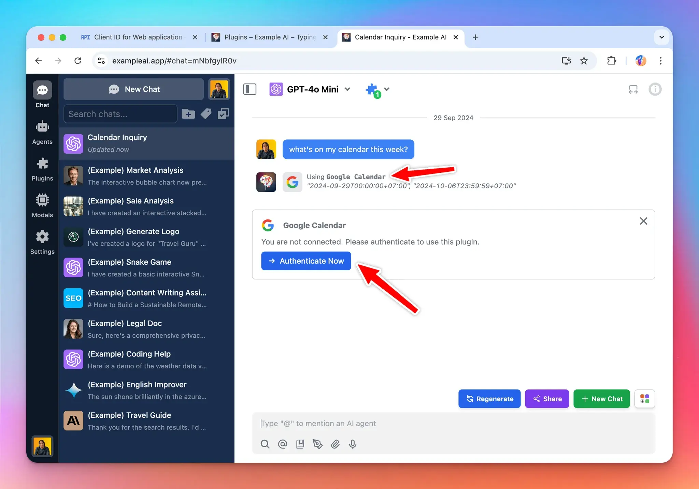

**Google Calendar** plugin allows the AI to access the user’s calendar via Google API. By the end of this tutorial, you will be able to create a plugin like the screenshot below:



When using this plugin, the end user must authenticate with their Google account. The AI will then use the user permission to access their calendar to provide assistants and useful information.

Here is the link to the repository of the completed plugin: https://github.com/TypingMind/plugin-read-google-calendar

In this tutorial, we will go through 3 parts:

- Part 1: Create the plugin (as a plugin developer)
- Part 2: Install and setup the plugin (as an admin user)
- Part 3: Use the plugin (as an end user)

Let’s get started.

<aside>
💡

For clarity, this document is written in context of the [**TypingMind Team Version**](https://custom.typingmind.com). If you are using the [**TypingMind License Version**](https://www.typingmind.com), everything is the same except for some small differences. Read until the end for more information.

</aside>

## Part 1: Create the plugin

<aside>
💡

In this step, **we will act as a Plugin Developer** to create a plugin. This plugin can later be listed on the plugin store or share directly to other people in the community via a share URL or a GitHub repo.

</aside>

Let’s start creating the “Google Calendar” plugin step-by-step.

The easiest way to implement this plugin is by using [HTTP Action](Build%20a%20TypingMind%20Plugin%207ecc24adfcde4443b37ce7e4aea73b05.md), so let’s start by looking for an API endpoint.

### Research Google Calendar API

A quick Google search will gives us the HTTP endpoint we need on the [Google Calendar API docs](https://developers.google.com/calendar/api/v3/reference/calendarList/list): 


From this page, we will learn that:

1. The endpoint to get user’s primary calendar events is:

```
GET https://www.googleapis.com/calendar/v3/calendars/primary/events
```

1. To access the endpoint, you need an access token that have the `calendar.readonly` scope. The exact scope value is:

```
https://www.googleapis.com/auth/calendar.readonly
```

1. The endpoint supports a lot of parameters, but the ones we care about are:
    1.  `timeMin` and `timeMax`, which allows us to limit the results to a specific timeframe.
    2. `maxResults` which allows us to limit the number of results returned. We don’t want to return too many as it could consume too much of our LLM tokens if we later pass the result to the AI.

We can use the API Explorer to test the endpoint and check a sample response:


Based on this, we can construct a simple HTTP request to get the user’s calendar event in a specific time frame like follow:

```bash
curl -X GET \
-H "Authorization: Bearer {{ACCESS_TOKEN}}" \
"https://www.googleapis.com/calendar/v3/calendars/primary/events?timeMin=2024-09-28T00:00:00Z&timeMax=2024-09-30T23:59:59Z&maxResults=10"
```

To test this endpoint, we will need an access token (shown as `{{ACCESS_TOKEN}}` in the above example), and this access token must be granted the `calendar.readonly` scope.

I used the [Google OAuth 2.0 playground](https://developers.google.com/oauthplayground/) to get a test access token with my Google account. You can do the same with your Google account, just go to the playground, enter the desired scope, then follow the flow to get your access token.


Then I tested the endpoint with my access token and can confirm that the endpoint is working and returning my events in JSON format.


Now that we understand what are needed to get the user’s calendar events, let’s start creating the “Google Calendar” plugin.

### Creating a new plugin on TypingMind

The easiest way to create a new TypingMind plugin is to use the editor provided by TypingMind. You can access the editor via the Admin Panel (or using the TypingMind License version directly at www.typingmind.com).

- Go to your Admin Panel → Plugins → Create New Plugin.
- Name the plugin “**Google Calendar**”
- Description: “**Give AI read-only access to your Google Calendar**”


### OpenAI Function Spec

In this plugin, we want to give the AI access to the user’s google calendar within a specific timeframe, so we will name the function `get_google_calendar_events` with two parameters:

- `timeMax`
- `timeMin`

I leave the `maxResults` parameter to be used as a user settings (will explain later).

The full function spec is follow:

```json
{
  "name": "get_google_calendar_events",
  "parameters": {
    "type": "object",
    "required": [
      "timeMin",
      "timeMax"
    ],
    "properties": {
      "timeMax": {
        "type": "string",
        "description": "Must be an RFC3339 timestamp with mandatory time zone offset, for example, 2011-06-03T10:00:00-07:00, 2011-06-03T10:00:00Z."
      },
      "timeMin": {
        "type": "string",
        "description": "Must be an RFC3339 timestamp with mandatory time zone offset, for example, 2011-06-03T10:00:00-07:00, 2011-06-03T10:00:00Z."
      }
    }
  },
  "description": "Return events in the current user Google's calendar within a specific time range"
}
```

### User Settings

In this plugin, we want to allow the user to choose the maximum number of events returned by the API. So I set up the plugin with one user setting `maxResults` with the default value of `10`.

Here is the User Settings JSON content:

```json
[
  {
    "name": "maxResults",
    "label": "Max Results",
    "description": "Number of events to return from the Google Calendar API (default: 10)",
    "defaultValue": 10
  }
]
```

### Authentication

For authentication, let’s choose “OAuth 2.0” and setup the OAuth configurations.

For OAuth configurations, we will need the following information:

- **Scopes**: the permissions we need from the user. In this case, we already know the scope needed is `https://www.googleapis.com/auth/calendar.readonly`
- **Content Type**: JSON or URL encoded, in this case, google API uses JSON.
- **Authorization URL** to send the user to Google for authorization
- **Token URL**: to get access token

The URLs can be found from Google documentations, sometimes it can be difficult to navigate their documents, but in those cases, you can always ask AI!


You can verify the AI’s response by visiting [`https://accounts.google.com/.well-known/openid-configuration`](https://accounts.google.com/.well-known/openid-configuration) get the auth URL and token URL from there.

So here is the OAuth config I setup to the plugin:


### Implementation

For this plugin, as planned, we will use the HTTP Action implementation.


Based on the information we entered to the plugin, we have access to the following variables to use:

- `timeMin`  and `timeMax` from the OpenAI function spec
- `maxResults` from the User Settings JSON
- `OAUTH_PLUGIN_ACCESS_TOKEN` from the OAuth authentication type. The value of this variable will be provided on the fly when the user use the plugin and authorize the plugin’s access with Google.

Here is the detail to enter to the HTTP Action:

- Method: `GET`
- Endpoint URL: `https://www.googleapis.com/calendar/v3/calendars/primary/events?maxResults={maxResults}&timeMin={timeMin}&timeMax={timeMax}`
- Request headers:

```json
{
  "Authorization": "Bearer {OAUTH_PLUGIN_ACCESS_TOKEN}"
}
```

### Test the implementation

You can add some test variables and click “Send Test Request” to verify that all of your settings are correct.

Here I use the same test access token I got from the Google OAuth 2.0 playground:


As for the **Output Options**, we select “Give plugin output to the AI”, so that the AI can read the information in the response JSON and represent the result to the user in a friendly format.

### Finish creating the plugin

Click “Add Plugins” to finish creating the plugin. After created, it will be automatically installed to your current instance.

You can click “Share” to share this plugin to other people to use.


## Part 2: Install and setup the plugin

<aside>
💡

In this step, we will act as an **Admin User**. We will install the Google Calendar to our TypingMind instance, enable it, and set it up with our Google OAuth app.

</aside>

### Prepare your TypingMind instance

In this example, I will create a new TypingMind instance named “**ExampleAI**” hosted at [exampleai.app](https://www.exampleai.app/) (you can also create private instance like this using [TypingMind Custom](https://custom.typingmind.com)). **ExampleAI** will be a private AI platform that I created to provide AI access to my teammates at my company.

I will invite my teammates to this platform and let them use the AI with the Google Calendar plugin.


### Prepare the OAuth app

To use the Google Calendar plugin, I need a Google OAuth app.

<aside>
💡

**What is a Google OAuth app and why the need for it?**

Whenever an app need to access Google’s users data, they will need to signup for an OAuth app. This is how Google controls who have access to who and can revoke your access if they found that you are misusing the users data. The same OAuth setup is used for other platform (Facebook, Slack, GitHub, etc.).

From the beginning of this tutorial, I used the OAuth 2.0 Playground so that I don’t have to create one. But now as an Admin user of **ExampleAI**, I will need to create an OAuth app, this OAuth app will be used by TypingMind platform to request access to my users’ Google Calendar.

This means when the user authorize with Google, they will be asked:
**”ExampleAI wants to read your Google Calendar. Do you allow?”**

Note that it say “**ExampleAI**” is requesting the permission, not TypingMind. This allows me, as an Admin user of ExampleAI, to create an on-brand experience for my users.

</aside>

To create an OAuth app, go to [https://console.cloud.google.com/](https://console.cloud.google.com/) and click on the project navigation area, then click **New Project.**


I will name this project “**ExampleAI**”.


Next, search for the “**Google Calendar API**” and enable it for the project. You can enable multiple different APIs at the same time for the same project.


Once enabled, click go to Credentials → Create Credentials → OAuth client ID.


At this step, you will be asked to setup the Consent Screen (you only need to do this once per project).


On the next screen, select **Internal** if you are setting up with your Google Workspace account, otherwise, select **External**.


On the next screen, you can set up the branding info of the OAuth app. The details you enter here will be shown to the user when they authorize with Google.

Following the example we are doing, I will name this “ExampleAI” to match with the branding of my TypingMind instance.


Click Save. On the next screen, you need to specify the scopes needed for OAuth app.

<aside>
💡

**Tips:** You can use one OAuth app for multiple plugins, and the same one for [Login with OAuth](../TypingMind%20Team/User%20Management/OAuth%202%200%207bc28ee62d684e6a8f88314830cddd69.md). In such case, you can select multiple scopes as needed.

</aside>

For the current example, we search and select the “Google Calendar API” read-only scope.


On the next screen, you can add your own Google account as a test user to start testing your OAuth app right away.

<aside>
💡

Before your OAuth app is reviewed and approved by Google, you can only use it for a limited number of accounts (called test users). Once you tested that everything is working normally, you can request for review from Google so that your OAuth app can work with any Google account (or accounts within your Google Workspace if you choose Internal at the earlier step).

</aside>


Once you have setup the OAuth consent screen, go back to the Credentials tab and start creating your OAuth Client ID again.

Select “**Web application**” Application Type. You can skip the “Authorized Javascript Origin” options as we are not using those in this example.


Once created, you will see a **Client ID** and **Client Secret**. Take note of these values, we will need them at the next step.


### Install the Google Calendar plugin

Now that I have an OAuth app created, I can use the Google Calendar plugin. I install the plugin to the ExampleAI instance by importing the plugin repo URL:

```
https://github.com/TypingMind/plugin-read-google-calendar
```

When enabled, the plugin asks for the **OAuth Client ID** and **OAuth Client Secret**. Enter the details using the client ID and secret you get from your OAuth client in the previous step.


You can also have an “OAuth Callback URL”. Copy this and go back to Google Cloud Console and add it to your OAuth app and click **Save**.


Now the **Google Calendar** plugin is enabled and configured, ready to be used by the user!

## Part 3: Users use the plugin

Now I will login to the ExampleAI instance as a user and start to use the **Google Calendar** plugin.


Start a new chat with the Google Calendar plugin enabled:


When I ask the AI “What’s on my calendar this week”, it activates the Google Calendar plugin and ask me to authenticate.


When I click Authenticate Now, TypingMind sends me to authorize with the **ExampleAI** OAuth app.


Once I authorized, the AI now have access to my Google calendar and can show me the events I have on my calendar in the week:


## Conclusion

In this tutorial, we've explored the process of implementing OAuth 2.0 authentication in a plugin, using Google Calendar as a practical example. We covered three main parts

- Creating the plugin as a developer
- Setting it up as an admin
- Using it as an end-user.

This approach allows for secure, user-authorized access to external services, enhancing the capabilities of AI assistants while maintaining data privacy and security.

Here is a complete diagram to visualize the flow:


## How does this apply for the TypingMind License version?

If you are using the license version (individual version) at www.typingmind.com, everything is almost the same with some important difference:

- You must provide the OAuth app by your own before using the plugin. You are acting as both admin user and end user (because there is no admin user in the TypingMind license version).
- When authenticating, all steps of the [OAuth authentication flow](https://oauth.net/2/) is run on the client side (your browser). The TypingMind license version does not have a server or a backend. Note that some OAuth providers may not allow this behavior. We tested the OAuth flow of Google and it seems to work on the browser side, but some other providers may not.
- The TypingMind License Version is intended for single-user use. We don’t recommend sharing the license version to other users as they will have access to your OAuth Client Secret, which is not secure.
- To share access to other users in a secure way, please use [**TypingMind Custom**](https://custom.typingmind.com).

<aside>
💡

TypingMind License Version does not have a built-in OAuth app for plugins. This is because having an OAuth app means that we (TypingMind) will have access to your Google account after you authorize, and we don’t want to have access your data.

We are committed to make TypingMind License Version a truly static web app where all of your data is only stored locally on your device. By using your own OAuth credentials, you can still use all of the OAuth features without giving await access to your data.

</aside>

## Learn more

TypingMind Plugin is a powerful system. Learn more about it by reading our documents at [https://docs.typingmind.com](https://docs.typingmind.com) or share your ideas at our [Awesome TypingMind Github Repo](https://github.com/TypingMind/awesome-typingmind)