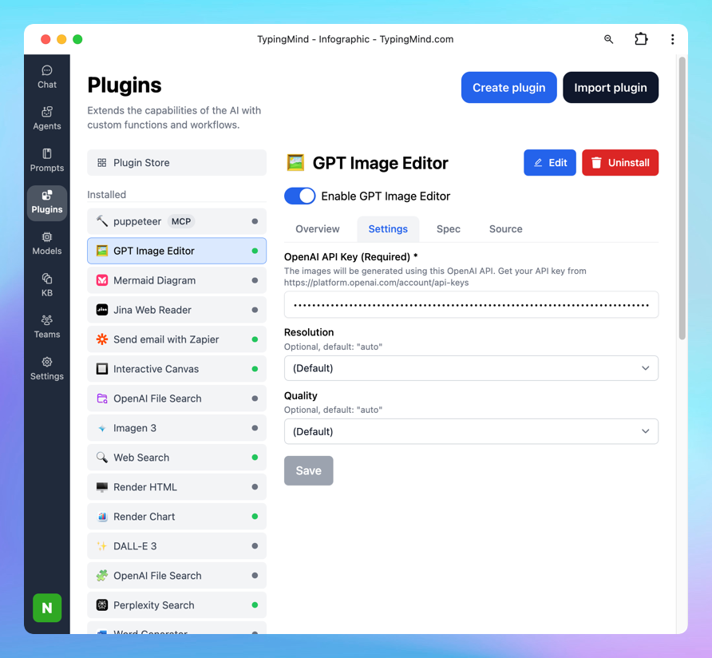

# GPT Image Editor

**OpenAI Image Generation is available on TypingMind via the GPT Image Editor plugin.**

With this plugin, you can:

- Generate and edit images using the `gpt-image-1` API (just like ChatGPT’s native image generation)
- Use image generation with any LLM—not limited to OpenAI models

## Step 1: Open GPT Image Editor plugin setting

- On TypingMind.com, navigate the plugin menu on the left workspace bar of the app (next to the sidebar)
- Click on Plugin Store and install GPT Image Editor.
- Click on the installed GPT Image Editor plugin to open its settings.

## Step 2: Enter your OpenAI API key

- Switch tab to the Settings tab
- Enter your [OpenAI API key](../Manage%20&%20Connect%20AI%20Models/OpenAI%20(GPT-5,%20GPT-4%201)%2097b6ce8cbb6642a9934e81f7b7365575.md)
- Set up image generated resolution and quality as you want.

## Step 3: Start prompting the AI model to generate images

You can:

- Create and edit image

- Upload image and edit from your image file

- Create infographic

- And more!

## Image Generation Prompt Tips

Tips from the OpenAI community, read more [here](https://community.openai.com/t/dalle3-prompt-tips-and-tricks-thread/498040)

1. **Be Specific and Detailed**: The more specific your prompt, the better the image quality. Include details like the setting, objects, colors, mood, and any specific elements you want in the image.
2. **Mood and Atmosphere**: Describe the mood or atmosphere you want to convey. Words like “serene,” “chaotic,” “mystical,” or “futuristic” can guide the AI in setting the right tone.
3. **Use Descriptive Adjectives**: Adjectives help in refining the image. For example, instead of saying “a dog,” say “a fluffy, small, brown dog.”
4. **Consider Perspective and Composition**: Mention if you want a close-up, a wide shot, a bird’s-eye view, or a specific angle. This helps in framing the scene correctly.
5. **Specify Lighting and Time of Day**: Lighting can dramatically change the mood of an image. Specify if it’s day or night, sunny or cloudy, or if there’s a specific light source like candlelight or neon lights.
6. **Incorporate Action or Movement**: If you want a dynamic image, describe actions or movements. For instance, “a cat jumping over a fence” is more dynamic than just “a cat.”
7. **Avoid Overloading the Prompt**: While details are good, too many can confuse the AI. Try to strike a balance between being descriptive and being concise.
8. **Use Analogies or Comparisons**: Sometimes it helps to compare what you want with something well-known, like “in the style of Van Gogh” or “resembling a scene from a fantasy novel.”
9. **Specify Desired Styles or Themes**: If you have a particular artistic style or theme in mind, mention it. For example, “cyberpunk,” “art deco,” or “minimalist.”
10. **Iterative Approach**: Sometimes, you may not get the perfect image on the first try. Use the results to refine your prompt and try again.

**OpenAI Image Generation is available on TypingMind via the GPT Image Editor plugin.**

With this plugin, you can:

- Generate and edit images using the `gpt-image-1` API (just like ChatGPT’s native image generation)
- Use image generation with any LLM—not limited to OpenAI models