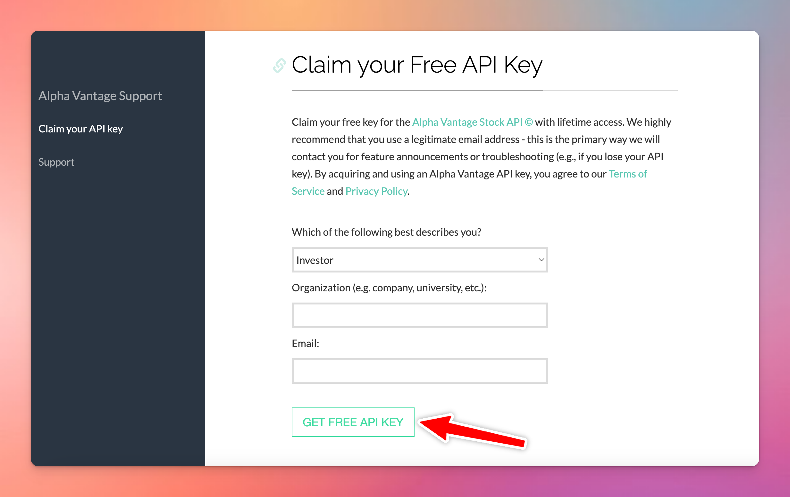

# Market News

You can use Market News plugin on TypingMind to get the latest financial information. 

Here are some simple steps to set this up:

- Go to [https://www.alphavantage.co/support/#api-key](https://www.alphavantage.co/support/#api-key) to get API key

- Copy your API key into a safe place
- Go to typingmind.com, click on the plugin icon 🧩 right next to the model selection
- Click on Market News Plugin
- Switch to Settings tab
- Enter your copied API key

