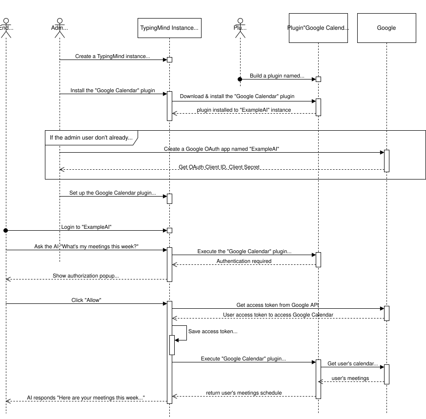
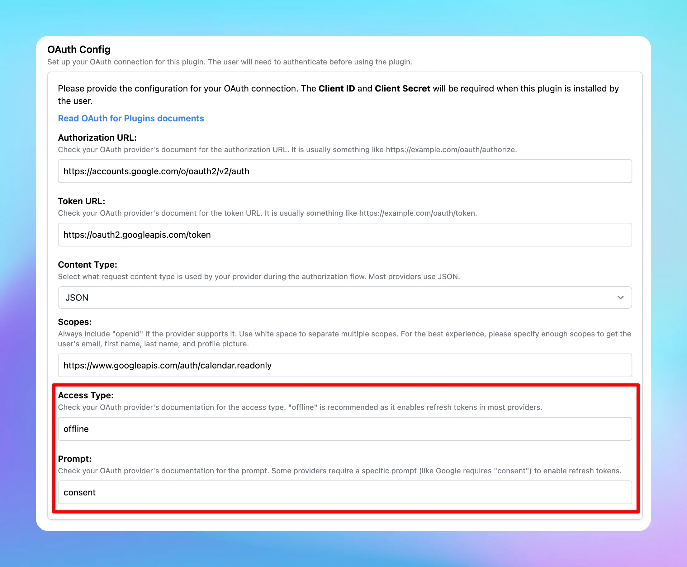

TypingMind Plugins support OAuth 2.0 authentication type. This help plugin developers create plugins that act on behalf of the user using the user’s account.


This authentication type make it easy to work with external services that requires OAuth.

Some example plugins you can create using OAuth authentication:

- A Google Calendar plugin that allows the AI to read events from user’s Google calendar.
- A Slack message plugin that all allows the AI to send a message to the user’s Slack channel.

## **Glossary**

| **Term** | Description |
| --- | --- |
| Plugin Developer | The person who create the Google Calendar plugin. |
| Admin User | The person who is the admin of a TypingMind instance ([TypingMind Custom](https://custom.typingmind.com)), this person have access to the admin panel to create new AI agents and install new plugins. |
| End User | The person who use the TypingMind instance, chat with the AI models, using the AI agents and plugins created by the Admin users. |

<Tip>
  **Looking for a step-by-step guide?**

  Read our tutorial: [create a Google Calendar plugin with OAuth 2.0](/plugins/google-calendar).
</Tip>

## Overview and facts

- Creating a plugin with OAuth requires the plugin developer to setup Authorization URL, Token URL, Scopes, Prompt, Access Type. These parameters are different depending on which OAuth provider is used.
- When install a plugin with OAuth, the plugin will requires setting up OAuth Client ID and OAuth Client Secret. The admin user who install the plugin will need to set this up with their own OAuth app.
- When the plugin is being used by the end users, they will need to authorize first. The authorization process is handled by TypingMind automatically.
- Plugin developer can use the `{OAUTH_PLUGIN_ACCESS_TOKEN}` variable in their plugin source code as a placeholder for the user’s access token. If the user have not authorized or the access token has expired, the variable will hold an empty value.

Here is a diagram of the full flow (excluding the refresh token process):



## Refresh Tokens

Access tokens are typically short-lived. A **refresh token** allows new access tokens to be obtained without reauthentication, ensuring a smooth user experience even when access tokens expire quickly (e.g., in one hour).

TypingMind manages refresh tokens internally if they are provided by the OAuth provider. However, **whether a refresh token is issued depends on your OAuth configuration.** To make sure refresh tokens are issued, it is often necessary to set specific parameters:

- **Access Type:** Setting `access_type=offline` to explicitly request a refresh token.
- **Prompt:** Many providers (like Google) only issue a refresh token the first time a user grants consent. Using `prompt=consent` ensures a refresh token is issued even if the user has previously authorized the app.

**Note**: Some OAuth providers automatically issue refresh tokens without requiring `access_type` or `prompt`, while others are strict about these parameters, or expect different values. Always consult the documentation of the specific provider.

Example OAuth Configuration:

```json
"oauthConfig": {
	  "scopes": "https://www.googleapis.com/auth/calendar.readonly",
	  "tokenURL": "https://oauth2.googleapis.com/token",
	  "contentType": "json",
	  "authorizationURL": "https://accounts.google.com/o/oauth2/v2/auth",
	  "prompt": "consent",
	  "accessType": "offline"
}
```



## **Shared OAuth Connections**

TypingMind supports **Shared OAuth Connections**, allowing multiple plugins to share a single OAuth configuration. This simplifies plugin management and reduces repetitive OAuth setups, ensuring users only authenticate once across multiple plugins with the same OAuth settings.

**Note:** The Shared OAuth Connections feature is only available in **TypingMind Custom**. It is not available in the TypingMind License version.

### **Key Benefits:**

- **Centralized OAuth Setup**: Admins configure OAuth credentials just once for multiple plugins.
- **Simplified User Experience**: Users authenticate once and gain seamless access across all plugins sharing the OAuth connection.

### **Setup Guide:**

1. **Create a Shared Connection**:
   - Navigate to the Plugins Manager
   - Select the **"Shared OAuth Connections"** tab
   - Click **"Add New Connection"** to create a new OAuth connection
   
2. **Configure OAuth Credentials**:
   - Enter necessary details such as Authorization URL, Token URL, Client ID, Client Secret, Scopes, Prompt, and Access Type
   
3. **Apply Shared OAuth to Plugins**:
   - Edit the desired plugin
   - Under the **"Authentication"** section, select **OAuth 2.0**
   - Choose your **"OAuth Configuration Source"** from the dropdown menu, selecting your newly created shared OAuth connection
   - Plugin credentials will automatically apply from the shared connection—no further setup required
   
   

### **Built-in OAuth Plugins:**

- Built-in plugins provided by the system come with predefined OAuth settings and cannot be directly modified.
- To apply a shared OAuth connection:
  - Duplicate the built-in plugin
  - Edit your duplicated plugin to select the shared OAuth connection

## OAuth in the TypingMind License version

If you are using the license version (individual version) at [www.typingmind.com](http://www.typingmind.com), everything is almost the same with some important difference:

- You must provide the OAuth app by your own before using the plugin. You are acting as both admin user and end user (because there is no admin user in the TypingMind license version).
- When authenticating, all steps of the [OAuth authentication flow](https://oauth.net/2/) is run on the client side (your browser). The TypingMind license version does not have a server or a backend. Note that some OAuth providers may not allow this behavior. We tested the OAuth flow of Google and it seems to work on the browser side, but some other providers may not.
- The TypingMind License Version is intended for single-user use. We don’t recommend sharing the license version to other users as they will have access to your OAuth Client Secret, which is not secure.
- To share access to other users in a secure way, please use [**TypingMind Custom**](https://custom.typingmind.com).

<aside>
  💡

  TypingMind License Version does not have a built-in OAuth app for plugins. This is because having an OAuth app means that we (TypingMind) will have access to your Google account after you authorize, and we don’t want to have access your data.

  We are committed to make TypingMind License Version a truly static web app where all of your data is only stored locally on your device. By using your own OAuth credentials, you can still use all of the OAuth features without giving await access to your data.
</aside>