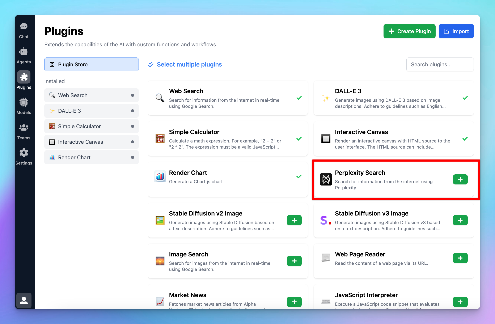
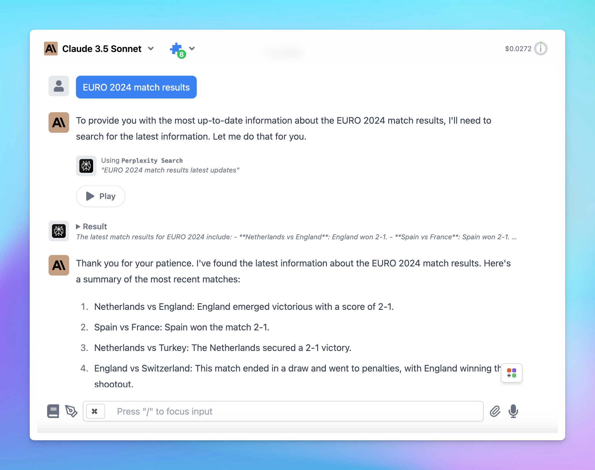

This plugin allows the AI assistant to search for information from the internet using Perplexity.

Here’s the detailed guideline:

## Get a Perplexity AI account

Go to [https://www.perplexity.ai/](https://www.perplexity.ai/) and sign up for an account. Then go to  [https://www.perplexity.ai/settings/api](https://www.perplexity.ai/settings/api) to get your API key.

<aside>
  💡 Note that you may need to **top-up your credit** to use the API key
</aside>

# Use Perplexity Plugin on TypingMind

- Click on Plugins menu on the left side panel
- Install Perplexity Search plugin to your plugin list

- Enable Perplexity Search
- Switch to Settings tab to enter the necessary settings to get the plugin to work
- Enter the API key you just got from Perplexity

- Test the plugin to see if it works properly!

