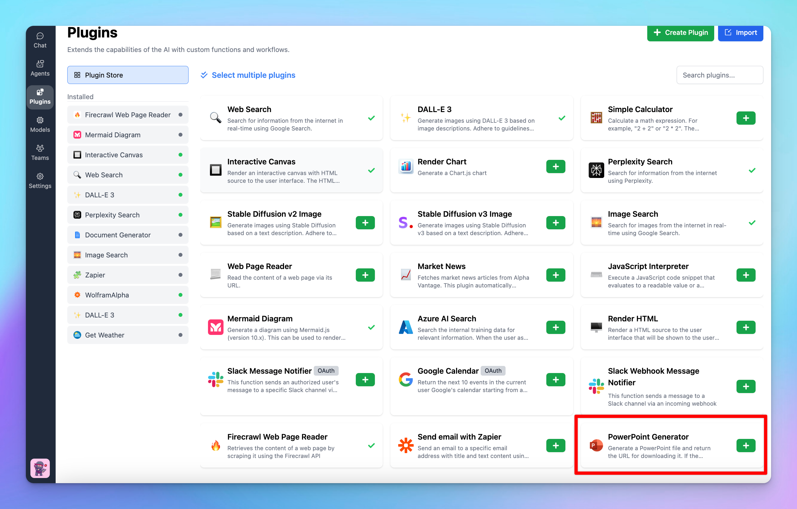

# Powerpoint Generator

<Warning>
  Plugin has been removed because it relied on a legacy plugin server. Please use Code Sandbox to generate files instead.
</Warning>

The PowerPoint Generator plugin allows you to quickly create PowerPoint slides with customizable layouts, fonts, and colors. Follow these steps to set up and configure the plugin on your app.

## Step 1: Install the Powerpoint Generator Plugin

- Open the **Plugins** tab from the left sidebar in the app.
- Click on **Plugin Store** to browse available plugins.
- Click **Install (+ icon)** to install the Powerpoint Generator plugin

## Step 2: Configure the plugin

To use the Powerpoint Generator, you will need to set up a Plugin Server following this guide: [**How to set up a Plugin Server on Render**](https://docs.typingmind.com/plugins/plugins-server/how-to-deploy-plugins-server-on-render)

## Step 3: Customize the slides generated

After setting up the Plugin server, you can customize how the slides will look by adjusting some settings such as Title font size, Header font size, Body font size, Font family, Background color, Text color, Show footer, etc.

## Step 4: Save configuration

After configuring the settings, scroll down to save the changes.

## Step 5: Start a conversation!

Once the PowerPoint Generator plugin is installed and configured, you can start generating PowerPoint slides:

## Important notes

- The generated PowerPoint files will be automatically removed after one hour.
- The plugin does not yet support image embedding in PowerPoint files.