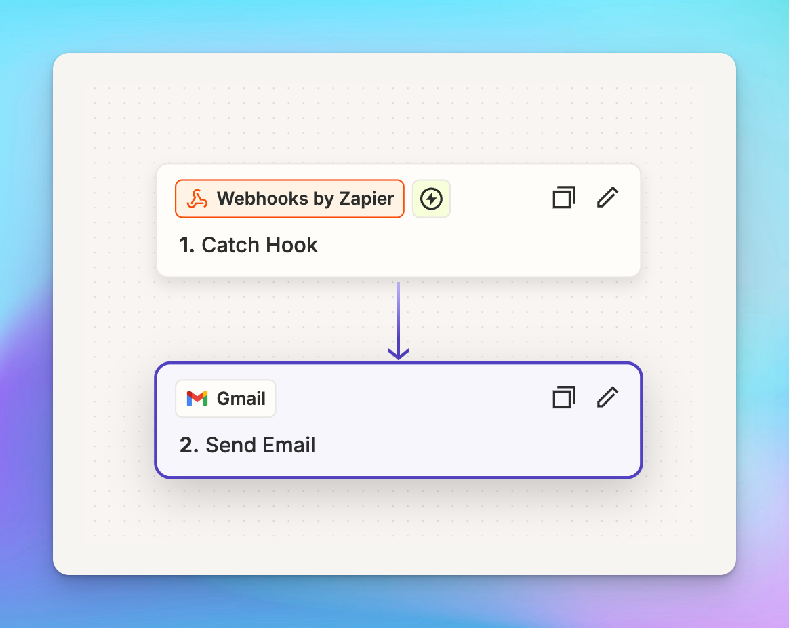

TypingMind can be integrated with Zapier to automate various tasks through custom plugins. Common use cases include:

- Send emails
- Update Notion content
- Schedule social media posts
- Update spreadsheets (Google Sheets, Airtable)
- Create Google Docs
- And many more automation possibilities

<aside>
💡

Please note that this plugin requires server plugin to get it to work. Learn more: [Server Plugin](https://docs.typingmind.com/changelog/typingmind/introducing-plugin-server)

You will also need to have Zapier Pro to use Webhook by Zapier. 

</aside>

Before diving into more details, **you must define your goal** - which tasks you want to achieve by using Zapier automation? 

In this guide, we will provide **an example guideline to set up Send emails via Zapier**, but you can adapt these principles to create other types of automations based on your specific needs.

<aside>
💡

Here is the link to the repository of the completed plugin so you can directly import to TypingMind: https://github.com/TypingMind/plugin-send-email-with-zapier

</aside>



## Step 1: **Create a Zapier Webhook**

- Log into Zapier and create a new Zap.
- For the trigger:
    - Select "**Webhooks by Zapier**"
    - Choose "**Catch Hook**" as the trigger event
    - Click "**Continue**"


- Skip the configuration step
- In the test step, copy the provided webhook URL, we will need this later.(format: `https://hooks.zapier.com/hooks/catch/*****`). Ignore the Test trigger action, we will do this later.

## Step 2: Review the Zapier trigger action

- Move to the **Trigger action** section
- Select **Gmail**
- Choose an **action event**: Send email, Create draft, Reply to, Find email, etc. In this guide, we select Send email.
- Connect with your Gmail account.


- In the **Configure** step, you need to enter the required fields for the app. To make them dynamic, specify each field appropriately.


For example, here we set "Email" for the **To** field, "Subject" for the **Subject** field, and "Content" for the **Body** field as dynamic fields. This allows the app to send any content to any email address as needed.

If you plan to use other apps, check their settings to see which fields can be set dynamically within TypingMind plugin. 

## **Step 3: Create a custom plugin in TypingMind**

- Go to TypingMind Admin Panel → Plugins → Create New Plugin.
- Name the plugin “**Send email with Zapier**”
- Description: “With this plugin, you can send custom messages from TypingMind to any email address you prefer using Webhook by Zapier”
- Open Plugin menu to provide necessary details as follows:

### OpenAI Function Spec

In this plugin, we want to enable the AI to send messages to an email. We'll name the function send_email_with_zapier with three parameters:

- `email`
- `subject`
- `message`

The full function spec is as follows:

```json
{
  "name": "send_email_with_zapier",
  "parameters": {
    "type": "object",
    "required": [
      "email",
      "subject",
      "content"
    ],
    "properties": {
      "email": {
        "type": "string",
        "description": "The recipient's email address."
      },
      "content": {
        "type": "string",
        "description": "The body content of the email."
      },
      "subject": {
        "type": "string",
        "description": "The subject line of the email."
      }
    }
  },
  "description": "Send an email to a specific email address with title and text content using Zapier webhook"
}
```

**Ensure you provide a comprehensive description so the AI knows what to send to the webhook.*

### User settings (optional)

This plugin requires a Webhook URL to get it to work.

If you create the plugin without requiring users to enter their own URL, you can skip this step.

However, if the plugin requires users to enter their own URL, please follow the instructions below:

```json
[
  {
    "name": "webhookURL",
    "type": "password",
    "label": "Webhook URL (Required)",
    "required": true,
    "description": "The Zapier webhook URL to which the email data will be sent",
    "placeholder": "https://hooks.zapier.com/hooks/catch/******"
  }
]
```


### Implementation

- Navigate to the **Implementation** section and choose **HTTP Action**.
- Set the HTTP Method to **POST**
- Enter your copied webhook URL in step 2 as the Endpoint or `{webhookURL}` as placeholder for user setting.
- Ensure **Add request body** is checked.
- Configure the request body as follows:

```json
{
  "email": "{email}",
  "subject": "{subject}",
  "content": "{content}"
}
```


- Click **Add test variables** and send a test request - this will send a request record that defines the values for your Zapier settings.

<aside>
💡

Replace the test value with your webhook URL to check if it works.


</aside>

## Step 4: **Complete the Zapier Setup**

- Go back to Zapier → Click to edit the Trigger Event - Webhook by Zapier to check on the recorded values you have just sent from TypingMind in step 3.
- Choose records with appropriate values and click on **Continue with selected record**.


- Return to the Trigger Action to configure the fields:
    - In the **To** field, select the "Email" value (click to toggle Catch Hook and select the value)
    - In the **Subject** and **Content** fields, select their corresponding values.

For other settings, you can manually fill in as permanent data or go back to TypingMind request body to add more value and re-do the steps.


- Click **Continue**, skip the test, and publish your Zap.

## Step 5: Test plugin

Test your custom plugin in TypingMind to ensure it works as expected.


<aside>
💡

Please note that the 'Send Email via Zapier' plugin is also available on the TypingMind Plugin Store. You can install it directly and follow the steps above to make it work.

</aside>