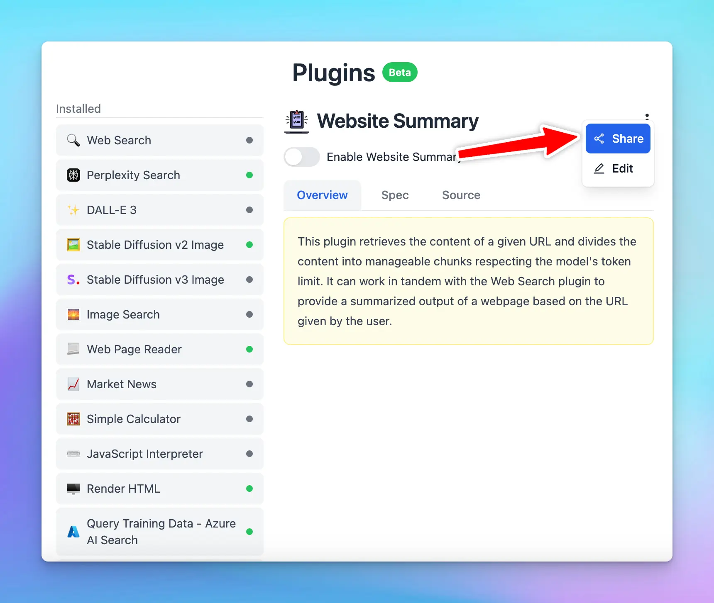
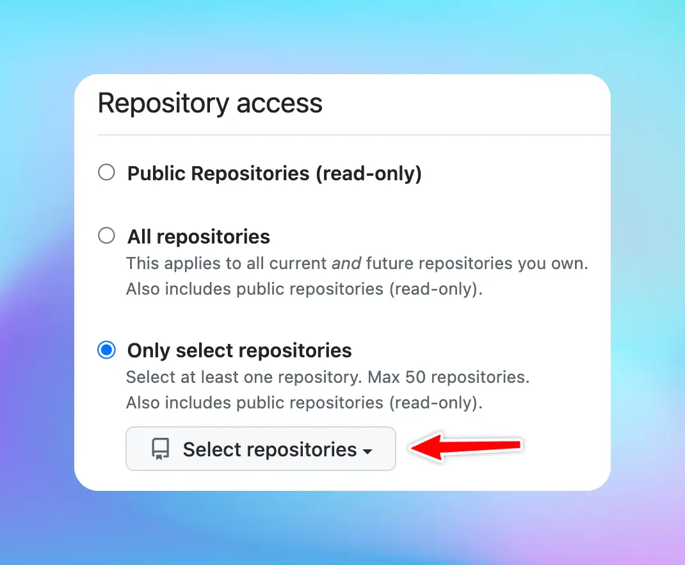
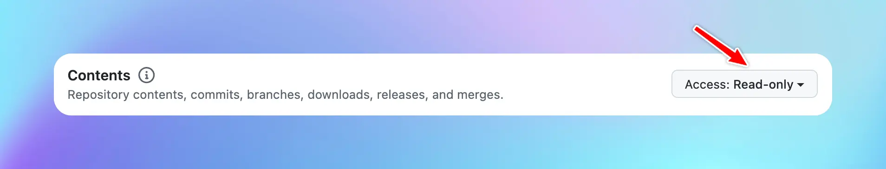
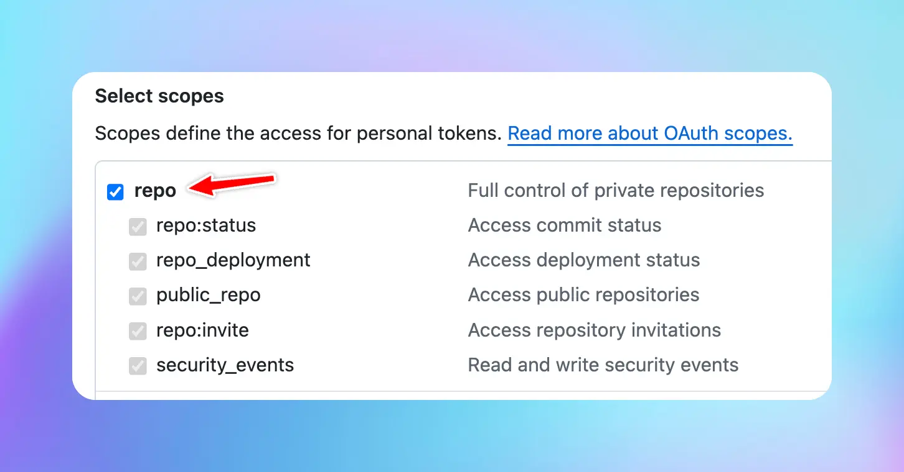

Looking to share plugins or import shared plugins? This guide will provide the easiest steps to do so.

## Share a plugin

### Share as URL and JSON

1. Open **Plugins**
2. Click on the “**Share**” button on the top right corner of the plugin (under the three dots menu).



3. There will be 2 options to share your plugins:

- Share via a unique URL
- Share as JSON


1. Simply copy the generated link/JSON file and share

## Share via GitHub

To share a plugin via GitHub (check [this repo](https://github.com/TypingMind/plugin-stable-diffusion-v2-image) as an example):

1. Create a public repo on GitHub
2. Create 3 files: `README.md` , `implementation.js` and `plugin.json`:
   - `README.md`: plugin overview
   - `implementation.js`: this file contains the JS code, it is only required if you use Javascript code implementation. It must contain a function with the name as same as the id in plugin.json file
   - `plugin.json`: a JSON file containing all configs of the plugin, please check [this guide](https://docs.typingmind.com/plugins/build-a-typingmind-plugin) to understand more. It has the following properties:
     - `version`: number, for other users to notice to update
     - `uuid`: string, this is the unique id to distinguish plugins
     - `iconURL`: string
     - `emoji`: string, this will be used if `iconURL` is not available
     - `title`: string, the displayed name of the plugin
     - `userSettings`: JSON string, check details in [this guide](https://docs.typingmind.com/plugins/build-a-typingmind-plugin#0e3d2ca8c78f4b62b1a8504957bbb268)
     - `openaiSpec`: JSON string, check details in [this guide](https://docs.typingmind.com/plugins/build-a-typingmind-plugin#f75675f108634820be70b39319cafb08)
     - `implementationType`: string, `"http"` or `"javascript"`
     - `httpAction`: JSON string, required if the implementation is HTTP, check details in [this guide](https://docs.typingmind.com/plugins/build-a-typingmind-plugin#f8f5759520614775aaf136c279931e76)
       - `id`: string, uuid preferred
       - `method`: string, the request method
       - `url`: string
       - `hasHeaders`: boolean
       - `requestHeaders`: JSON, required if hasHeaders is true
       - `hasBody`: boolean
       - `requestBody`: JSON, required if hasBody is true
       - `requestBodyFormat`: string, `"json"` or `"form-data"`
       - `hasResultTransform`: boolean
       - `resultTransform`: object, required if hasResultTransform is true, its shape is either of these:
       ```json
       {
         "engine": "handlebars",
         "templateString": "string template value"
       }
       ```
       ```json
       {
         "engine": "jmes",
         "expression": "string expression value"
       }
       ```
       - `outputType`: string, `"render_markdown"` or `"respond_to_ai"` or `"render_html"`
3. Get the GitHub repo link to share, for example: [https://github.com/TypingMind/stable-diffusion-v2-image](https://github.com/TypingMind/stable-diffusion-v2-image)

## **Import a shared plugin**

Find a plugin you'd like to use? Import it with these easy steps:

### **Import a plugin via URL**

To import a plugin using its URL, follow these steps:

1. Open **Plugins**
2. Click on the “**Import plugins”** button.
3. Paste the plugin URL into the designated field to import the plugin.


### Import a plugin via GitHub URL

To import a plugin using its URL, follow these steps:

1. Open **Plugins**
2. Click on the “**Import plugins”** button.
3. Paste the plugin Github URL into the designated field to import the plugin.


### Import a plugin from a private GitHub repo

1. Generate a new GitHub personal access token ([https://github.com/settings/tokens?type=beta](https://github.com/settings/tokens?type=beta)). There are 2 types of tokens:
   1. Fine-grained token (Recommended): Select that private repo and set **Contents** permission to **Read-only**   b. Classic token: select the scope **repo** 
2. Attach the query `?token=[the-generated-token]` to the URL, for example: [https://github.com/TypingMind/plugin-stable-diffusion-v2-image?token=github\_pat\_xxxxxx](https://github.com/TypingMind/plugin-stable-diffusion-v2-image)

### Import via JSON file

- Create new plugin
- Choose **Import plugin from JSON**


### **Direct Plugin Import**

Another way of importing a shared plugin is to use a direct import. Here's how:

1. Click on the shared plugin link that you've received.
2. Click the “**Import to TypingMind**” button to import to the app and use it effortlessly

