# Spotify Song Suggestions

## Overview

In this tutorial, we'll create a **Spotify Song Suggestions** plugin that recommends a list of songs from Spotify. By the end, you'll have built a plugin similar to the one shown in the screenshot below:

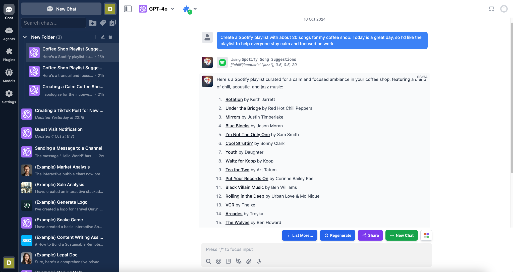

When using this plugin, users must authenticate their Spotify account via OAuth 2.0. Once authenticated, the AI can access the user's Spotify data and provide personalized song suggestions.

The plugin will ask users to authenticate their Spotify account, as shown in the image below:

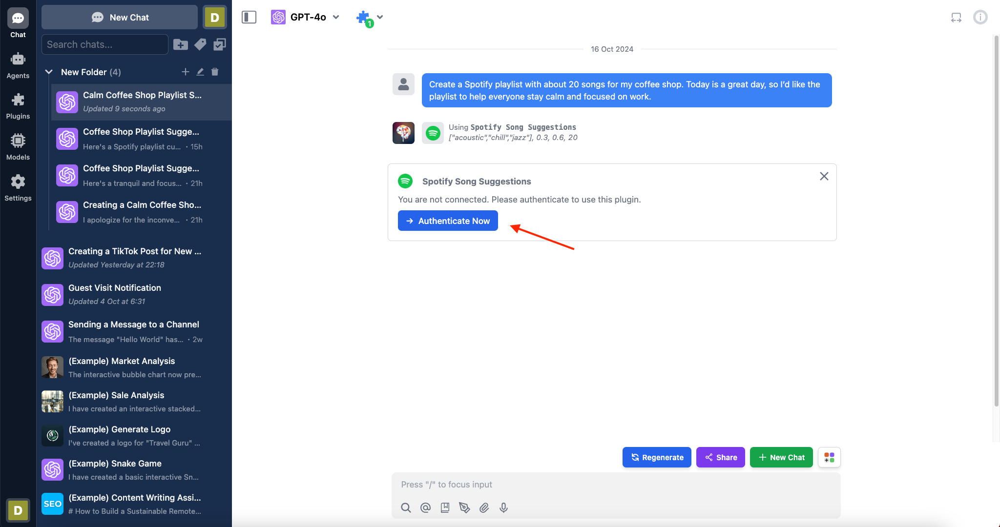

Here is the link to the repository of the completed plugin:

[https://github.com/TypingMind/plugin-spotify-song-suggestions](https://github.com/TypingMind/plugin-spotify-song-suggestions)

Let's get started!

<aside>
💡

For clarity, this document is written in context of the [**TypingMind Team Version**](https://custom.typingmind.com/). If you are using the [**TypingMind License Version**](https://www.typingmind.com/), please be aware that it is not supported yet.

</aside>

## Table of Contents

- Part 1: Create the plugin
    - Research Spotify Web API
    - Create an Spotify App
    - OAuth 2.0 Authorization Flow
    - Creating a new plugin on TypingMind
    - OpenAI Function Spec
    - Authentication
    - Implementation
    - Finish creating the plugin
- Part 2: Install and setup the plugin
    - Prepare your TypingMind instance
    - Install the Spotify Song Suggestions plugin
    - Add OAuth Callback URL to Spotify App
- Part 3: Users use the plugin
- Conclusion
- Learn more

## Part 1: Create the plugin

<aside>
💡

In this step, **we will act as a Plugin Developer** to create a plugin. This plugin can later be listed on the plugin store or share directly to other people in the community via a share URL or a GitHub repo.

</aside>

Let's start creating the "Spotify Song Suggestions" plugin step-by-step.

We'll implement this plugin using [**HTTP Action**](https://docs.typingmind.com/plugins/build-a-typingmind-plugin). First, let's examine the Spotify Web API.

### Research Spotify Web API

Before we begin, let's explore the Spotify Web API to find the endpoints we need for song suggestions. A quick search leads us to the [Get Recommendations API](https://developer.spotify.com/documentation/web-api/reference/get-recommendations). This endpoint allows us to get track recommendations based on specific input parameters.

A quick look at the documentation shows the **endpoint** and the supported **OAuth 2.0** authentication, which we'll configure later.

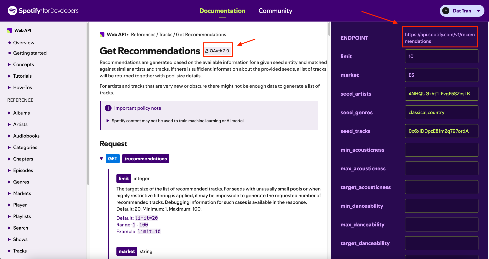

Now, let's scroll down under the **Request** section to look at some parameters that we'll use to build our plugin:

- **limit**: The maximum number of items to return (1-100, default: 20)
- **target_energy**: A value from 0.0 to 1.0 representing the energy level of the track
- **target_valence**: A value from 0.0 to 1.0 describing the musical positiveness conveyed by a track
- **seed_genres**: A comma-separated list of Spotify genres to use as seeds for recommendations

These parameters will allow us to customize the recommendations based on user request.

You can also test the API on the right side of the page. Scroll down and click the "Try It" button to view an example request and response.

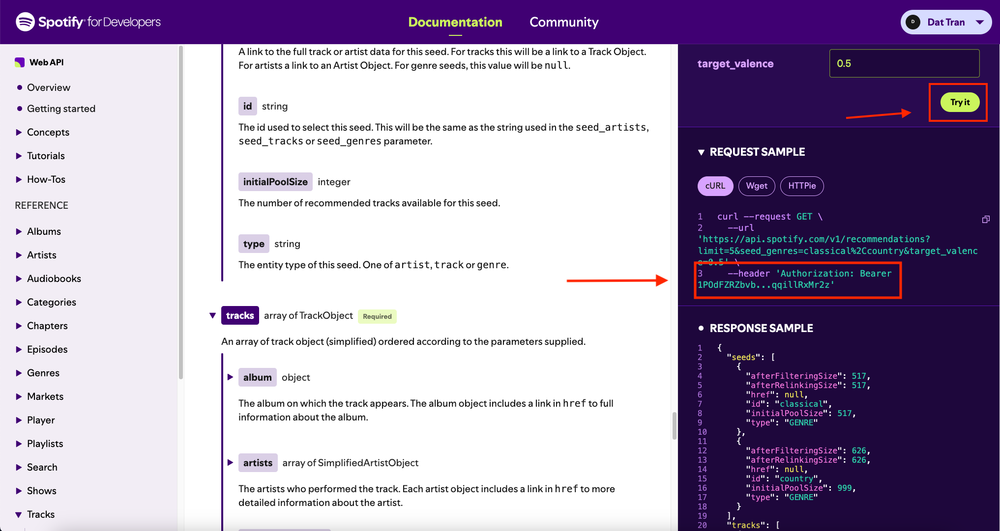

As you can see, the HTTP request requires an Authorization header with a Bearer Token, which is part of the OAuth setup. Now that we've identified the appropriate API, let's move on to setting up our Spotify App.

### Create a Spotify App

To use Spotify's services, we'll create a Spotify App on their Developer Dashboard. This provides us with the Client ID and Client Secret needed for authentication, a key step in our plugin's development. 

To create a Spotify App, follow these steps:

1. Log into the [Spotify Developer Dashboard](https://developer.spotify.com/dashboard) using your Spotify account.
2. Click on "Create app".
3. Fill in the following details:
    - App name (e.g., "Typing Mind Test")
    - App description (e.g., "This plugin suggests Spotify playlists based on user descriptions using the Spotify Web API")
    - Redirect URI (we'll set this later; for now, temporarily set it to [https://example.org/callback](https://example.org/callback))
    - Which API/SDKs are you planning to use? (select "Web API")
4. Agree to the terms of service and click "Save".

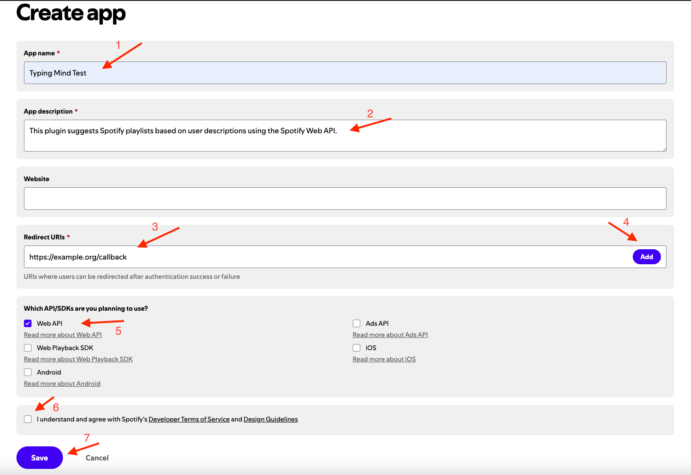

After creating the app, navigate to the App Details Page and click on "Settings" in the top right corner.

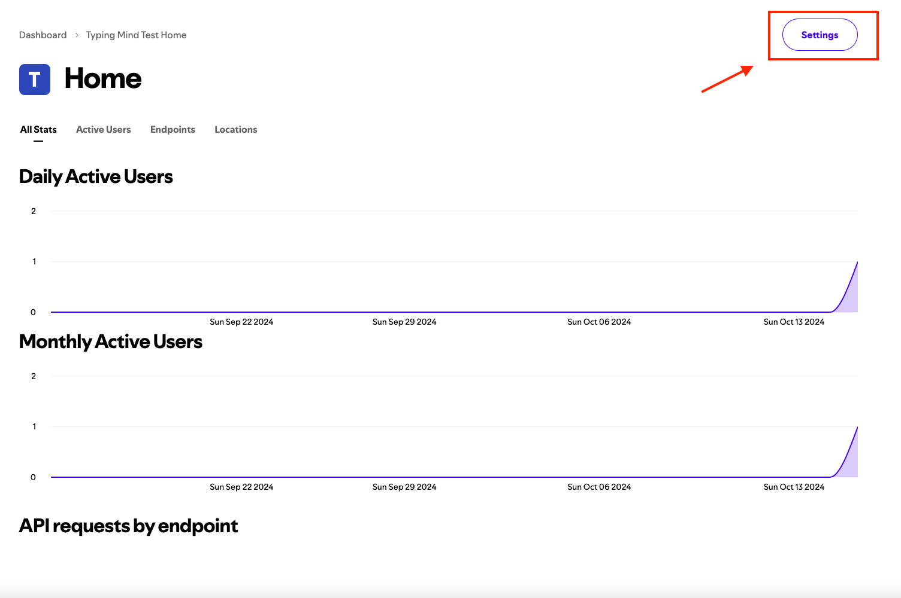

Here, you can access your **Client ID** and **Client Secret**. Let's save your credentials, as we'll need them later when setting up OAuth authentication for our plugin.

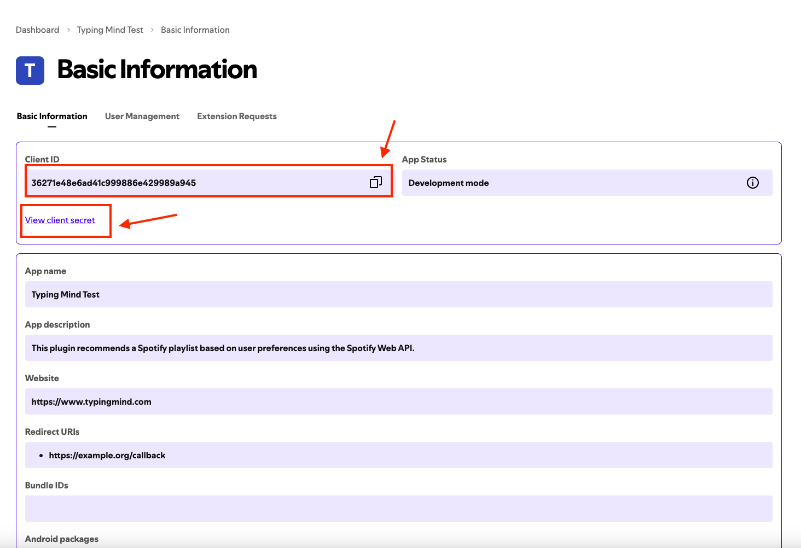

You can also test your credentials by going to the [Spotify Create an App Tutorial](https://developer.spotify.com/documentation/web-api/tutorials/getting-started#create-an-app) and scrolling down to the "**Request an access token**" section. You can replace your client ID and secret and test the cURL command in your terminal as shown in the image below.


### OAuth 2.0 Authorization Flow

At the end of the previous section, we learned how to test simple Client Credentials. However, for this tutorial, we'll use the OAuth Authorization Code Flow. This process is described in detail in the [Spotify Authorization Code Flow Documentation](https://developer.spotify.com/documentation/web-api/tutorials/code-flow).

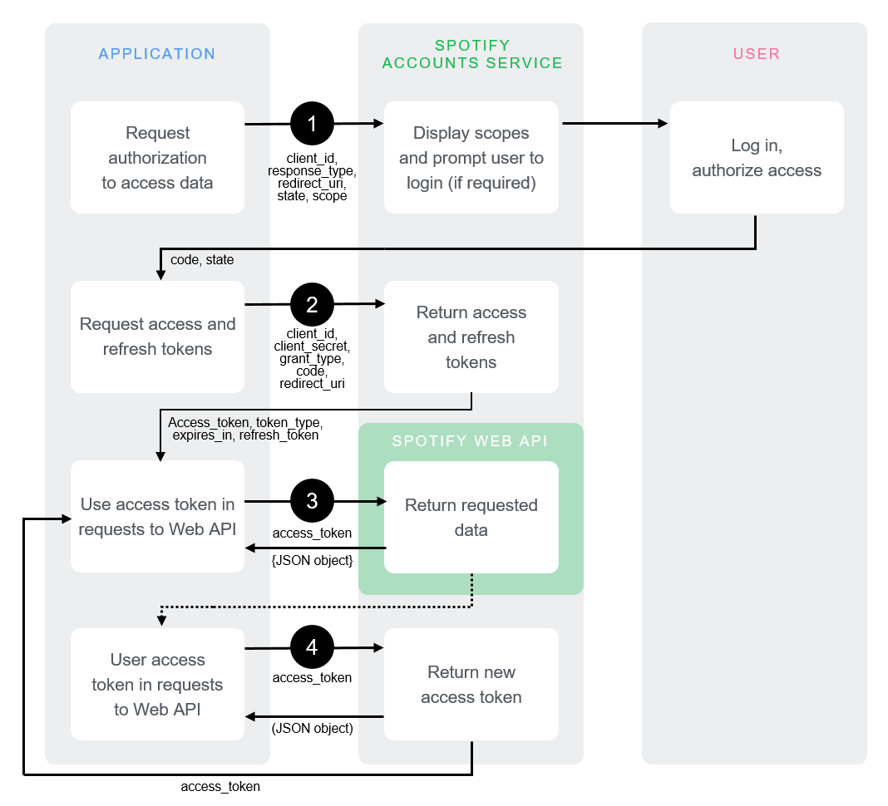

Additionally, you can refer to the [TypingMind OAuth plugin documentation](https://docs.typingmind.com/plugins/oauth-for-plugin) to understand how TypingMind plugins integrate with OAuth.

For our Spotify Song Suggestions plugin, we'll need the following OAuth 2.0 details. Remember to keep these URLs and scopes in mind, as we'll use them later in the plugin setup:

- **Authorization URL:**
    
    ```jsx
    [https://accounts.spotify.com/authorize](https://accounts.spotify.com/authorize)
    ```
    
- **Token URL:**
    
    ```jsx
    [https://accounts.spotify.com/api/token](https://accounts.spotify.com/api/token)
    ```
    
- **Scopes:**
    
    There are no scopes required for the [Get Recommendations API](https://developer.spotify.com/documentation/web-api/reference/get-recommendations). You can find scope details at the [List of Scopes Page](https://developer.spotify.com/documentation/web-api/concepts/scopes).
    

<aside>
💡

A quick tip to obtain the above information without reading through the entire documentation is to use ChatGPT

</aside>

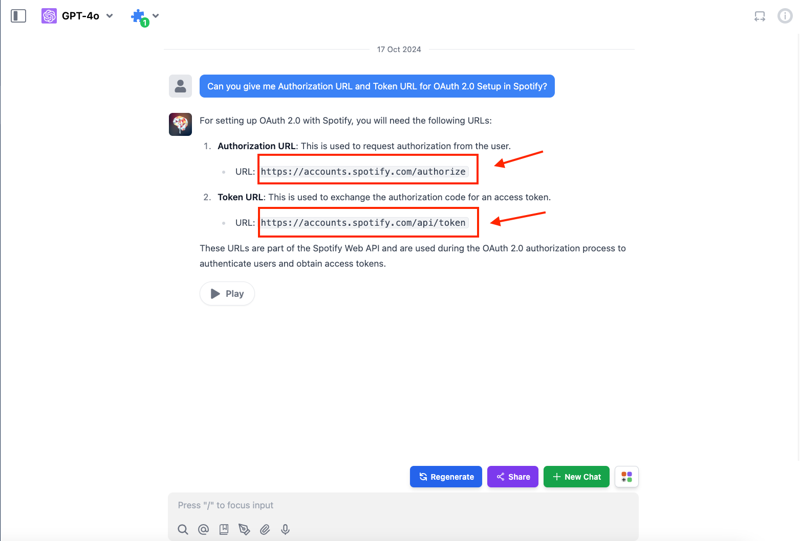

Now, with our Spotify App in place and an understanding of the OAuth flow, let's move on to creating a TypingMind Plugin.

### Creating a new plugin on TypingMind

Let's create our Spotify Song Suggestions plugin using TypingMind's built-in editor. You can access the editor via the Admin Panel. 

- Go to your Admin Panel → Plugins → Create New Plugin.
- Name the plugin "**Spotify Song Suggestions**"
- Description: "This plugin suggests Spotify playlists based on user descriptions using the Spotify Web API".


### OpenAI Function Spec

In this plugin, we'll enable the AI to recommend Spotify playlists. We'll name the function `recommend_spotify_playlist` with four parameters that match the Recommendation API request params we mentioned earlier: 

- `genres`: Corresponds to the `seed_genres` parameter. This allows us to specify the musical genres for the playlist.
- `target_energy`: Corresponds to the `target_energy` parameter. This helps set the desired energy level of the tracks.
- `target_valence`: Corresponds to the `target_valence` parameter. This determines the musical positiveness of the recommended tracks.
- `number_of_songs`: Corresponds to the `limit` parameter. This sets the limit number of songs in the playlist.

The full function spec is as follows:

```json
{
  "name": "recommend_spotify_playlist",
  "parameters": {
    "type": "object",
    "required": [
      "genres"
    ],
    "properties": {
      "genres": {
        "type": "array",
        "items": {
          "type": "string"
        },
        "default": [],
        "description": "A list of genres to include in the playlist, such as ['chill', 'acoustic', 'jazz']. This helps refine the type of music included. Default is an empty array, implying no specific genre preference."
      },
      "target_energy": {
        "type": "number",
        "default": 0.5,
        "description": "A value between 0.0 and 1.0 indicating the desired energy level of the tracks. Optional. Default is 0.5, representing a neutral energy level."
      },
      "target_valence": {
        "type": "number",
        "default": 0.5,
        "description": "A value between 0.0 and 1.0 indicating the desired valence (positivity) of the tracks. Optional. Default is 0.5, representing a neutral positive level."
      },
      "number_of_songs": {
        "type": "integer",
        "default": 20,
        "description": "The specific number of songs to include in the playlist. This is optional and overrides duration-based calculations if provided. Default is calculated from the duration assuming an average song length of 3 minutes."
      }
    }
  },
  "description": "Return a Spotify playlist recommendation based on the specified energy and valence levels, preferred genres, and the desired duration or number of songs."
}
```

### Authentication

As we prepared in the **OAuth 2.0 Authorization Flow** section, let's fill in the following OAuth config values in the TypingMind Settings:

- **Authorization URL:** `https://accounts.spotify.com/authorize`
- **Token URL:** `https://accounts.spotify.com/api/token`
- **Scopes:** Leave this empty, as no scopes are required for the Get Recommendations API
- **Content-Type:** Select **URL Encoded**, which corresponds to `application/x-www-form-urlencoded`

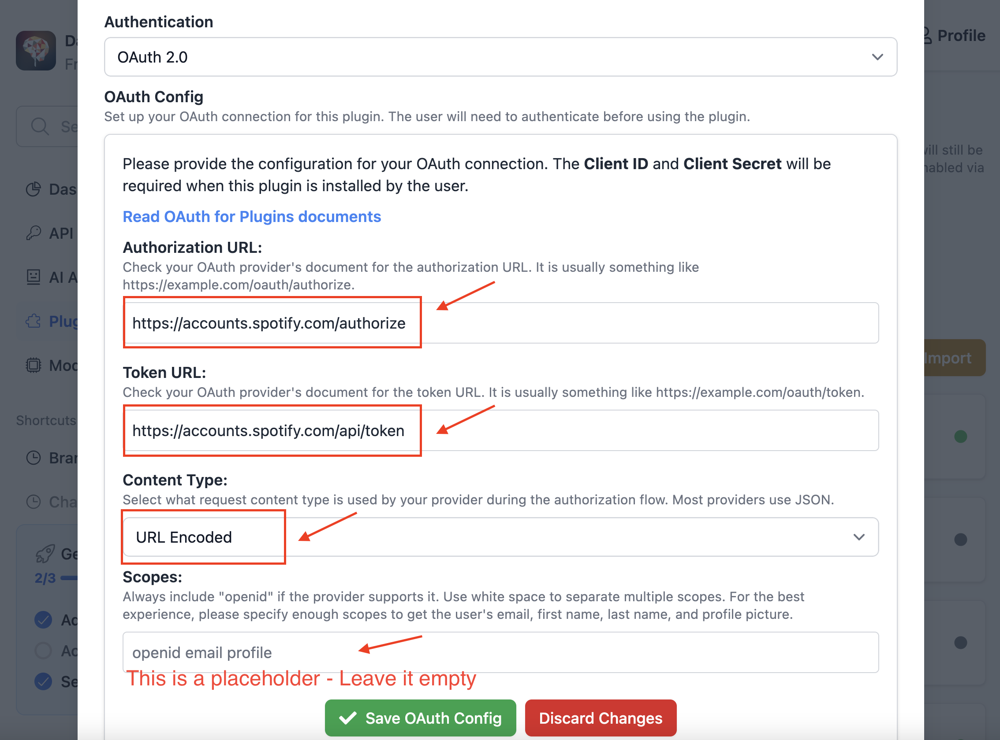

After completing the OAuth configuration, click the "Save OAuth Config" button to go to the next step.

### Implementation

Now, let's implement our plugin using the HTTP Action as planned. This approach allows us to easily fetch song recommendations from Spotify without complex coding.

- Scroll down to the **Implementation** section and select the **HTTP Action** option.
- Add an HTTP endpoint for a GET method:

```
[https://api.spotify.com/v1/recommendations?limit={number_of_songs}&seed_genres={genres}&target_valence={target_valence}&target_energy={target_energy}](https://api.spotify.com/v1/recommendations?limit=%7Bnumber_of_songs%7D&seed_genres=%7Bgenres%7D&target_valence=%7Btarget_valence%7D&target_energy=%7Btarget_energy%7D)
```

- Add a request header with Authorization

```json
{
  "Authorization": "Bearer {OAUTH_PLUGIN_ACCESS_TOKEN}"
}
```

<aside>
⚠️

Note: Ensure that the labels inside curly braces `{}` match exactly with the **Available variables** listed before the HTTP Method selection.

</aside>


### Finish creating the plugin

For the **Output Options**, select "Give plugin output to the AI". This setting allows the AI to interpret the response JSON and present the results to the user in a user-friendly format. Then, click the "Update Plugin" button to finalize the plugin creation.

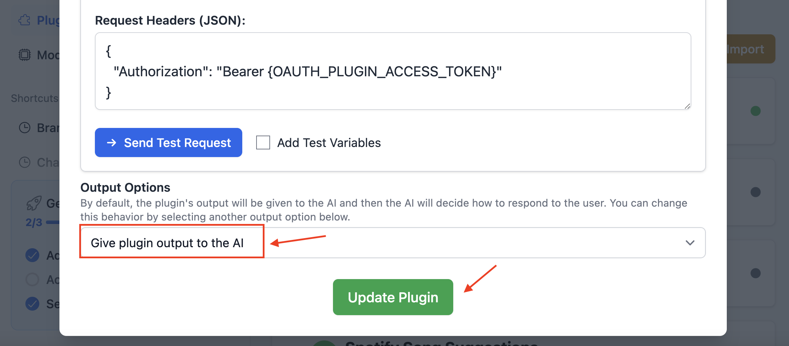

Now, you can find your newly created plugin listed on your Plugins Page. To share this plugin with others, simply click the "Share" button.

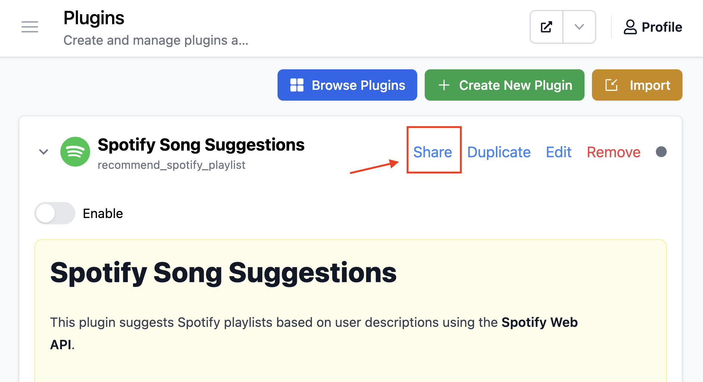

## Part 2: Install and setup the plugin

<aside>
💡

In this step, we'll take on the role of an **Admin User**. We'll install the Spotify Song Suggestions plugin on our TypingMind instance, enable it, and input the OAuth credentials in the user settings.

</aside>

### Prepare your TypingMind instance

In this example, I will create a new TypingMind instance named “**Coffee Shop AI**” (you can also create private instance like this using [**TypingMind Custom**](https://custom.typingmind.com/)). 

**Coffee Shop AI** will be a private AI platform I've created for my coffee shop staff. I can invite them to join the platform, allowing them to use this plugin to generate daily song playlists.


### Install the Spotify Song Suggestions plugin

Now that we have created our Spotify Song Suggestions plugin, we can install it on our TypingMind instance. Let's navigate to the Plugins Page and add the plugin we just created.

- Enable the plugin, it will prompt you for two pieces of information: the **OAuth Client ID** and **OAuth Client Secret**.
- Enter the **Client ID** and **Client Secret** that you set up in the "Create a Spotify App" section. After entering these credentials
- Click "**Save Credentials**".

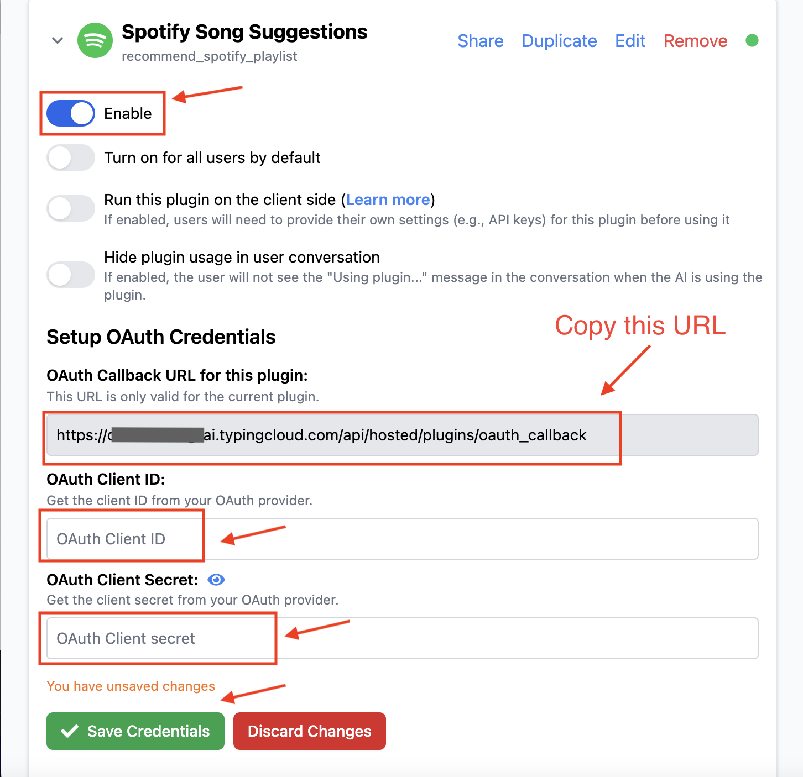

You have successfully set up the Credentials. Now, let's copy the **OAuth Callback URL**, which we'll use in the next step.

### Add OAuth Callback URL to Spotify App

In this section, we'll add the copied OAuth Callback URL to our Spotify App. Let's navigate back to the [Spotify Developer Dashboard](https://developer.spotify.com/dashboard). 

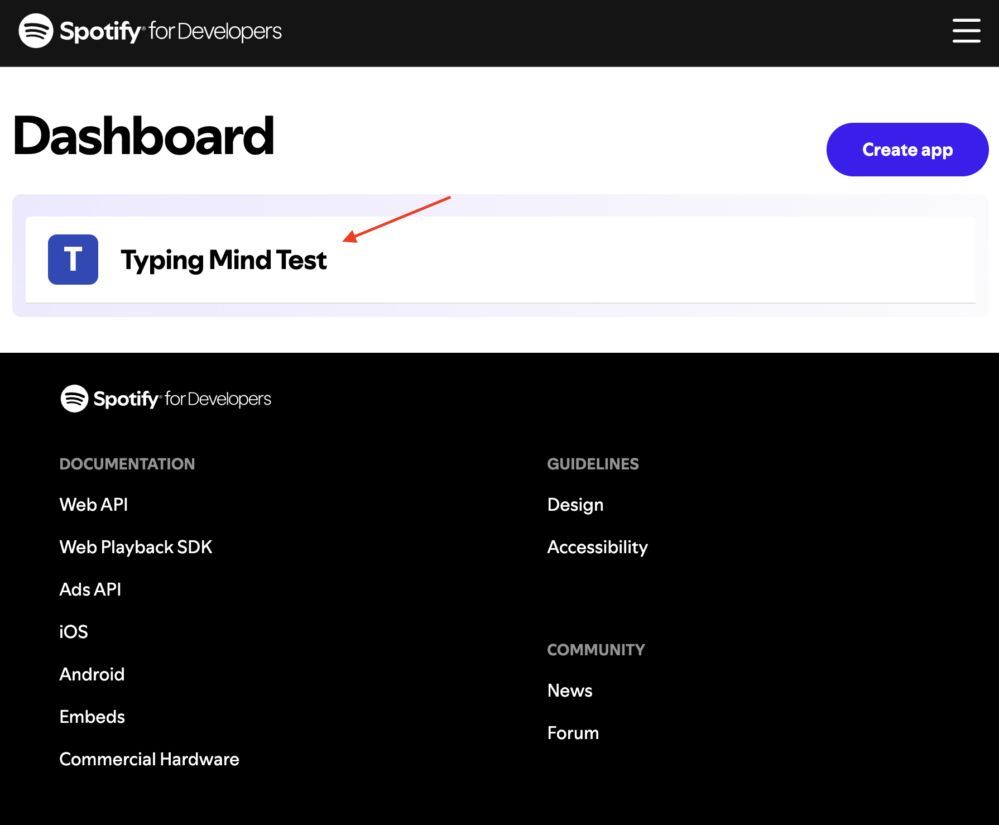

Click on the "Typing Mind Test" app to go to its details page. Then, click on "Settings" to navigate to the Settings page. Under the Basic Information tab, click on the "Edit" button.


Under "Redirect URIs," paste your copied OAuth Callback URL and click "Save".


## Part 3: Users use the plugin

As a user, I will log in to the Coffee Shop AI instance and start using the **Spotify Song Suggestions** plugin.


Start a new chat. If the plugin is currently disabled, enable it. 


Now I can ask the AI for playlist suggestions using prompts like this:

> Create a Spotify playlist with about 20 songs for my coffee shop. Today is a great day, so I’d like the playlist to help everyone stay calm and focused on work.
> 

The plugin will first prompt me to authenticate with Spotify

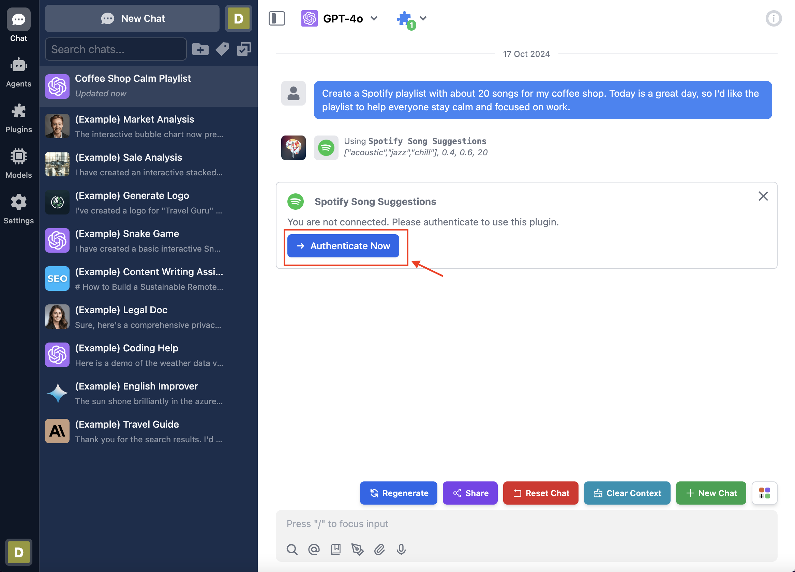

When I click "Authenticate Now," TypingMind redirects me to authorize the **Typing Mind Test** Spotify app. I then click the "Agree" button to complete the authentication process.


Finally, the AI can now access my Spotify account and generate playlist recommendations. The AI then displays the suggested playlist based on my request. 


## Conclusion

This tutorial covers three main roles in creating and using the Spotify Song Suggestions plugin:

### 1. Plugin Developer:

- Create the Spotify Song Suggestions plugin for TypingMind
- Set up the plugin structure and functionality

### 2. User Admin:

- Create and configure a Spotify app for OAuth authentication
- Install and set up the plugin in a TypingMind instance
- Connect the Spotify app with the TypingMind instance

### 3. End User:

- Enable the Spotify Song Suggestions plugin in TypingMind chat
- Authenticate with Spotify when first using the plugin
- Use AI to generate personalized playlist recommendations

This plugin seamlessly integrates TypingMind with Spotify, allowing users to receive AI-assisted playlist suggestions. It ensures secure communication between TypingMind and Spotify through OAuth 2.0 authentication.

## Learn more

TypingMind OAuth for Plugins: [https://docs.typingmind.com/plugins/oauth-for-plugin](https://docs.typingmind.com/plugins/oauth-for-plugin)

Spotify API Web API: [https://developer.spotify.com/documentation/web-api](https://developer.spotify.com/documentation/web-api/)

Spotify OAuth Flow: [https://developer.spotify.com/documentation/web-api/tutorials/code-flow](https://developer.spotify.com/documentation/web-api/tutorials/code-flow)

TypingMind Plugin is a powerful system. To learn more about it, read our documentation at

[**https://docs.typingmind.com**](https://docs.typingmind.com/). Share your ideas at our [Awesome TypingMind Github Repo](https://github.com/TypingMind/awesome-typingmind)