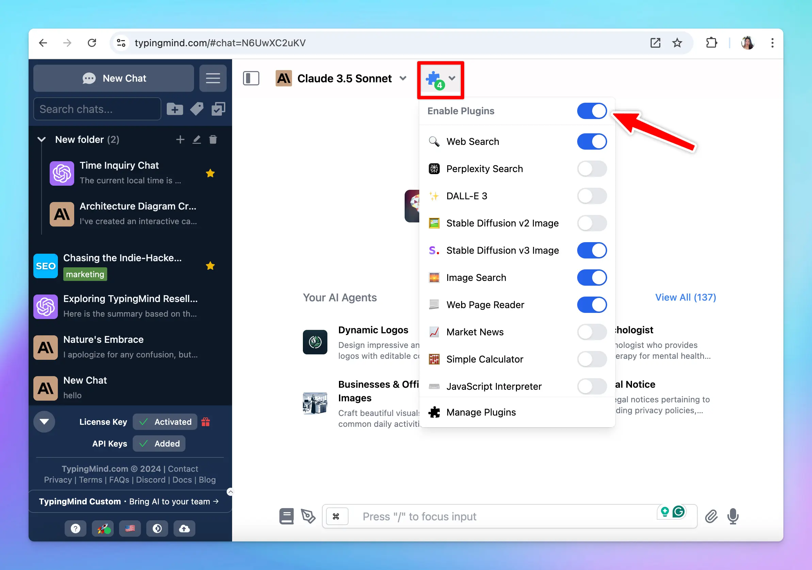

Plugins allow you to extend the AI model capabilities beyond text generation so you can get better AI responses:

- Access the latest information in real-time
- Generate images, graphs, and visual content
- Integrate with your vector database
- And much more!

Let’s dive in!

# Use Plugins on TypingMind

To use plugins on TypingMind app:

- Click on the 🧩 icon next to model selection
- Toggle the plugins option to enable plugins
- Click on the plugin you want to use and enable. Please note that there are some plugins required manual settings from your side, switch to the Settings tab to fill in necessary information to get the plugin to work.

# TypingMind Available Plugins

Here are the plugins that TypingMind supports natively:

- [Web Search](https://docs.typingmind.com/plugins/use-web-search-and-image-search): allows AI models to search for information from the internet in real-time using Google Search.
- [Perplexity Search](https://docs.typingmind.com/plugins/set-up-perplexity-search): allows AI models to search for information from the internet using Perplexity.
- [Web Page Reader](https://docs.typingmind.com/plugins/set-up-web-page-reader): let the AI models read the content of your provided URLs and analyze or summarize it.
- [Market News](https://docs.typingmind.com/plugins/set-up-market-news): get the latest financial information.
- [Dall-E 3](https://docs.typingmind.com/plugins/set-up-dall-e-3): allow AI model to generate image using Dall-E 3
- [Stable Diffusion v2 and v3](https://docs.typingmind.com/plugins/set-up-stable-diffusion): allow AI model to generate an image using Stable Diffusion
- [Image Search](https://docs.typingmind.com/plugins/use-web-search-and-image-search): search the web for images using Google search.
- Interactive Canvas: allow the AI to create an interactive canvas with the user. The canvas can be used to create forms, HTML/JS/CSS code, games, visualizations, or any other interactive content.
- Render HTML: this plugin demonstrates how to render HTML to the end users (mostly the same as Interactive Canvas, this is an example plugin for plugin developers.)
- Render Chart: help visualize data by drawing charts.
- Mermaid Diagram: generate and render diagrams using the Mermaid.js library. This can be used to render various types of diagrams, including Flowchart, Sequence Diagram, Class Diagram, etc.
- [Azure AI Search](https://docs.typingmind.com/plugins/set-up-query-training-data-azure-ai-search): this plugin connects TypingMind to your training data in Azure AI Search (Cognitive Search).

<aside>
  💡 You can also Build your own custom plugin that connects with your own system or work as you like using the instructions here: [https://docs.typingmind.com/plugins/build-a-typingmind-plugin](https://docs.typingmind.com/plugins/build-a-typingmind-plugin)

  We are constantly adding new plugins to our collection, so stay tuned!
</aside>

# Best practices

- **Be specific with your requests**: clearly specify what you need to trigger the correct plugin. For example, if you need the latest market data, include terms like "financial news" or "latest market trends" in your prompt.
- **Combine plugins when needed**: leverage multiple plugins in a single prompt to maximize efficiency. For example, you can search the latest fashion trend (Web Search) and visualize it (Render Chart).
- **Test and experiment**: familiarize yourself with different plugins by testing them in various scenarios to understand their full capabilities and limitations.

Happy chatting!
